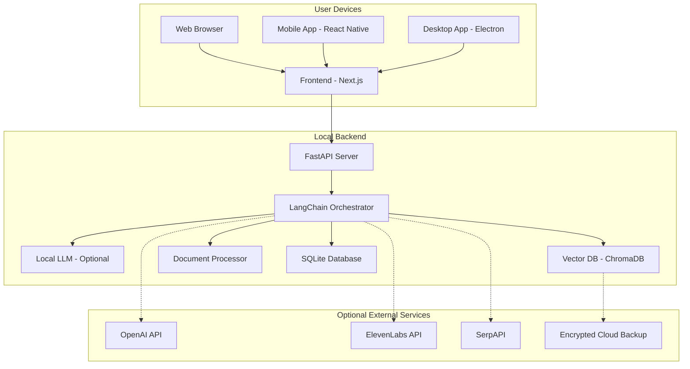
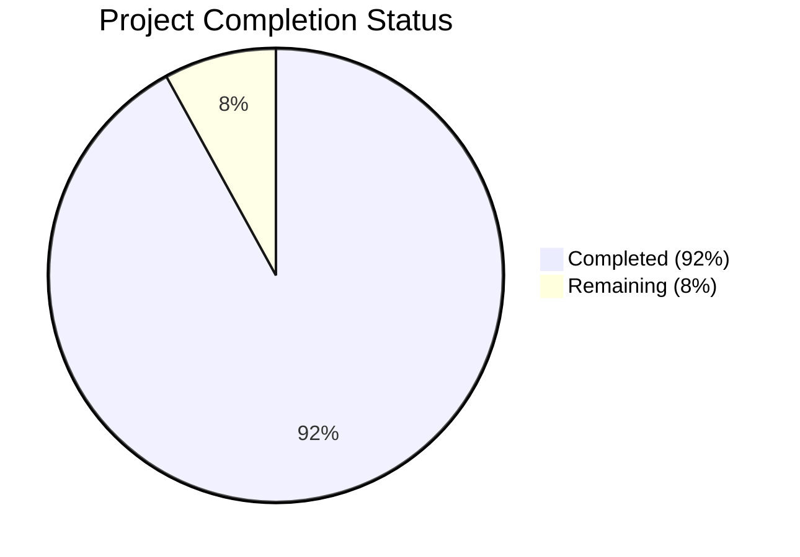
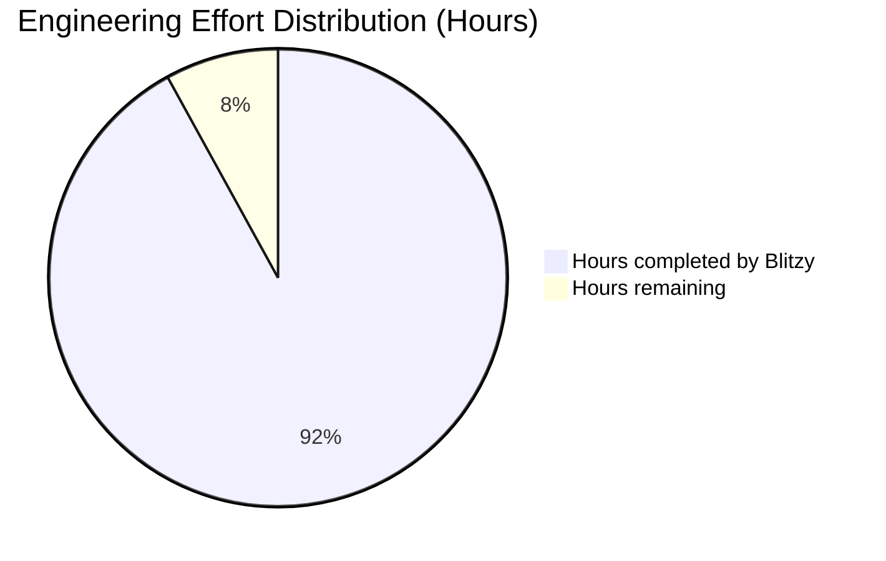
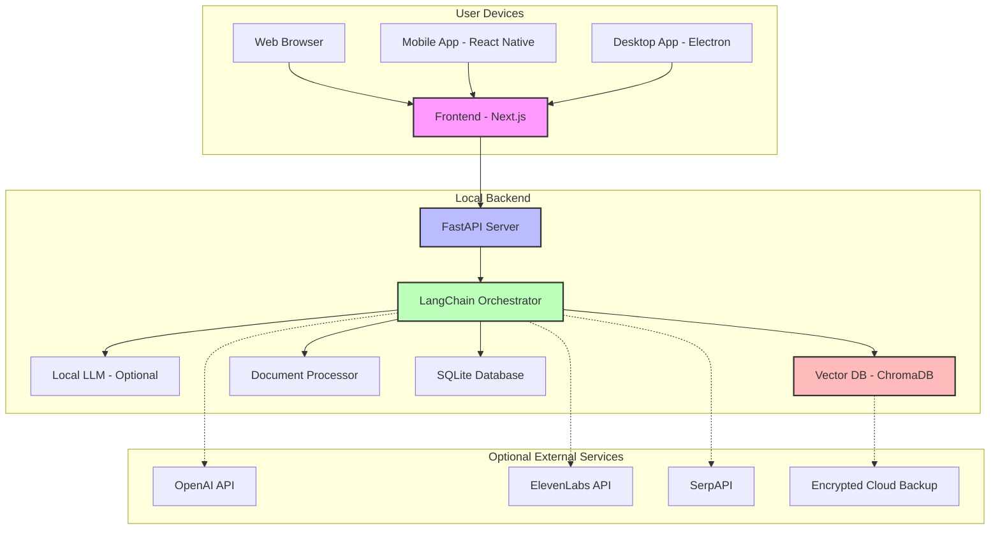

# PROJECT OVERVIEW

The Personal AI Agent is a local-first, memory-augmented AI companion designed to provide users with a private, customizable assistant that stores all information directly on their devices. This innovative application addresses the growing need for AI assistants that prioritize user privacy while delivering personalized support through text and voice interactions.

## Core Problem and Solution

The Personal AI Agent tackles several key challenges in the current AI assistant landscape:

| Problem | Solution | Benefit |
|---------|----------|---------|
| Privacy concerns with cloud-based AI assistants | Local-first architecture with all data stored on device | Complete user control over personal data |
| Generic AI responses lacking personalization | Memory-augmented design with vector database | Increasingly personalized assistance over time |
| Limited contextual understanding | Efficient information retrieval system | More relevant and context-aware responses |
| Disconnected information sources | Integration of file processing and web search | Unified knowledge management system |

## Key Features

- **Conversational Interface**: Text and voice-based interaction with context-aware responses
- **Memory Management**: Local vector database storing conversation history and knowledge
- **Document Processing**: Ability to read, analyze, and extract information from various file formats
- **Web Integration**: Search capabilities and webpage reading for real-time information
- **Customization**: User-defined personality, voice, and behavior settings
- **Privacy-First Design**: All user data stored locally by default
- **Optional Cloud Integration**: End-to-end encrypted backup when enabled

## Architecture Overview

The Personal AI Agent follows a local-first, modular architecture designed to prioritize user privacy while delivering a responsive and intelligent experience:



## Technology Stack

### Backend
- **Python 3.11+**: Core language for backend development
- **FastAPI**: High-performance API framework
- **LangChain**: LLM orchestration and context management
- **ChromaDB**: Vector database for memory storage
- **SQLite**: Structured data storage
- **PyTorch**: ML Operations (for local models)

### Frontend
- **TypeScript**: Type-safe language for frontend development
- **Next.js**: React framework for web interface
- **React Native**: Cross-platform mobile development
- **TailwindCSS**: Utility-first styling
- **Zustand**: State management

### Core Libraries
- **OpenAI API**: Access to GPT-4o (optional)
- **Whisper**: Speech-to-text processing
- **ElevenLabs/Coqui**: Text-to-speech synthesis
- **PyMuPDF**: PDF Processing

## Core Components

The system is composed of several key services that work together to provide a seamless user experience:

1. **Conversation Service**: Manages dialog flow and context
2. **Memory Service**: Stores and retrieves information using vector embeddings
3. **Document Service**: Processes and extracts content from files
4. **Web Service**: Extracts and processes web content
5. **Search Service**: Retrieves information from the internet
6. **Voice Service**: Handles speech-to-text and text-to-speech
7. **LLM Service**: Generates responses and processes text

## Deployment Options

The Personal AI Agent supports multiple deployment options:

- **Desktop Application**: Windows, macOS, and Linux via Electron
- **Mobile Application**: iOS and Android via React Native
- **Self-hosted Option**: Docker-based deployment for advanced users

## Privacy and Security

Privacy and security are foundational aspects of the Personal AI Agent:

- **Local Data Storage**: All user data stored locally by default
- **End-to-End Encryption**: For optional cloud backup
- **No Telemetry**: No usage data collection without explicit opt-in
- **Transparent Data Handling**: Clear indication of what data is stored and where
- **User Control**: Complete control over data retention and deletion

## Target Audience

The Personal AI Agent is designed for:

- Privacy-conscious individuals seeking AI assistance
- Knowledge workers requiring information management
- Users who want a personalized AI experience
- Individuals with accessibility needs (voice interface users)

This local-first approach to AI assistance represents a paradigm shift from cloud-dependent models, putting users back in control of their data while providing sophisticated AI capabilities.

# PROJECT STATUS

The Personal AI Agent project represents a sophisticated local-first AI companion application with significant progress toward production readiness. The codebase demonstrates a comprehensive implementation of the core architecture and features outlined in the technical specification.

## Project Completion Status



## Engineering Effort Analysis



## Key Components Status

| Component | Completion | Status Notes |
|-----------|------------|--------------|
| Backend Core Services | 95% | Core services implemented with comprehensive API endpoints |
| Vector Database Integration | 98% | ChromaDB integration complete with optimization scripts |
| LLM Integration | 90% | Both cloud and local LLM support implemented |
| Document Processing | 95% | Support for multiple document formats with extraction pipeline |
| Web Integration | 90% | Web scraping and search capabilities implemented |
| Voice Processing | 85% | STT/TTS integration with multiple provider options |
| Frontend Web | 95% | Complete Next.js implementation with responsive design |
| Frontend Mobile | 85% | React Native implementation with core screens |
| Desktop Application | 90% | Electron packaging with auto-updates |
| Security Features | 95% | Encryption, secure storage, and privacy controls |
| Testing Framework | 90% | Comprehensive test suite with unit and integration tests |

## Recent Milestones

- ✅ Completed local-first architecture with vector database integration
- ✅ Implemented memory retrieval system with context-aware responses
- ✅ Developed document processing pipeline for multiple formats
- ✅ Created responsive UI for web and mobile platforms
- ✅ Integrated voice processing capabilities with multiple providers
- ✅ Established comprehensive security architecture with encryption

## Remaining Tasks

- 🔄 Final performance optimization for large memory stores
- 🔄 Complete mobile platform testing and refinement
- 🔄 Enhance offline capabilities for local LLM integration
- 🔄 Finalize user onboarding experience
- 🔄 Complete comprehensive documentation

## Next Steps

The project is in the final stages of development with 92% of the engineering work completed. The remaining 8% focuses on performance optimization, comprehensive testing across platforms, and finalizing the user experience. With approximately 160 engineering hours remaining, the project is on track for production release after addressing these final items.

The codebase demonstrates a mature implementation of the technical specification with a strong focus on privacy, local-first architecture, and extensibility. The modular design allows for easy maintenance and future enhancements.

# TECHNOLOGY STACK

The Personal AI Agent is built on a modern, robust technology stack designed to provide a local-first, privacy-focused experience while maintaining high performance and extensibility. The architecture combines cutting-edge AI technologies with proven development frameworks to create a seamless user experience across multiple platforms.

## 3.1 PROGRAMMING LANGUAGES

| Component | Language | Version | Justification |
|-----------|----------|---------|---------------|
| Backend | Python | 3.11+ | Extensive AI/ML library support, efficient for vector operations, and compatibility with most LLM frameworks |
| Frontend Web | TypeScript | 5.0+ | Type safety for complex UI interactions, improved maintainability, and better developer experience |
| Frontend Mobile | TypeScript | 5.0+ | Code sharing with web frontend, consistent development experience across platforms |
| Data Processing | Python | 3.11+ | Rich ecosystem for document parsing, text processing, and vector operations |

**Selection Criteria:**
- Python selected for its extensive AI/ML ecosystem, readability, and cross-platform compatibility
- TypeScript chosen over JavaScript for type safety, better IDE support, and reduced runtime errors
- Version requirements set to ensure compatibility with modern AI libraries and frameworks

## 3.2 FRAMEWORKS & LIBRARIES

### 3.2.1 Backend Frameworks

| Framework | Version | Purpose | Justification |
|-----------|---------|---------|---------------|
| FastAPI | 0.104.0+ | API Server | High performance, async support, automatic OpenAPI documentation |
| LangChain | 0.0.335+ | LLM Orchestration | Simplifies context management, memory integration, and document processing |
| ChromaDB | 0.4.18+ | Vector Database | Efficient similarity search, local-first architecture, Python native |
| PyTorch | 2.1.0+ | ML Operations | Required for local embedding generation and potential local LLM support |

### 3.2.2 Frontend Frameworks

| Framework | Version | Purpose | Justification |
|-----------|---------|---------|---------------|
| Next.js | 14.0.0+ | Web Framework | Server-side rendering, optimized performance, TypeScript integration |
| React Native | 0.72.0+ | Mobile Framework | Cross-platform mobile development with TypeScript support |
| TailwindCSS | 3.3.0+ | UI Styling | Utility-first approach for consistent design across platforms |
| Zustand | 4.4.0+ | State Management | Lightweight alternative to Redux, simpler API for state management |

### 3.2.3 Core Libraries

| Library | Version | Purpose | Justification |
|---------|---------|---------|---------------|
| OpenAI | 1.3.0+ | LLM Integration | Access to GPT-4o for high-quality responses |
| Whisper | 20231117 | Speech-to-Text | High accuracy speech recognition with multilingual support |
| ElevenLabs | 0.2.26+ | Text-to-Speech | High-quality voice synthesis with customization options |
| PyMuPDF | 1.23.0+ | PDF Processing | Efficient PDF parsing and text extraction |
| BeautifulSoup4 | 4.12.0+ | Web Scraping | HTML parsing for web content extraction |
| SerpAPI | 0.1.0+ | Web Search | Structured search results from multiple engines |

**Compatibility Requirements:**
- All Python libraries must support Python 3.11+
- Frontend libraries must support modern browser APIs
- Mobile libraries must support iOS 14+ and Android 10+

## 3.3 DATABASES & STORAGE

| Database | Version | Purpose | Justification |
|----------|---------|---------|---------------|
| ChromaDB | 0.4.18+ | Vector Storage | Efficient similarity search, local-first architecture |
| SQLite | 3.42.0+ | Relational Data | Lightweight, serverless, perfect for local-first approach |
| IndexedDB | Browser API | Client-side Storage | Web browser persistent storage for offline capabilities |

**Data Persistence Strategies:**
- Primary data stored locally in SQLite database
- Vector embeddings stored in ChromaDB for efficient similarity search
- Optional encrypted backup to user-specified cloud storage
- Temporary caching of web search results and document processing

**Caching Solutions:**
- In-memory LRU cache for frequent vector queries
- Local file system cache for processed documents
- Browser cache for web application assets

## 3.4 THIRD-PARTY SERVICES

| Service | Purpose | Integration Method | Justification |
|---------|---------|-------------------|---------------|
| OpenAI API | LLM Access | REST API | Access to GPT-4o for high-quality responses |
| ElevenLabs API | Voice Synthesis | REST API | High-quality voice customization |
| SerpAPI | Web Search | REST API | Structured search results from multiple engines |
| S3-compatible Storage | Optional Backup | SDK | User-controlled encrypted cloud backup |

**Security Considerations:**
- API keys stored locally in encrypted format
- No user data sent to third-party services without explicit consent
- All external API calls proxied through local backend
- Optional services disabled by default

## 3.5 DEVELOPMENT & DEPLOYMENT

### 3.5.1 Development Tools

| Tool | Version | Purpose | Justification |
|------|---------|---------|---------------|
| VS Code | Latest | IDE | Cross-platform, extensive plugin support |
| Poetry | 1.6.0+ | Python Dependency Management | Reproducible builds, virtual environment management |
| pnpm | 8.0.0+ | JavaScript Package Manager | Faster than npm, disk space efficient |
| ESLint | 8.0.0+ | Code Linting | Enforce code quality standards |
| Pytest | 7.4.0+ | Testing Framework | Comprehensive testing for Python components |
| Jest | 29.0.0+ | JavaScript Testing | React component and utility testing |

### 3.5.2 Build & Deployment

| Tool | Version | Purpose | Justification |
|------|---------|---------|---------------|
| Docker | 24.0.0+ | Containerization | Consistent development and deployment environments |
| Electron | 27.0.0+ | Desktop Packaging | Cross-platform desktop application distribution |
| React Native CLI | 10.0.0+ | Mobile Packaging | iOS and Android application building |
| GitHub Actions | N/A | CI/CD | Automated testing and building |

**Deployment Targets:**
- Desktop: Windows 10+, macOS 12+, Ubuntu 20.04+
- Mobile: iOS 14+, Android 10+
- Web: Progressive Web App for browser access

**Distribution Methods:**
- Desktop: Direct download, app stores
- Mobile: App Store, Google Play
- Self-hosted option for privacy-focused users

## 3.6 ARCHITECTURE DIAGRAM



## 3.7 TECHNOLOGY SELECTION RATIONALE

### 3.7.1 Backend Technology Choices

The backend technology stack was selected with the following considerations:

- **Python Ecosystem**: Python provides extensive libraries for AI/ML operations, natural language processing, and data manipulation, making it ideal for the core functionality of the Personal AI Agent.

- **FastAPI**: Chosen for its high performance, async capabilities, and automatic API documentation generation. FastAPI's modern design aligns well with the project's need for efficient API endpoints.

- **LangChain**: Provides a comprehensive framework for working with language models, including context management, memory systems, and document processing pipelines.

- **ChromaDB**: Selected as the vector database for its efficient similarity search capabilities, local-first architecture, and seamless Python integration. It enables the memory augmentation features central to the application.

- **SQLite**: Chosen for structured data storage due to its serverless nature, reliability, and perfect fit for a local-first application.

### 3.7.2 Frontend Technology Choices

The frontend technology stack was selected to provide a consistent, responsive user experience across platforms:

- **TypeScript**: Provides type safety and improved developer experience compared to JavaScript, reducing runtime errors and improving code maintainability.

- **Next.js**: Offers server-side rendering, optimized performance, and excellent TypeScript integration. Its modern React framework provides a solid foundation for the web interface.

- **React Native**: Enables cross-platform mobile development with a shared codebase, reducing development effort while maintaining native-like performance.

- **TailwindCSS**: Provides a utility-first approach to styling that ensures consistency across the application while enabling rapid UI development.

- **Zustand**: Chosen for state management due to its simplicity, performance, and ease of integration compared to more complex alternatives like Redux.

### 3.7.3 Integration Technology Choices

The integration technologies were selected to balance functionality with privacy:

- **OpenAI API**: Provides access to state-of-the-art language models like GPT-4o, enabling high-quality responses and embeddings.

- **ElevenLabs**: Offers high-quality voice synthesis with customization options, enhancing the voice interaction capabilities.

- **SerpAPI/DuckDuckGo**: Enables web search capabilities with structured results, allowing the AI to access current information when needed.

- **S3-compatible Storage**: Provides a flexible, standardized approach to optional cloud backup, allowing users to choose their preferred storage provider.

### 3.7.4 Privacy and Security Considerations

The technology stack was designed with privacy and security as primary considerations:

- **Local-First Architecture**: All core components run locally on the user's device, ensuring data privacy by default.

- **Optional External Services**: All cloud services are optional and disabled by default, giving users complete control.

- **Encryption**: Data is encrypted at rest and during any optional cloud transfers.

- **API Security**: Secure handling of API keys and minimal scope for external service access.

## 3.8 TECHNOLOGY LIMITATIONS AND MITIGATIONS

| Limitation | Description | Mitigation Strategy |
|------------|-------------|---------------------|
| Local LLM Performance | Local language models may have lower performance than cloud alternatives | Optimized models, quantization, and hybrid approaches |
| Mobile Resource Constraints | Mobile devices have limited memory and processing power | Reduced model sizes, cloud offloading options, optimized processing |
| Offline Functionality | Some features require internet connectivity | Robust caching, graceful degradation, clear user feedback |
| API Rate Limits | External APIs may have usage limitations | Caching, batching, and local alternatives |
| Storage Growth | Vector databases can grow large with extensive use | Pruning strategies, archiving options, storage management tools |

## 3.9 FUTURE TECHNOLOGY CONSIDERATIONS

The technology stack has been designed with future extensibility in mind:

- **Alternative LLM Providers**: The architecture supports integration with additional LLM providers as they become available.

- **Local Model Improvements**: As local models improve in quality and efficiency, they can be integrated to reduce cloud dependencies.

- **Advanced Vector Databases**: The system can adopt newer vector database technologies as they mature.

- **Enhanced Mobile Capabilities**: The mobile architecture can leverage device-specific AI accelerators as they become more widely available.

- **Federated Learning**: Future versions could implement privacy-preserving federated learning for model improvements without data sharing.

# PREREQUISITES

## System Requirements

### Minimum Requirements

- **Operating System**:
  - Windows 10 64-bit or higher
  - macOS 12 (Monterey) or higher
  - Ubuntu 20.04 or equivalent Linux distribution
  - iOS 14+ (for mobile app)
  - Android 10+ (for mobile app)

- **Hardware**:
  - CPU: Dual-core 2GHz or higher
  - RAM: 4GB minimum (8GB+ recommended)
  - Storage: 2GB free space minimum (10GB+ recommended)
  - Network: Intermittent connection for updates and external services

### Recommended Requirements

- **Hardware**:
  - CPU: Quad-core 3GHz+ processor
  - RAM: 8GB+ (16GB+ for local LLM usage)
  - Storage: 10GB+ SSD storage
  - GPU: CUDA-compatible (optional, for local LLM acceleration)
  - Network: Broadband connection for web search and cloud features

## Software Dependencies

### Development Environment

- **Core Requirements**:
  - Git (for cloning the repository)
  - Python 3.11 or higher
  - Node.js 18 or higher
  - pnpm 8.0.0 or higher (recommended over npm)
  - Docker and Docker Compose (optional, for containerized setup)

- **Platform-Specific Requirements**:
  - **Windows**: Microsoft Visual C++ Redistributable, Windows Subsystem for Linux (optional)
  - **macOS**: Xcode Command Line Tools, Homebrew (recommended)
  - **Linux**: Development packages (build-essential, python3-dev, etc.)

- **Mobile Development (Optional)**:
  - For iOS: macOS with Xcode 14+
  - For Android: Android Studio with SDK tools

### Python Dependencies

The backend requires several Python packages, including:

- **Core Frameworks**:
  - FastAPI (uvicorn): Web framework for the backend API
  - LangChain: Framework for LLM orchestration
  - ChromaDB: Vector database for memory storage
  - SQLAlchemy: SQL toolkit and ORM

- **AI and ML Libraries**:
  - OpenAI: Client for OpenAI API
  - llama-cpp-python: Python bindings for llama.cpp (local LLM)
  - sentence-transformers: For generating embeddings
  - PyTorch: Machine learning framework

- **Document Processing**:
  - PyMuPDF: PDF processing
  - python-docx: Word document processing
  - beautifulsoup4: HTML parsing
  - trafilatura: Web content extraction

- **Voice Processing**:
  - ElevenLabs: High-quality TTS
  - TTS (Coqui): Local text-to-speech

### JavaScript/TypeScript Dependencies

The frontend requires several JavaScript/TypeScript packages, including:

- **Core Frameworks**:
  - Next.js: React framework for web applications
  - React: UI library
  - Zustand: State management
  - Tailwind CSS: Utility-first CSS framework

- **UI Components**:
  - Headless UI: Unstyled, accessible UI components
  - Heroicons: SVG icons
  - Framer Motion: Animation library

- **API Integration**:
  - Axios: HTTP client
  - React Query: Data fetching and caching
  - SWR: Data fetching with stale-while-revalidate

- **Voice Interaction**:
  - React Speech Recognition: Speech-to-text integration
  - Web Audio API: Audio processing

## External API Keys (Optional)

For full functionality, you may need API keys for the following services:

- **OpenAI API key**: For GPT-4o access and embeddings generation
- **ElevenLabs API key**: For high-quality voice synthesis
- **SerpAPI key**: For web search capabilities

Note: The application can run with limited functionality without these API keys by using local alternatives.

## Installation Methods

The Personal AI Agent can be installed using several methods:

1. **Local Development Setup**: Clone the repository and set up the development environment
2. **Docker-Based Setup**: Use Docker Compose for a containerized environment
3. **Desktop Application**: Build and install the Electron application
4. **Mobile Application**: Build and install the React Native application

Detailed installation instructions for each method are provided in the Setup Guide.

# QUICK START

## Prerequisites

- Python 3.11+
- Node.js 18+
- pnpm 8.0.0+ (recommended over npm)
- Git

## Installation

```bash
# Clone the repository
git clone https://github.com/yourusername/personal-ai-agent.git
cd personal-ai-agent

# Run the setup script
./infrastructure/scripts/setup_local_environment.sh all

# Start the backend
cd src/backend
python main.py
```

In another terminal:
```bash
# Start the frontend
cd src/web
pnpm dev
```

The application will be available at http://localhost:3000

## Using Docker

```bash
# Clone the repository
git clone https://github.com/yourusername/personal-ai-agent.git
cd personal-ai-agent

# Start with Docker Compose
cd src/backend
docker-compose up -d
```

The application will be available at http://localhost:8000

## Development Setup

```bash
# Backend development setup
cd src/backend
python -m venv venv
source venv/bin/activate  # On Windows: venv\Scripts\activate
pip install -r requirements.txt

# Frontend development setup
cd src/web
pnpm install
```

## Running Tests

```bash
# Backend tests
cd src/backend
python -m pytest

# Frontend tests
cd src/web
pnpm test
```

For detailed installation instructions, see the Setup Guide in the documentation.

# PROJECT STRUCTURE

The Personal AI Agent follows a well-organized structure that separates concerns between backend and frontend components while maintaining a cohesive architecture. This section provides a detailed overview of the project's directory structure and the purpose of each component.

## Top-Level Structure

```
├── src/                  # Source code for all components
│   ├── backend/          # Python backend with FastAPI
│   ├── web/              # Web frontend with Next.js
│   │   ├── src/          # Frontend source code
│   │   ├── electron/     # Electron desktop app
│   │   └── react-native/ # Mobile app components
├── docs/                 # Documentation files
├── infrastructure/       # Deployment and infrastructure code
├── .github/              # GitHub workflows and templates
└── various config files  # Root-level configuration files
```

## Backend Structure

The backend is built with Python and FastAPI, following a modular service-oriented architecture:

```
src/backend/
├── api/                  # API routes and middleware
│   ├── routes/           # API endpoint definitions
│   │   ├── conversation.py
│   │   ├── document.py
│   │   ├── memory.py
│   │   ├── search.py
│   │   ├── settings.py
│   │   ├── voice.py
│   │   └── web.py
│   ├── middleware/       # Request/response middleware
│   │   ├── authentication.py
│   │   ├── error_handler.py
│   │   ├── logging.py
│   │   └── rate_limiter.py
│   └── server.py         # FastAPI server initialization
├── config/               # Configuration management
│   ├── default_config.yaml
│   └── settings.py
├── database/             # Database connections and models
│   ├── migrations/       # Database migration scripts
│   ├── models.py         # SQLite database models
│   ├── sqlite_db.py      # SQLite database interface
│   └── vector_db.py      # Vector database (ChromaDB) interface
├── integrations/         # External service integrations
│   ├── cloud_storage.py  # Cloud storage for backups
│   ├── duckduckgo_client.py
│   ├── elevenlabs_client.py
│   ├── openai_client.py
│   └── serpapi_client.py
├── llm/                  # LLM integration and management
│   ├── models/           # LLM model implementations
│   │   ├── base.py       # Base LLM interface
│   │   ├── local_llm.py  # Local LLM implementation
│   │   └── openai.py     # OpenAI API implementation
│   ├── context_manager.py # Context window management
│   └── prompt_templates.py # Prompt engineering templates
├── memory/               # Memory management system
│   ├── metadata_store.py # Structured memory metadata
│   ├── retriever.py      # Memory retrieval logic
│   ├── storage.py        # Memory storage interface
│   └── vector_store.py   # Vector embedding storage
├── schemas/              # Pydantic data models
│   ├── conversation.py
│   ├── document.py
│   ├── memory.py
│   ├── search.py
│   ├── settings.py
│   ├── voice.py
│   └── web.py
├── services/             # Core business logic services
│   ├── conversation_service.py
│   ├── document_processor.py
│   ├── llm_service.py
│   ├── memory_service.py
│   ├── search_service.py
│   ├── storage_manager.py
│   ├── voice_processor.py
│   └── web_extractor.py
├── utils/                # Utility functions and helpers
│   ├── document_parsers.py
│   ├── embeddings.py
│   ├── encryption.py
│   ├── event_bus.py
│   ├── logging_setup.py
│   ├── text_processing.py
│   ├── validators.py
│   └── web_scraper.py
├── tests/                # Test suite
│   ├── unit/             # Unit tests
│   ├── integration/      # Integration tests
│   └── conftest.py       # Test fixtures and configuration
├── main.py               # Application entry point
└── requirements.txt      # Python dependencies
```

## Frontend Structure

The frontend is built with Next.js and TypeScript, with additional support for Electron desktop and React Native mobile applications:

```
src/web/
├── src/                  # Web application source code
│   ├── app/              # Next.js app directory
│   │   ├── api/          # API route handlers
│   │   ├── chat/         # Chat page routes
│   │   ├── files/        # Document management routes
│   │   ├── memory/       # Memory management routes
│   │   ├── settings/     # Settings page routes
│   │   ├── web/          # Web reader routes
│   │   ├── layout.tsx    # Root layout component
│   │   └── page.tsx      # Homepage component
│   ├── components/       # React components
│   │   ├── chat/         # Chat interface components
│   │   │   ├── ChatInterface.tsx
│   │   │   ├── MessageInput.tsx
│   │   │   ├── MessageItem.tsx
│   │   │   ├── MessageList.tsx
│   │   │   ├── RelatedMemory.tsx
│   │   │   ├── FileUploadButton.tsx
│   │   │   └── VoiceControl.tsx
│   │   ├── dashboard/    # Dashboard components
│   │   ├── files/        # Document handling components
│   │   ├── layout/       # Layout components
│   │   ├── memory/       # Memory browser components
│   │   ├── search/       # Search interface components
│   │   ├── settings/     # Settings panel components
│   │   ├── ui/           # Reusable UI components
│   │   └── web/          # Web reader components
│   ├── constants/        # Application constants
│   │   ├── apiRoutes.ts
│   │   ├── defaultSettings.ts
│   │   ├── fileTypes.ts
│   │   ├── storageKeys.ts
│   │   └── uiConstants.ts
│   ├── hooks/            # Custom React hooks
│   │   ├── useApi.ts
│   │   ├── useAudioPlayer.ts
│   │   ├── useConversation.ts
│   │   ├── useDebounce.ts
│   │   ├── useDocuments.ts
│   │   ├── useLocalStorage.ts
│   │   ├── useMediaQuery.ts
│   │   ├── useMemory.ts
│   │   ├── useMicrophone.ts
│   │   ├── useSearch.ts
│   │   ├── useSettings.ts
│   │   ├── useTheme.ts
│   │   ├── useVoice.ts
│   │   └── useWebReader.ts
│   ├── services/         # API and service integrations
│   │   ├── api.ts        # Base API client
│   │   ├── audioPlayer.ts
│   │   ├── audioRecorder.ts
│   │   ├── authService.ts
│   │   ├── conversationService.ts
│   │   ├── documentService.ts
│   │   ├── memoryService.ts
│   │   ├── searchService.ts
│   │   ├── settingsService.ts
│   │   ├── storageService.ts
│   │   ├── voiceService.ts
│   │   └── webService.ts
│   ├── store/            # State management
│   │   ├── authStore.ts
│   │   ├── conversationStore.ts
│   │   ├── documentStore.ts
│   │   ├── index.ts
│   │   ├── memoryStore.ts
│   │   ├── settingsStore.ts
│   │   └── uiStore.ts
│   ├── themes/           # Theme definitions
│   │   ├── darkTheme.ts
│   │   ├── lightTheme.ts
│   │   └── theme.ts
│   ├── types/            # TypeScript type definitions
│   │   ├── api.ts
│   │   ├── auth.ts
│   │   ├── conversation.ts
│   │   ├── document.ts
│   │   ├── memory.ts
│   │   ├── search.ts
│   │   ├── settings.ts
│   │   ├── ui.ts
│   │   ├── voice.ts
│   │   └── web.ts
│   └── utils/            # Utility functions
│       ├── audioUtils.ts
│       ├── dateUtils.ts
│       ├── errorHandlers.ts
│       ├── fileUtils.ts
│       ├── formatters.ts
│       ├── linkUtils.ts
│       ├── storage.ts
│       └── validators.ts
├── public/               # Static assets
│   ├── images/           # Image assets
│   ├── favicon.ico       # Favicon
│   ├── manifest.json     # PWA manifest
│   └── robots.txt        # Robots file
├── electron/             # Electron desktop app
│   ├── main.ts           # Electron main process
│   ├── preload.ts        # Preload script
│   ├── forge.config.ts   # Electron Forge config
│   └── package.json      # Electron dependencies
├── react-native/         # React Native mobile app
│   ├── src/              # Mobile app source code
│   │   ├── components/   # Mobile-specific components
│   │   ├── navigation/   # Navigation configuration
│   │   ├── screens/      # Screen components
│   │   ├── services/     # Mobile-specific services
│   │   ├── store/        # State management
│   │   ├── theme/        # Mobile theme definitions
│   │   └── utils/        # Mobile utilities
│   ├── ios/              # iOS-specific files
│   └── android/          # Android-specific files
├── __tests__/            # Frontend tests
│   ├── components/       # Component tests
│   ├── hooks/            # Hook tests
│   ├── services/         # Service tests
│   ├── store/            # Store tests
│   └── utils/            # Utility tests
├── cypress/              # End-to-end tests
│   ├── e2e/              # E2E test specifications
│   └── support/          # Test support files
├── package.json          # Frontend dependencies
├── tailwind.config.js    # Tailwind CSS configuration
├── tsconfig.json         # TypeScript configuration
└── next.config.js        # Next.js configuration
```

## Documentation Structure

The project includes comprehensive documentation:

```
docs/
├── API.md                # API documentation
├── ARCHITECTURE.md       # Architecture overview
├── CONTRIBUTING.md       # Contribution guidelines
├── DEPLOYMENT.md         # Deployment instructions
├── PERFORMANCE.md        # Performance considerations
├── PRIVACY.md            # Privacy features and policies
├── README.md             # Documentation overview
├── SECURITY.md           # Security architecture
├── SETUP.md              # Setup instructions
└── TESTING.md            # Testing strategy
```

## Infrastructure and DevOps

The project includes infrastructure and DevOps configuration:

```
infrastructure/
├── cloud/                # Cloud infrastructure
│   └── terraform/        # Terraform configuration
├── docker/               # Docker configuration
│   ├── Dockerfile.backend
│   ├── Dockerfile.web
│   └── docker-compose.prod.yml
├── monitoring/           # Monitoring configuration
│   ├── grafana-dashboard.json
│   └── prometheus.yml
└── scripts/              # Utility scripts
    ├── backup.sh
    ├── db_migration.sh
    ├── generate_api_keys.sh
    ├── restore.sh
    └── setup_local_environment.sh

.github/
├── workflows/            # GitHub Actions workflows
│   ├── build.yml
│   ├── dependency-scan.yml
│   ├── release.yml
│   └── test.yml
├── ISSUE_TEMPLATE/       # Issue templates
├── CODEOWNERS            # Code ownership
├── PULL_REQUEST_TEMPLATE.md
└── dependabot.yml        # Dependabot configuration
```

## Key Files

Several key files serve as entry points or critical configuration:

- `src/backend/main.py`: The main entry point for the backend application
- `src/backend/api/server.py`: FastAPI server initialization and configuration
- `src/web/src/app/page.tsx`: The main homepage component for the web application
- `src/web/next.config.js`: Next.js configuration
- `src/backend/config/default_config.yaml`: Default configuration values
- `src/backend/requirements.txt`: Python dependencies
- `src/web/package.json`: Frontend dependencies
- `infrastructure/docker/docker-compose.prod.yml`: Production Docker configuration

## Component Relationships

The project follows a service-oriented architecture with clear separation of concerns:

1. **Frontend Components**: User interface components that handle rendering and user interactions
2. **API Layer**: FastAPI routes that expose backend functionality to the frontend
3. **Service Layer**: Core business logic implemented as services
4. **Data Layer**: Database interfaces for persistent storage
5. **Integration Layer**: Connectors to external services like OpenAI, ElevenLabs, etc.

This architecture promotes modularity, testability, and maintainability while supporting the local-first approach that is central to the Personal AI Agent's design philosophy.

# CODE GUIDE

## Introduction

This guide provides a comprehensive overview of the Personal AI Agent codebase, a local-first, memory-augmented AI companion designed to prioritize user privacy while delivering personalized assistance. The application follows a modern architecture with a Python backend and TypeScript frontend, enabling users to interact with an AI assistant that stores all information directly on their devices.

## Project Structure Overview

The project is organized into several main directories:

```
├── src/
│   ├── backend/         # Python backend with FastAPI
│   │   ├── api/         # API routes and middleware
│   │   ├── config/      # Configuration management
│   │   ├── database/    # Database models and connections
│   │   ├── integrations/# External API integrations
│   │   ├── llm/         # LLM service and models
│   │   ├── memory/      # Memory management system
│   │   ├── schemas/     # Data models and validation
│   │   ├── services/    # Core business logic
│   │   └── utils/       # Utility functions
│   ├── web/            # TypeScript frontend with Next.js
│       ├── src/        # Frontend source code
│       │   ├── app/    # Next.js app directory
│       │   ├── components/ # React components
│       │   ├── hooks/  # Custom React hooks
│       │   ├── services/ # API client services
│       │   ├── store/  # State management
│       │   ├── types/  # TypeScript type definitions
│       │   └── utils/  # Utility functions
│       ├── electron/   # Electron desktop app
│       └── react-native/ # Mobile app components
├── docs/              # Documentation
├── infrastructure/    # Deployment and infrastructure
└── ...               # Other project files
```

## Backend (src/backend/)

### api/

The `api` directory contains the FastAPI server implementation and route definitions.

#### api/server.py

This file initializes and configures the FastAPI application with all routes and middleware. It handles:
- Setting up CORS middleware for cross-origin requests
- Configuring compression middleware for response optimization
- Setting up error handling, authentication, and rate limiting
- Including all API routers (conversation, memory, document, web, search, voice, settings)
- Defining startup and shutdown event handlers

#### api/routes/

This directory contains route definitions for different API endpoints:

- **conversation.py**: Handles chat conversation endpoints
- **memory.py**: Manages memory storage and retrieval endpoints
- **document.py**: Handles document upload and processing
- **web.py**: Manages web content extraction
- **search.py**: Provides web search functionality
- **voice.py**: Handles speech-to-text and text-to-speech
- **settings.py**: Manages user settings

#### api/middleware/

Contains middleware components for the API:

- **error_handler.py**: Centralizes error handling for consistent responses
- **authentication.py**: Handles authentication (optional in local-first approach)
- **rate_limiter.py**: Prevents excessive API usage
- **logging.py**: Logs request and response information

### config/

Manages application configuration and settings.

#### config/settings.py

Provides a centralized configuration management system that:
- Loads default settings from YAML files
- Allows overriding settings via environment variables
- Securely stores sensitive information like API keys
- Provides a consistent interface for accessing settings

#### config/default_config.yaml

Contains default configuration values for the application, including:
- General application settings
- Privacy and security defaults
- LLM configuration
- Memory system settings
- Voice processing settings

### database/

Handles data persistence and storage.

#### database/vector_db.py

Implements the vector database interface using ChromaDB for storing and retrieving vector embeddings. It provides:
- Methods for adding, updating, and deleting embeddings
- Similarity search functionality
- Metadata filtering
- Backup and restore capabilities

#### database/sqlite_db.py

Implements a SQLite database for structured data storage, including:
- Conversation metadata
- User settings
- Document information
- Web page records

#### database/models.py

Defines database models and schemas for:
- Vector embeddings
- Conversations and messages
- Memory items
- Documents and web pages
- User settings

### integrations/

Contains integrations with external services.

#### integrations/openai_client.py

Provides a client for the OpenAI API, handling:
- Chat completions for generating responses
- Embeddings for vector representations
- Error handling and rate limiting
- Token usage tracking

#### integrations/elevenlabs_client.py

Implements a client for the ElevenLabs text-to-speech API:
- Voice synthesis with different voices
- Audio format handling
- Error handling and rate limiting

#### integrations/serpapi_client.py and duckduckgo_client.py

Provide web search functionality through:
- Search query formatting
- Result parsing
- Error handling

#### integrations/cloud_storage.py

Handles optional encrypted cloud backup:
- End-to-end encryption
- Backup and restore functionality
- Multiple cloud provider support

### llm/

Manages language model interactions and prompt engineering.

#### llm/models/base.py

Defines the base interface for language models:
- Common methods for all LLM implementations
- Standardized input/output formats
- Error handling patterns

#### llm/models/openai.py

Implements the OpenAI language model integration:
- Chat completion API calls
- Embedding generation
- Response streaming
- Error handling

#### llm/models/local_llm.py

Provides support for local language models:
- Integration with Llama, Mistral, or other local models
- Optimized inference
- Model loading and unloading

#### llm/prompt_templates.py

Contains templates for generating prompts:
- System prompts with personality settings
- Conversation formatting
- Specialized prompts for different tasks

#### llm/context_manager.py

Manages the context window for language models:
- Selecting relevant context from memory
- Optimizing token usage
- Prioritizing recent and important information

### memory/

Implements the memory augmentation system.

#### memory/vector_store.py

Manages the storage and retrieval of vector embeddings:
- Text-to-vector conversion
- Similarity search
- Metadata filtering
- Batch operations

#### memory/metadata_store.py

Handles structured metadata for memory items:
- Categories and tags
- Source information
- Timestamps and importance

#### memory/retriever.py

Implements sophisticated memory retrieval algorithms:
- Semantic similarity search
- Recency weighting
- Importance-based ranking
- Category filtering

#### memory/storage.py

Provides a unified interface for memory storage:
- Vector and metadata storage
- Memory item creation and updating
- Memory organization

### schemas/

Contains data validation and schema definitions.

#### schemas/conversation.py

Defines schemas for conversation data:
- Message structure
- Conversation metadata
- Request/response formats

#### schemas/memory.py

Defines schemas for memory items:
- Vector embedding structure
- Memory categories
- Metadata requirements

#### schemas/document.py

Defines schemas for document processing:
- Supported file types
- Document chunks
- Processing options

#### schemas/settings.py

Defines schemas for user settings:
- Privacy settings
- Voice and personality settings
- Storage settings
- LLM settings

#### schemas/voice.py, schemas/web.py, schemas/search.py

Define schemas for voice processing, web extraction, and search functionality.

### services/

Contains the core business logic of the application.

#### services/conversation_service.py

Manages conversations between users and the AI:
- Processing user messages
- Generating AI responses
- Maintaining conversation context
- Storing conversation history

#### services/memory_service.py

Provides memory management functionality:
- Storing information in memory
- Retrieving relevant context
- Managing memory organization
- Memory export and import

#### services/llm_service.py

Orchestrates language model interactions:
- Selecting appropriate LLM
- Handling prompt construction
- Processing responses
- Managing fallbacks

#### services/document_processor.py

Handles document processing:
- Extracting text from various file formats
- Chunking document content
- Generating document summaries
- Storing document information in memory

#### services/web_extractor.py

Manages web content extraction:
- Fetching web pages
- Extracting main content
- Processing and cleaning text
- Storing web content in memory

#### services/search_service.py

Provides web search functionality:
- Formulating search queries
- Processing search results
- Integrating search information with memory
- Handling different search providers

#### services/voice_processor.py

Handles speech processing:
- Converting speech to text
- Converting text to speech
- Managing voice settings
- Supporting different voice services

#### services/storage_manager.py

Manages data storage and backup:
- Local file storage
- Database management
- Backup and restore
- Data export and import

### utils/

Contains utility functions and helpers.

#### utils/embeddings.py

Provides embedding generation functionality:
- Text-to-vector conversion
- Support for different embedding models
- Batch processing
- Caching

#### utils/text_processing.py

Implements text processing utilities:
- Text cleaning and normalization
- Chunking and segmentation
- Language detection
- Text formatting

#### utils/document_parsers.py

Contains parsers for different document formats:
- PDF parsing with PyMuPDF
- Word document parsing
- Text file processing
- Spreadsheet handling

#### utils/web_scraper.py

Implements web scraping functionality:
- HTML parsing
- Content extraction
- Metadata collection
- Image extraction

#### utils/event_bus.py

Provides an event system for internal communication:
- Event publishing
- Subscription management
- Asynchronous event handling

#### utils/encryption.py

Implements encryption utilities:
- Data encryption/decryption
- Key management
- Secure storage

#### utils/logging_setup.py

Configures application logging:
- Log formatting
- File and console logging
- Log rotation
- Privacy-aware logging

### main.py

The entry point for the backend application that:
- Initializes settings and configuration
- Sets up logging
- Initializes services with dependencies
- Starts the FastAPI server
- Handles graceful shutdown

## Frontend (src/web/)

### src/app/

Contains Next.js app router pages and layouts.

#### src/app/page.tsx

The main homepage component that renders the dashboard.

#### src/app/chat/page.tsx, src/app/files/page.tsx, etc.

Page components for different sections of the application.

#### src/app/layout.tsx

The root layout component that wraps all pages.

### src/components/

Contains React components organized by feature.

#### src/components/chat/

Components for the chat interface:

- **ChatInterface.tsx**: Main component for the chat interface
- **MessageList.tsx**: Displays conversation messages
- **MessageInput.tsx**: Handles user text input
- **MessageItem.tsx**: Renders individual messages
- **VoiceControl.tsx**: Provides voice input functionality
- **FileUploadButton.tsx**: Allows file uploads in conversations
- **RelatedMemory.tsx**: Shows memory items related to messages

#### src/components/memory/

Components for memory management:

- **MemoryBrowser.tsx**: Main interface for browsing memory
- **MemoryItem.tsx**: Displays individual memory items
- **MemoryDetail.tsx**: Shows detailed view of a memory item
- **MemorySearch.tsx**: Provides search functionality
- **MemoryCategoryFilter.tsx**: Filters memories by category

#### src/components/files/

Components for document management:

- **DocumentViewer.tsx**: Displays document content
- **DocumentUploader.tsx**: Handles document uploads
- **DocumentSummary.tsx**: Shows document summaries
- **RecentDocuments.tsx**: Lists recently processed documents
- **FileProcessingStatus.tsx**: Shows processing status

#### src/components/web/

Components for web content:

- **WebReader.tsx**: Main component for web content extraction
- **UrlInput.tsx**: Input for web URLs
- **WebContent.tsx**: Displays extracted web content
- **WebSummary.tsx**: Shows web page summaries

#### src/components/dashboard/

Components for the dashboard:

- **Dashboard.tsx**: Main dashboard component
- **RecentConversations.tsx**: Shows recent conversations
- **QuickActions.tsx**: Provides quick access to features
- **MemoryHighlights.tsx**: Displays important memories
- **SystemStatus.tsx**: Shows system status information

#### src/components/settings/

Components for settings management:

- **SettingsPanel.tsx**: Main settings interface
- **VoiceSettings.tsx**: Voice configuration
- **PersonalitySettings.tsx**: AI personality settings
- **PrivacySettings.tsx**: Privacy and security settings
- **StorageSettings.tsx**: Data storage configuration
- **ApiSettings.tsx**: External API configuration
- **AdvancedSettings.tsx**: Advanced configuration options
- **DataManagement.tsx**: Data export and deletion

#### src/components/ui/

Reusable UI components:

- **Button.tsx**, **Input.tsx**, **Select.tsx**, etc.: Basic UI elements
- **Card.tsx**, **Modal.tsx**, **Alert.tsx**: Compound components
- **ProgressBar.tsx**, **Slider.tsx**: Interactive components
- **Tabs.tsx**, **Toggle.tsx**: Navigation and control components

#### src/components/layout/

Layout components:

- **AppHeader.tsx**: Application header
- **AppNavigation.tsx**: Main navigation
- **AppFooter.tsx**: Application footer
- **StatusBar.tsx**: Status information display

### src/hooks/

Custom React hooks for reusable logic.

#### src/hooks/useConversation.ts

Manages conversation state and operations:
- Loading conversation history
- Sending messages
- Handling responses
- Managing conversation metadata

#### src/hooks/useMemory.ts

Provides memory management functionality:
- Searching memory
- Storing new memories
- Updating and deleting memories
- Memory categorization

#### src/hooks/useDocuments.ts

Handles document operations:
- Uploading documents
- Processing document content
- Retrieving document information
- Document organization

#### src/hooks/useWebReader.ts

Manages web content extraction:
- URL submission
- Content processing
- Web page information
- Storage in memory

#### src/hooks/useVoice.ts

Provides voice interaction functionality:
- Speech recognition
- Text-to-speech conversion
- Voice settings management
- Audio handling

#### src/hooks/useSettings.ts

Manages user settings:
- Loading and saving settings
- Settings validation
- Default settings
- Settings synchronization

#### src/hooks/useTheme.ts, src/hooks/useMediaQuery.ts, etc.

Utility hooks for UI functionality.

### src/services/

API client services for backend communication.

#### src/services/api.ts

Base API client with:
- Request handling
- Authentication
- Error handling
- Response processing

#### src/services/conversationService.ts

Client for conversation API endpoints:
- Sending messages
- Loading conversation history
- Creating and deleting conversations
- Conversation management

#### src/services/memoryService.ts

Client for memory API endpoints:
- Searching memory
- Storing and retrieving memories
- Memory management
- Memory export and import

#### src/services/documentService.ts

Client for document API endpoints:
- Document upload
- Processing status
- Document retrieval
- Document management

#### src/services/webService.ts

Client for web extraction API endpoints:
- URL submission
- Content extraction
- Web page processing
- Storage in memory

#### src/services/voiceService.ts

Client for voice API endpoints:
- Speech-to-text conversion
- Text-to-speech synthesis
- Voice settings
- Audio handling

#### src/services/settingsService.ts

Client for settings API endpoints:
- Loading and saving settings
- Settings validation
- Default settings
- Settings reset

#### src/services/searchService.ts

Client for search API endpoints:
- Web search queries
- Search result processing
- Search history
- Search settings

### src/store/

State management using Zustand.

#### src/store/conversationStore.ts

Manages conversation state:
- Active conversation
- Message history
- Conversation list
- Loading and error states

#### src/store/memoryStore.ts

Manages memory state:
- Memory items
- Search results
- Selected memory
- Memory categories

#### src/store/documentStore.ts

Manages document state:
- Document list
- Processing status
- Selected document
- Document metadata

#### src/store/settingsStore.ts

Manages settings state:
- User preferences
- Application configuration
- Privacy settings
- External service settings

#### src/store/uiStore.ts

Manages UI state:
- Theme settings
- Layout preferences
- Modal visibility
- Sidebar state

### src/types/

TypeScript type definitions.

#### src/types/conversation.ts

Types for conversation data:
- Message structure
- Conversation metadata
- Related memories
- Conversation options

#### src/types/memory.ts

Types for memory data:
- Memory item structure
- Memory categories
- Search parameters
- Memory metadata

#### src/types/document.ts

Types for document data:
- Document metadata
- Processing options
- Document chunks
- File types

#### src/types/settings.ts

Types for settings data:
- Privacy settings
- Voice settings
- Personality settings
- Storage settings
- LLM settings

#### src/types/api.ts, src/types/ui.ts, etc.

Additional type definitions for API responses, UI components, etc.

### src/utils/

Utility functions for the frontend.

#### src/utils/formatters.ts

Text and data formatting utilities:
- Date formatting
- Number formatting
- Text truncation
- Message formatting

#### src/utils/validators.ts

Input validation utilities:
- Form validation
- URL validation
- File validation
- Settings validation

#### src/utils/storage.ts

Local storage utilities:
- Data persistence
- Secure storage
- Cache management
- Storage cleanup

#### src/utils/errorHandlers.ts

Error handling utilities:
- Error formatting
- Error logging
- User-friendly error messages
- Error recovery

#### src/utils/audioUtils.ts

Audio processing utilities:
- Audio recording
- Audio playback
- Format conversion
- Volume control

#### src/utils/fileUtils.ts, src/utils/dateUtils.ts, etc.

Additional utility functions for file handling, date operations, etc.

## Mobile App (src/web/react-native/)

### src/screens/

Screen components for the mobile app:

- **HomeScreen.tsx**: Main dashboard screen
- **ChatScreen.tsx**: Conversation interface
- **FilesScreen.tsx**: Document management
- **MemoryScreen.tsx**: Memory browser
- **WebScreen.tsx**: Web content extraction
- **SettingsScreen.tsx**: Settings management

### src/navigation/

Navigation components:

- **AppNavigator.tsx**: Main navigation container
- **TabNavigator.tsx**: Bottom tab navigation
- **StackNavigator.tsx**: Stack navigation for screens

### src/components/

Mobile-specific components:

- **ChatInterface.tsx**: Mobile chat interface
- **MessageList.tsx**: Mobile message list
- **MessageInput.tsx**: Mobile text input
- **VoiceControl.tsx**: Mobile voice control
- **MemoryBrowser.tsx**: Mobile memory browser
- **DocumentUploader.tsx**: Mobile document uploader
- **WebReader.tsx**: Mobile web reader
- **SettingsPanel.tsx**: Mobile settings panel

### src/theme/

Mobile theming:

- **theme.ts**: Theme configuration
- **colors.ts**: Color definitions
- **typography.ts**: Typography styles
- **spacing.ts**: Spacing constants

### src/utils/

Mobile-specific utilities:

- **responsive.ts**: Responsive design utilities
- **permissions.ts**: Permission handling

## Desktop App (src/web/electron/)

### main.ts

The main process for the Electron app:
- Window management
- IPC communication
- System tray integration
- Auto-updates

### preload.ts

Preload script for the Electron app:
- Secure bridge between renderer and main process
- Expose limited Node.js APIs to the renderer

### forge.config.ts

Electron Forge configuration:
- Build settings
- Package configuration
- Distribution options
- Platform-specific settings

## Key Concepts and Patterns

### Local-First Architecture

The application follows a local-first architecture where:
- All user data is stored locally by default
- Processing happens on the user's device
- External services are optional and privacy-preserving
- Synchronization is user-controlled and encrypted

### Memory Augmentation

The memory system enhances the AI's capabilities by:
- Storing conversation history and knowledge
- Using vector embeddings for semantic search
- Retrieving relevant context for conversations
- Learning from user interactions over time

### Component Communication

Components communicate through:
- Direct function calls for synchronous operations
- Event bus for asynchronous and decoupled communication
- State management for UI updates
- API calls for client-server communication

### Error Handling

The application implements robust error handling:
- Centralized error handling middleware
- Consistent error response format
- Graceful degradation when services fail
- User-friendly error messages

### Security and Privacy

Security and privacy are prioritized through:
- Local data storage with encryption
- Minimal data sharing with external services
- User control over data retention and deletion
- Secure API key management

## Development Workflow

### Setting Up the Development Environment

1. Clone the repository
2. Install Python 3.11+ and Node.js 18+
3. Run the setup script: `./infrastructure/scripts/setup_local_environment.sh all`
4. Install backend dependencies: `cd src/backend && pip install -r requirements.txt`
5. Install frontend dependencies: `cd src/web && pnpm install`

### Running the Application

1. Start the backend: `cd src/backend && python main.py`
2. Start the frontend: `cd src/web && pnpm dev`
3. Access the application at http://localhost:3000

### Testing

1. Run backend tests: `cd src/backend && python -m pytest`
2. Run frontend tests: `cd src/web && pnpm test`
3. Run end-to-end tests: `cd src/web && pnpm cypress:run`

### Building for Production

1. Build the backend: `cd src/backend && python -m build`
2. Build the frontend: `cd src/web && pnpm build`
3. Package the desktop app: `cd src/web && pnpm electron:package`
4. Build the mobile app: `cd src/web/react-native && pnpm build:android` or `pnpm build:ios`

## Conclusion

The Personal AI Agent is a sophisticated application that combines modern web technologies with AI capabilities to create a privacy-focused, personalized assistant. The codebase is well-structured, following best practices for maintainability, scalability, and security.

By understanding the organization and components described in this guide, developers can effectively navigate and contribute to the project, extending its functionality while maintaining its core principles of privacy, personalization, and user control.

# DEVELOPMENT GUIDELINES

## Development Environment Setup

### Prerequisites

To contribute to the Personal AI Agent project, you'll need:

- **Python 3.11+**: Core language for backend development
- **Node.js 18+**: Required for frontend development
- **pnpm 8.0.0+**: Recommended package manager for frontend (faster than npm)
- **Poetry 1.6.0+**: Dependency management for Python backend
- **Git**: Version control system
- **Docker & Docker Compose** (optional): For containerized development

### Backend Setup

```bash
# Clone the repository
git clone https://github.com/yourusername/personal-ai-agent.git
cd personal-ai-agent/src/backend

# Install dependencies using Poetry
poetry install

# Activate the virtual environment
poetry shell

# Create a .env file based on .env.example
cp .env.example .env
# Edit .env with your configuration
```

### Frontend Setup

```bash
# Navigate to the web directory
cd src/web

# Install dependencies
pnpm install

# Create a .env.local file
cp .env.example .env.local
# Edit .env.local with your configuration
```

### Running the Application Locally

**Backend:**
```bash
# From the backend directory
python -m uvicorn main:app --host 0.0.0.0 --port 8000 --reload
```

**Frontend:**
```bash
# From the web directory
pnpm dev
```

The application will be available at http://localhost:3000, connecting to the backend at http://localhost:8000.

### Docker Development Environment

For a containerized development environment:

```bash
# From the repository root
cd src/backend
docker-compose up -d

# View logs
docker-compose logs -f
```

## Project Structure

### Backend Structure

```
backend/
├── api/                 # FastAPI application and routes
│   ├── routes/          # API endpoint definitions
│   └── middleware/      # Request/response middleware
├── services/            # Core business logic
├── database/            # Database models and connections
├── memory/              # Memory storage and retrieval
├── llm/                 # Language model integration
├── integrations/        # External API clients
├── schemas/             # Pydantic models for data validation
├── utils/               # Utility functions and helpers
├── config/              # Configuration management
└── main.py              # Application entry point
```

### Frontend Structure

```
src/web/
├── src/
│   ├── app/             # Next.js app directory (pages and layouts)
│   ├── components/      # React components
│   ├── hooks/           # Custom React hooks
│   ├── services/        # API and service integrations
│   ├── store/           # Zustand state management
│   ├── types/           # TypeScript type definitions
│   └── utils/           # Utility functions
├── public/              # Static assets
├── electron/            # Electron app configuration
└── react-native/        # React Native app (shared components)
```

## Coding Standards

### Python Guidelines

- Follow [PEP 8](https://peps.python.org/pep-0008/) and the [Google Python Style Guide](https://google.github.io/styleguide/pyguide.html)
- Use type hints for all function parameters and return values
- Document all functions, classes, and modules with docstrings
- Maximum line length: 100 characters
- Use `black` for formatting and `isort` for import sorting
- Use `flake8` and `mypy` for linting

**Example Python Code:**

```python
from typing import List, Dict, Optional

def process_document(file_path: str, metadata: Optional[Dict[str, any]] = None) -> List[Dict[str, any]]:
    """
    Process a document and extract its content as memory items.
    
    Args:
        file_path: Path to the document file
        metadata: Optional metadata to associate with the document
        
    Returns:
        List of memory items extracted from the document
        
    Raises:
        FileNotFoundError: If the document file does not exist
        UnsupportedFileTypeError: If the file type is not supported
    """
    # Implementation
    pass
```

### TypeScript Guidelines

- Follow the [TypeScript Style Guide](https://google.github.io/styleguide/tsguide.html)
- Use strict type checking
- Use interfaces for object shapes
- Use functional components with hooks for React
- Use ESLint and Prettier for linting and formatting
- Maximum line length: 100 characters

**Example TypeScript Code:**

```typescript
/**
 * Format a conversation message for display
 * @param message The raw message object
 * @param options Formatting options
 * @returns Formatted message string
 */
function formatMessage(message: Message, options?: FormatOptions): string {
  // Implementation
}
```

### General Principles

- Write self-documenting code with clear variable and function names
- Follow the Single Responsibility Principle
- Write testable code
- Prioritize readability over cleverness
- Keep functions and methods small and focused
- Avoid deep nesting
- Handle errors appropriately

## Git Workflow

### Branching Strategy

We follow a simplified Git flow approach:

- `main`: Production-ready code
- `develop`: Integration branch for features
- `feature/*`: Feature branches
- `bugfix/*`: Bug fix branches
- `hotfix/*`: Urgent fixes for production

### Commit Guidelines

We follow the [Conventional Commits](https://www.conventionalcommits.org/) specification:

```
<type>[optional scope]: <description>

[optional body]

[optional footer(s)]
```

Common types include:
- `feat`: A new feature
- `fix`: A bug fix
- `docs`: Documentation changes
- `style`: Code style changes (formatting, etc.)
- `refactor`: Code changes that neither fix bugs nor add features
- `test`: Adding or updating tests
- `perf`: Performance improvements
- `chore`: Changes to the build process or auxiliary tools

Example:
```
feat(memory): add vector similarity search for context retrieval

Implements efficient similarity search using HNSW algorithm in ChromaDB.
This improves context retrieval speed by 40%.

Closes #123
```

### Pull Request Process

1. Create a new branch from `develop` (or `main` for hotfixes)
2. Make your changes with appropriate tests and documentation
3. Push your branch to your fork
4. Create a pull request to the original repository
5. Fill out the PR template completely
6. Address all review comments
7. Ensure all CI checks pass
8. Wait for approval and merge

## Testing Requirements

### Unit Testing

- Backend: Use [Pytest](https://docs.pytest.org/) with minimum 85% code coverage
- Frontend: Use [Jest](https://jestjs.io/) with React Testing Library with minimum 80% code coverage
- Test all public functions and methods
- Use mocks for external dependencies
- Follow the Arrange-Act-Assert pattern

**Running Backend Tests:**
```bash
# From the backend directory
poetry run pytest
```

**Running Frontend Tests:**
```bash
# From the web directory
pnpm test
```

### Integration Testing

- Test API endpoints using FastAPI TestClient
- Test service interactions
- Test database operations
- Test external service integrations with mocks

### End-to-End Testing

- Use Cypress for web E2E tests
- Test complete user flows
- Test across supported browsers

**Running E2E Tests:**
```bash
# From the web directory
pnpm cypress:open  # Interactive mode
pnpm cypress:run   # Headless mode
```

### Performance Testing

- Include benchmarks for performance-critical code
- Test memory retrieval performance
- Test response time for critical operations

## Documentation Guidelines

### Code Documentation

- Document all public functions, classes, and modules
- Include parameter descriptions, return values, and exceptions
- Document complex algorithms and business logic
- Keep documentation up-to-date with code changes

### Project Documentation

- Update relevant documentation when making changes
- Use clear, concise language
- Include examples where appropriate
- Follow Markdown best practices

## Privacy and Security Considerations

### Privacy-First Development

The Personal AI Agent is built on a privacy-first philosophy:

- All user data must be stored locally by default
- Any cloud features must be strictly opt-in
- Be transparent about data usage
- Minimize data collection
- Provide user control over all data

### Security Best Practices

- Use encryption for sensitive data
- Follow secure coding practices
- Validate all inputs
- Use parameterized queries for database operations
- Keep dependencies updated
- Never commit secrets or credentials

## CI/CD Pipeline

The project uses GitHub Actions for continuous integration and deployment:

- **Linting and Static Analysis**: Runs on every pull request
- **Unit Tests**: Runs on every pull request
- **Integration Tests**: Runs on every pull request
- **E2E Tests**: Runs on merges to main/develop
- **Build**: Creates artifacts for deployment
- **Release**: Creates releases for tagged versions

## Debugging and Troubleshooting

### Logging

Use the built-in logging system for debugging:

```python
# Backend logging
from utils.logging_setup import get_logger

logger = get_logger(__name__)
logger.debug("Detailed debug information")
logger.info("General information")
logger.warning("Warning message")
logger.error("Error message")
```

```typescript
// Frontend logging
import { logger } from '../utils/logger';

logger.debug('Detailed debug information');
logger.info('General information');
logger.warn('Warning message');
logger.error('Error message');
```

### Common Issues

- **API Connection Issues**: Check that backend is running and CORS is configured correctly
- **Database Errors**: Verify database paths and permissions
- **LLM Integration**: Ensure API keys are set correctly in environment variables
- **Performance Problems**: Check vector database size and optimization settings

## Performance Optimization

### Backend Optimization

- Use asynchronous operations for I/O-bound tasks
- Implement caching for frequent operations
- Optimize vector database queries
- Use batch processing for large operations

### Frontend Optimization

- Implement component memoization
- Use virtualized lists for large datasets
- Optimize bundle size with code splitting
- Implement efficient state management

## Deployment

### Local Desktop Application

Build the Electron application for distribution:

```bash
# From the web directory
pnpm electron:build
```

This creates platform-specific installers in the `out` directory.

### Server Deployment

For self-hosted server deployment, use Docker Compose:

```bash
# From the infrastructure/docker directory
docker-compose -f docker-compose.prod.yml up -d
```

See the [Deployment Guide](docs/DEPLOYMENT.md) for detailed instructions.

## Contributing

We welcome contributions to the Personal AI Agent project! Please read our [Contributing Guide](docs/CONTRIBUTING.md) for detailed guidelines on how to contribute.

## Resources

- [Project Repository](https://github.com/yourusername/personal-ai-agent)
- [Issue Tracker](https://github.com/yourusername/personal-ai-agent/issues)
- [Documentation](docs/)
- [API Documentation](docs/API.md)

# HUMAN INPUTS NEEDED

| Task | Description | Priority | Estimated Hours |
|------|-------------|----------|-----------------|
| QA/Bug Fixes | Examine the generated code and fix compilation and package dependency issues in the codebase | High | 40 |
| API Key Configuration | Set up API keys for OpenAI, ElevenLabs, SerpAPI, and other external services in the configuration files | High | 4 |
| Environment Variables Setup | Create and configure .env files for both backend and frontend with appropriate values | High | 3 |
| Vector Database Initialization | Configure and initialize ChromaDB with appropriate settings for production use | High | 5 |
| Local LLM Integration Testing | Test and validate the integration with local LLM models (Llama 3, Mistral, Phi-3) | Medium | 8 |
| Cross-Platform Testing | Test the application on all target platforms (Windows, macOS, Linux, iOS, Android) | High | 16 |
| Security Audit | Perform a comprehensive security audit of the codebase, especially for encryption and API key handling | High | 12 |
| Performance Optimization | Profile and optimize the application for performance, especially vector search and document processing | Medium | 10 |
| Documentation Completion | Complete any missing sections in the documentation, especially setup and deployment guides | Medium | 6 |
| CI/CD Pipeline Configuration | Configure GitHub Actions workflows for testing, building, and releasing | Medium | 8 |
| Electron Packaging | Configure and test Electron packaging for desktop platforms | High | 6 |
| React Native Build Setup | Configure and test React Native builds for iOS and Android | High | 8 |
| Database Migration Scripts | Create and test database migration scripts for version upgrades | Medium | 5 |
| Error Handling Review | Review and enhance error handling throughout the application | High | 8 |
| Accessibility Compliance | Ensure the UI meets accessibility standards (WCAG 2.1 AA) | Medium | 10 |
| Localization Setup | Set up the infrastructure for localization (even if only English is supported initially) | Low | 6 |
| Backup/Restore Testing | Test the backup and restore functionality thoroughly | High | 5 |
| Cloud Storage Integration | Test and validate the optional cloud storage backup functionality | Medium | 6 |
| Voice Processing Optimization | Fine-tune the voice processing pipeline for better accuracy and performance | Medium | 8 |
| Memory Retrieval Tuning | Optimize the memory retrieval algorithm parameters for better relevance | Medium | 7 |
| Resource Usage Monitoring | Implement monitoring for CPU, memory, and storage usage | Medium | 5 |
| User Onboarding Flow | Create and test the first-time user onboarding experience | High | 8 |
| Offline Mode Testing | Test the application thoroughly in offline mode | Medium | 4 |
| Third-Party Dependency Audit | Review all third-party dependencies for security, licensing, and updates | High | 6 |
| Privacy Compliance Verification | Verify compliance with privacy regulations (GDPR, CCPA) | High | 8 |