# Technical Specifications

## 1. INTRODUCTION

### 1.1 EXECUTIVE SUMMARY

The Personal AI Agent is a local-first, memory-augmented AI companion designed to provide users with a private, customizable assistant that stores all information directly on their devices. This system addresses the growing need for AI assistants that prioritize user privacy while delivering personalized support through text and voice interactions.

| Core Problem | Solution | Value Proposition |
|--------------|----------|-------------------|
| Existing AI assistants compromise privacy by storing user data in the cloud | Local-first architecture with optional encrypted backup | Complete user control over personal data |
| Generic AI responses lacking personalization | Memory-augmented design that recalls past conversations | Increasingly personalized assistance over time |
| Limited contextual understanding | Vector database for efficient information retrieval | More relevant and context-aware responses |
| Disconnected information sources | Integration of file processing and web search capabilities | Unified knowledge management system |

**Key Stakeholders:**
- End users seeking a private AI companion
- Privacy-conscious consumers
- Knowledge workers requiring information management
- Individuals with accessibility needs (voice interface users)

### 1.2 SYSTEM OVERVIEW

#### 1.2.1 Project Context

The Personal AI Agent positions itself in the growing market of AI assistants with a distinct focus on privacy and personalization. Unlike cloud-based alternatives that store user data on remote servers, this solution emphasizes local storage and user control.

Current limitations in existing systems include:
- Privacy concerns with cloud-based AI assistants
- Limited personalization capabilities
- Restricted ability to process local files and documents
- Lack of persistent memory across conversations

The system is designed as a standalone application but can integrate with local file systems and web services to enhance functionality.

#### 1.2.2 High-Level Description

The Personal AI Agent is a desktop and mobile application that provides an AI companion with the following primary capabilities:

| Capability | Description |
|------------|-------------|
| Conversational Interface | Text and voice-based interaction with context-aware responses |
| Memory Management | Local vector database storing conversation history and knowledge |
| Document Processing | Ability to read, analyze, and extract information from various file formats |
| Web Integration | Search capabilities and webpage reading for real-time information |
| Customization | User-defined personality, voice, and behavior settings |

The architecture follows a local-first approach with a Python backend, TypeScript frontend, and vector database for efficient information retrieval. The system leverages large language models (either cloud-based or local) for natural language understanding and generation.

#### 1.2.3 Success Criteria

**Measurable Objectives:**
- 100% local storage of user data by default
- Sub-second response time for memory retrieval
- Support for at least 5 common document formats
- Voice recognition accuracy exceeding 95%

**Critical Success Factors:**
- User privacy preservation
- Intuitive and responsive user interface
- Accurate information retrieval and context understanding
- Seamless integration of local and web-based information

**Key Performance Indicators:**
- User retention rate
- Frequency of interaction
- Memory retrieval accuracy
- User satisfaction with personalization

### 1.3 SCOPE

#### 1.3.1 In-Scope

**Core Features and Functionalities:**

| Feature Category | Included Capabilities |
|------------------|------------------------|
| Interaction | Text chat, voice conversations, context-aware responses |
| Memory | Vector database storage, conversation history, knowledge management |
| Document Processing | PDF, Word, text files, web pages |
| Web Integration | Internet search, information summarization |
| Customization | Voice selection, personality settings, behavior configuration |
| Privacy | Local storage, optional encrypted backup, user data control |

**Implementation Boundaries:**
- System will operate on desktop (Windows, macOS, Linux) and mobile platforms (iOS, Android)
- Initial release will support English language only
- User data will be stored locally with optional encrypted cloud backup
- System will support individual users (not multi-user environments)

#### 1.3.2 Out-of-Scope

- Multi-user collaboration features
- Enterprise deployment and management
- Integration with third-party productivity tools
- Autonomous agent capabilities (taking actions without user approval)
- Creation of images, videos, or other media content
- Support for languages other than English in initial release
- Real-time video processing capabilities
- IoT device control or smart home integration
- E-commerce or payment processing functionality
- Advanced data analytics and visualization

Future phases may consider expanding language support, adding multi-user capabilities, and developing integrations with productivity tools based on user feedback and market demand.

## 2. PRODUCT REQUIREMENTS

### 2.1 FEATURE CATALOG

#### 2.1.1 Core Interaction Features

| Feature Metadata | Details |
|------------------|---------|
| **ID** | F-001 |
| **Feature Name** | Text-Based Conversation |
| **Feature Category** | User Interaction |
| **Priority Level** | Critical |
| **Status** | Proposed |

**Description:**
- **Overview**: Enables users to interact with the AI agent through text-based chat interface
- **Business Value**: Primary interaction method for the AI agent
- **User Benefits**: Accessible, familiar interface for communicating with the AI
- **Technical Context**: Requires natural language processing and generation capabilities

**Dependencies:**
- **Prerequisite Features**: None
- **System Dependencies**: LLM integration
- **External Dependencies**: OpenAI GPT-4o API or local LLM alternative
- **Integration Requirements**: Frontend chat UI, backend API for message processing

| Feature Metadata | Details |
|------------------|---------|
| **ID** | F-002 |
| **Feature Name** | Voice-Based Conversation |
| **Feature Category** | User Interaction |
| **Priority Level** | High |
| **Status** | Proposed |

**Description:**
- **Overview**: Enables users to interact with the AI agent through voice commands and receive spoken responses
- **Business Value**: Enhances accessibility and convenience
- **User Benefits**: Hands-free interaction, accessibility for users with disabilities
- **Technical Context**: Requires speech-to-text and text-to-speech capabilities

**Dependencies:**
- **Prerequisite Features**: F-001 (Text-Based Conversation)
- **System Dependencies**: Audio processing pipeline
- **External Dependencies**: OpenAI Whisper (STT), ElevenLabs/Coqui TTS
- **Integration Requirements**: Audio capture and playback systems

| Feature Metadata | Details |
|------------------|---------|
| **ID** | F-003 |
| **Feature Name** | Context-Aware Responses |
| **Feature Category** | Intelligence |
| **Priority Level** | Critical |
| **Status** | Proposed |

**Description:**
- **Overview**: AI provides responses that consider conversation history and stored memories
- **Business Value**: Creates a more natural, human-like interaction experience
- **User Benefits**: Reduces repetition, creates continuity in conversations
- **Technical Context**: Requires memory retrieval and context management

**Dependencies:**
- **Prerequisite Features**: F-001, F-007 (Memory Storage)
- **System Dependencies**: Vector database integration
- **External Dependencies**: None
- **Integration Requirements**: Context window management, memory retrieval system

#### 2.1.2 Memory Management Features

| Feature Metadata | Details |
|------------------|---------|
| **ID** | F-004 |
| **Feature Name** | Local-First Storage |
| **Feature Category** | Privacy & Security |
| **Priority Level** | Critical |
| **Status** | Proposed |

**Description:**
- **Overview**: All user data and conversations stored locally on user's device by default
- **Business Value**: Key differentiator from cloud-based AI assistants
- **User Benefits**: Enhanced privacy and data ownership
- **Technical Context**: Requires local database implementation

**Dependencies:**
- **Prerequisite Features**: None
- **System Dependencies**: Local file system access
- **External Dependencies**: None
- **Integration Requirements**: Database initialization and management

| Feature Metadata | Details |
|------------------|---------|
| **ID** | F-005 |
| **Feature Name** | Optional Encrypted Backup |
| **Feature Category** | Privacy & Security |
| **Priority Level** | Medium |
| **Status** | Proposed |

**Description:**
- **Overview**: Optional capability to backup memory and settings to encrypted cloud storage
- **Business Value**: Provides data persistence across devices while maintaining privacy
- **User Benefits**: Data recovery, multi-device synchronization
- **Technical Context**: Requires encryption and cloud storage integration

**Dependencies:**
- **Prerequisite Features**: F-004 (Local-First Storage)
- **System Dependencies**: Encryption library
- **External Dependencies**: Cloud storage provider
- **Integration Requirements**: Secure API for cloud storage, encryption/decryption pipeline

| Feature Metadata | Details |
|------------------|---------|
| **ID** | F-006 |
| **Feature Name** | Memory Management Interface |
| **Feature Category** | User Control |
| **Priority Level** | High |
| **Status** | Proposed |

**Description:**
- **Overview**: Interface for users to view, edit, categorize, and delete stored memories
- **Business Value**: Provides transparency and control over AI's knowledge
- **User Benefits**: Privacy control, ability to correct or remove information
- **Technical Context**: Requires UI for memory visualization and management

**Dependencies:**
- **Prerequisite Features**: F-004, F-007
- **System Dependencies**: Frontend framework
- **External Dependencies**: None
- **Integration Requirements**: Memory database CRUD operations

| Feature Metadata | Details |
|------------------|---------|
| **ID** | F-007 |
| **Feature Name** | Vector Database Memory Storage |
| **Feature Category** | Intelligence |
| **Priority Level** | Critical |
| **Status** | Proposed |

**Description:**
- **Overview**: Vector database for efficient storage and retrieval of conversations and knowledge
- **Business Value**: Enables intelligent memory retrieval and context awareness
- **User Benefits**: More relevant responses based on past interactions
- **Technical Context**: Requires vector embedding and similarity search capabilities

**Dependencies:**
- **Prerequisite Features**: F-004
- **System Dependencies**: Vector database (ChromaDB, FAISS)
- **External Dependencies**: None
- **Integration Requirements**: Text embedding generation, vector search functionality

#### 2.1.3 Content Processing Features

| Feature Metadata | Details |
|------------------|---------|
| **ID** | F-008 |
| **Feature Name** | Document Processing |
| **Feature Category** | Content Analysis |
| **Priority Level** | High |
| **Status** | Proposed |

**Description:**
- **Overview**: Ability to read, analyze, and extract information from various document formats
- **Business Value**: Extends AI capabilities to user's personal documents
- **User Benefits**: Knowledge extraction from personal files, document summarization
- **Technical Context**: Requires document parsing and content extraction

**Dependencies:**
- **Prerequisite Features**: F-007
- **System Dependencies**: Document processing libraries
- **External Dependencies**: PyMuPDF, Pandas
- **Integration Requirements**: File upload system, content extraction pipeline

| Feature Metadata | Details |
|------------------|---------|
| **ID** | F-009 |
| **Feature Name** | Web Page Reading |
| **Feature Category** | Content Analysis |
| **Priority Level** | Medium |
| **Status** | Proposed |

**Description:**
- **Overview**: Ability to read, analyze, and extract information from web pages
- **Business Value**: Extends AI knowledge to online content
- **User Benefits**: Information gathering without manual copying
- **Technical Context**: Requires web scraping and content extraction

**Dependencies:**
- **Prerequisite Features**: F-007
- **System Dependencies**: Web scraping library
- **External Dependencies**: BeautifulSoup, requests
- **Integration Requirements**: URL input system, content extraction pipeline

| Feature Metadata | Details |
|------------------|---------|
| **ID** | F-010 |
| **Feature Name** | Web Search |
| **Feature Category** | Information Retrieval |
| **Priority Level** | Medium |
| **Status** | Proposed |

**Description:**
- **Overview**: Ability to search the web for real-time information
- **Business Value**: Keeps AI responses current and factual
- **User Benefits**: Access to up-to-date information
- **Technical Context**: Requires search API integration

**Dependencies:**
- **Prerequisite Features**: None
- **System Dependencies**: API client
- **External Dependencies**: SerpAPI or DuckDuckGo API
- **Integration Requirements**: Search query generation, result parsing

#### 2.1.4 Customization Features

| Feature Metadata | Details |
|------------------|---------|
| **ID** | F-011 |
| **Feature Name** | Voice Customization |
| **Feature Category** | Personalization |
| **Priority Level** | Low |
| **Status** | Proposed |

**Description:**
- **Overview**: Ability to select and customize AI's voice for spoken responses
- **Business Value**: Enhances personalization and user engagement
- **User Benefits**: Tailored experience matching user preferences
- **Technical Context**: Requires multiple TTS voices or voice modification

**Dependencies:**
- **Prerequisite Features**: F-002
- **System Dependencies**: TTS system
- **External Dependencies**: ElevenLabs or Coqui TTS
- **Integration Requirements**: Voice selection UI, voice parameter settings

| Feature Metadata | Details |
|------------------|---------|
| **ID** | F-012 |
| **Feature Name** | Personality Customization |
| **Feature Category** | Personalization |
| **Priority Level** | Medium |
| **Status** | Proposed |

**Description:**
- **Overview**: Ability to customize AI's personality traits and response style
- **Business Value**: Creates unique, personalized user experience
- **User Benefits**: AI companion that matches user's preferences
- **Technical Context**: Requires prompt engineering and response modification

**Dependencies:**
- **Prerequisite Features**: F-001
- **System Dependencies**: LLM integration
- **External Dependencies**: None
- **Integration Requirements**: Personality settings UI, prompt template system

### 2.2 FUNCTIONAL REQUIREMENTS TABLE

#### 2.2.1 Text-Based Conversation (F-001)

| Requirement Details | Description |
|---------------------|-------------|
| **Requirement ID** | F-001-RQ-001 |
| **Description** | System shall provide a text chat interface for user-AI interaction |
| **Acceptance Criteria** | User can type messages and receive text responses within 2 seconds |
| **Priority** | Must-Have |
| **Complexity** | Medium |

| Technical Specifications | Description |
|--------------------------|-------------|
| **Input Parameters** | User text messages (UTF-8 encoded, max 4000 chars) |
| **Output/Response** | AI-generated text responses (UTF-8 encoded) |
| **Performance Criteria** | Response time < 2 seconds for messages under 100 words |
| **Data Requirements** | Message history stored in local database |

| Validation Rules | Description |
|------------------|-------------|
| **Business Rules** | AI responses must maintain consistent personality |
| **Data Validation** | Input text must be sanitized to prevent injection attacks |
| **Security Requirements** | All messages stored locally with encryption at rest |
| **Compliance Requirements** | N/A |

#### 2.2.2 Voice-Based Conversation (F-002)

| Requirement Details | Description |
|---------------------|-------------|
| **Requirement ID** | F-002-RQ-001 |
| **Description** | System shall convert user speech to text for processing |
| **Acceptance Criteria** | Speech recognition accuracy > 95% in quiet environments |
| **Priority** | Should-Have |
| **Complexity** | High |

| Technical Specifications | Description |
|--------------------------|-------------|
| **Input Parameters** | Audio stream (16-bit PCM, 16kHz sample rate) |
| **Output/Response** | Transcribed text |
| **Performance Criteria** | Transcription completed within 1 second of speech completion |
| **Data Requirements** | Audio temporarily stored during processing, then discarded |

| Validation Rules | Description |
|------------------|-------------|
| **Business Rules** | User must explicitly enable microphone access |
| **Data Validation** | Audio quality check before processing |
| **Security Requirements** | Audio data never sent to cloud without explicit permission |
| **Compliance Requirements** | Comply with platform-specific audio permission requirements |

| Requirement Details | Description |
|---------------------|-------------|
| **Requirement ID** | F-002-RQ-002 |
| **Description** | System shall convert AI responses to spoken audio |
| **Acceptance Criteria** | Natural-sounding speech with appropriate prosody |
| **Priority** | Should-Have |
| **Complexity** | Medium |

| Technical Specifications | Description |
|--------------------------|-------------|
| **Input Parameters** | AI-generated text response |
| **Output/Response** | Audio stream (16-bit PCM, 24kHz sample rate) |
| **Performance Criteria** | TTS generation completed within 1 second for responses under 100 words |
| **Data Requirements** | Voice model parameters stored locally |

#### 2.2.3 Context-Aware Responses (F-003)

| Requirement Details | Description |
|---------------------|-------------|
| **Requirement ID** | F-003-RQ-001 |
| **Description** | System shall maintain conversation context across multiple exchanges |
| **Acceptance Criteria** | AI correctly references information from at least 10 previous messages |
| **Priority** | Must-Have |
| **Complexity** | High |

| Technical Specifications | Description |
|--------------------------|-------------|
| **Input Parameters** | Current user message, conversation history |
| **Output/Response** | Contextually relevant AI response |
| **Performance Criteria** | Context retrieval in < 100ms |
| **Data Requirements** | Conversation history stored in vector database |

| Validation Rules | Description |
|------------------|-------------|
| **Business Rules** | Context window size configurable by user |
| **Data Validation** | Verify context relevance before inclusion |
| **Security Requirements** | Context data stored locally with encryption |
| **Compliance Requirements** | N/A |

#### 2.2.4 Local-First Storage (F-004)

| Requirement Details | Description |
|---------------------|-------------|
| **Requirement ID** | F-004-RQ-001 |
| **Description** | System shall store all user data locally by default |
| **Acceptance Criteria** | No user data sent to external servers without explicit opt-in |
| **Priority** | Must-Have |
| **Complexity** | Medium |

| Technical Specifications | Description |
|--------------------------|-------------|
| **Input Parameters** | User data (conversations, preferences, files) |
| **Output/Response** | Confirmation of local storage |
| **Performance Criteria** | Data write operations < 50ms |
| **Data Requirements** | Local database with encryption support |

| Validation Rules | Description |
|------------------|-------------|
| **Business Rules** | User must explicitly enable any cloud features |
| **Data Validation** | Database integrity checks on write operations |
| **Security Requirements** | Encryption at rest for all stored data |
| **Compliance Requirements** | Compliance with local data protection regulations |

### 2.3 FEATURE RELATIONSHIPS

#### 2.3.1 Feature Dependencies Map

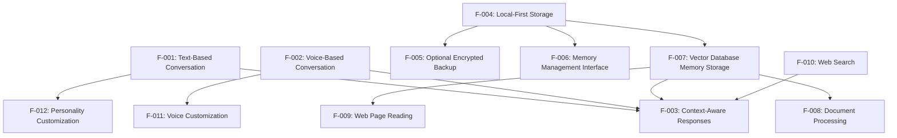
```mermaid
graph TD
    F001[F-001: Text-Based Conversation] --> F003[F-003: Context-Aware Responses]
    F001 --> F012[F-012: Personality Customization]
    F002[F-002: Voice-Based Conversation] --> F003
    F002 --> F011[F-011: Voice Customization]
    F004[F-004: Local-First Storage] --> F005[F-005: Optional Encrypted Backup]
    F004 --> F006[F-006: Memory Management Interface]
    F004 --> F007[F-007: Vector Database Memory Storage]
    F007 --> F003
    F007 --> F008[F-008: Document Processing]
    F007 --> F009[F-009: Web Page Reading]
    F010[F-010: Web Search] --> F003
```

#### 2.3.2 Integration Points

| Integration Point | Connected Features | Description |
|-------------------|-------------------|-------------|
| User Interface | F-001, F-002, F-006, F-011, F-012 | Frontend components for user interaction |
| Memory System | F-003, F-004, F-006, F-007 | Storage and retrieval of conversation history and knowledge |
| Content Processing | F-008, F-009, F-010 | Processing and extraction of information from documents and web |
| Voice System | F-002, F-011 | Speech recognition and synthesis pipeline |

#### 2.3.3 Shared Components

| Component | Used By Features | Description |
|-----------|------------------|-------------|
| Vector Database | F-003, F-007, F-008, F-009 | Stores and retrieves embeddings for text content |
| LLM Integration | F-001, F-003, F-008, F-009, F-010, F-012 | Processes natural language and generates responses |
| Local Storage | F-001, F-003, F-004, F-006, F-007 | Manages persistent data on user's device |
| User Settings | F-002, F-005, F-006, F-011, F-012 | Stores and applies user preferences |

### 2.4 IMPLEMENTATION CONSIDERATIONS

#### 2.4.1 Technical Constraints

| Feature | Constraints |
|---------|-------------|
| F-001, F-003 | LLM token limits and context window size |
| F-002 | Audio quality, background noise, accent variations |
| F-004, F-007 | Local storage capacity limitations |
| F-008 | Document format compatibility and parsing accuracy |
| F-010 | API rate limits, search result quality |

#### 2.4.2 Performance Requirements

| Feature | Performance Requirements |
|---------|--------------------------|
| F-001 | Response generation < 2 seconds |
| F-002 | Speech recognition < 1 second, TTS generation < 1 second |
| F-003 | Context retrieval < 100ms |
| F-007 | Vector similarity search < 200ms |
| F-008 | Document processing < 5 seconds per page |

#### 2.4.3 Security Implications

| Feature | Security Considerations |
|---------|-------------------------|
| F-004 | Local data encryption, secure storage permissions |
| F-005 | End-to-end encryption for cloud backup, secure key management |
| F-008 | Safe document parsing to prevent malicious code execution |
| F-009 | Secure web content handling, URL validation |
| F-010 | API key security, safe handling of search results |

#### 2.4.4 Traceability Matrix

| Requirement ID | Feature ID | User Need | Technical Implementation |
|----------------|------------|-----------|--------------------------|
| F-001-RQ-001 | F-001 | Text interaction | Chat UI + LLM integration |
| F-002-RQ-001 | F-002 | Voice interaction | Whisper STT + audio capture |
| F-002-RQ-002 | F-002 | Voice responses | ElevenLabs/Coqui TTS |
| F-003-RQ-001 | F-003 | Contextual memory | Vector DB + context window |
| F-004-RQ-001 | F-004 | Privacy protection | Local SQLite/ChromaDB |
| F-007-RQ-001 | F-007 | Knowledge storage | Vector embeddings + similarity search |
| F-008-RQ-001 | F-008 | Document analysis | PyMuPDF + content extraction |
| F-010-RQ-001 | F-010 | Current information | SerpAPI/DuckDuckGo integration |
| F-012-RQ-001 | F-012 | Personalization | Prompt templates + settings UI |

## 3. TECHNOLOGY STACK

### 3.1 PROGRAMMING LANGUAGES

| Component | Language | Version | Justification |
|-----------|----------|---------|---------------|
| Backend | Python | 3.11+ | Extensive AI/ML library support, efficient for vector operations, and compatibility with most LLM frameworks |
| Frontend Web | TypeScript | 5.0+ | Type safety for complex UI interactions, improved maintainability, and better developer experience |
| Frontend Mobile | TypeScript | 5.0+ | Code sharing with web frontend, consistent development experience across platforms |
| Data Processing | Python | 3.11+ | Rich ecosystem for document parsing, text processing, and vector operations |

**Selection Criteria:**
- Python selected for its extensive AI/ML ecosystem, readability, and cross-platform compatibility
- TypeScript chosen over JavaScript for type safety, better IDE support, and reduced runtime errors
- Version requirements set to ensure compatibility with modern AI libraries and frameworks

### 3.2 FRAMEWORKS & LIBRARIES

#### 3.2.1 Backend Frameworks

| Framework | Version | Purpose | Justification |
|-----------|---------|---------|---------------|
| FastAPI | 0.104.0+ | API Server | High performance, async support, automatic OpenAPI documentation |
| LangChain | 0.0.335+ | LLM Orchestration | Simplifies context management, memory integration, and document processing |
| ChromaDB | 0.4.18+ | Vector Database | Efficient similarity search, local-first architecture, Python native |
| PyTorch | 2.1.0+ | ML Operations | Required for local embedding generation and potential local LLM support |

#### 3.2.2 Frontend Frameworks

| Framework | Version | Purpose | Justification |
|-----------|---------|---------|---------------|
| Next.js | 14.0.0+ | Web Framework | Server-side rendering, optimized performance, TypeScript integration |
| React Native | 0.72.0+ | Mobile Framework | Cross-platform mobile development with TypeScript support |
| TailwindCSS | 3.3.0+ | UI Styling | Utility-first approach for consistent design across platforms |
| Zustand | 4.4.0+ | State Management | Lightweight alternative to Redux, simpler API for state management |

#### 3.2.3 Core Libraries

| Library | Version | Purpose | Justification |
|---------|---------|---------|---------------|
| OpenAI | 1.3.0+ | LLM Integration | Access to GPT-4o for high-quality responses |
| Whisper | 20231117 | Speech-to-Text | High accuracy speech recognition with multilingual support |
| ElevenLabs | 0.2.26+ | Text-to-Speech | High-quality voice synthesis with customization options |
| PyMuPDF | 1.23.0+ | PDF Processing | Efficient PDF parsing and text extraction |
| BeautifulSoup4 | 4.12.0+ | Web Scraping | HTML parsing for web content extraction |
| SerpAPI | 0.1.0+ | Web Search | Structured search results from multiple engines |

**Compatibility Requirements:**
- All Python libraries must support Python 3.11+
- Frontend libraries must support modern browser APIs
- Mobile libraries must support iOS 14+ and Android 10+

### 3.3 DATABASES & STORAGE

| Database | Version | Purpose | Justification |
|----------|---------|---------|---------------|
| ChromaDB | 0.4.18+ | Vector Storage | Efficient similarity search, local-first architecture |
| SQLite | 3.42.0+ | Relational Data | Lightweight, serverless, perfect for local-first approach |
| IndexedDB | Browser API | Client-side Storage | Web browser persistent storage for offline capabilities |

**Data Persistence Strategies:**
- Primary data stored locally in SQLite database
- Vector embeddings stored in ChromaDB for efficient similarity search
- Optional encrypted backup to user-specified cloud storage
- Temporary caching of web search results and document processing

**Caching Solutions:**
- In-memory LRU cache for frequent vector queries
- Local file system cache for processed documents
- Browser cache for web application assets

### 3.4 THIRD-PARTY SERVICES

| Service | Purpose | Integration Method | Justification |
|---------|---------|-------------------|---------------|
| OpenAI API | LLM Access | REST API | Access to GPT-4o for high-quality responses |
| ElevenLabs API | Voice Synthesis | REST API | High-quality voice customization |
| SerpAPI | Web Search | REST API | Structured search results from multiple engines |
| S3-compatible Storage | Optional Backup | SDK | User-controlled encrypted cloud backup |

**Security Considerations:**
- API keys stored locally in encrypted format
- No user data sent to third-party services without explicit consent
- All external API calls proxied through local backend
- Optional services disabled by default

### 3.5 DEVELOPMENT & DEPLOYMENT

#### 3.5.1 Development Tools

| Tool | Version | Purpose | Justification |
|------|---------|---------|---------------|
| VS Code | Latest | IDE | Cross-platform, extensive plugin support |
| Poetry | 1.6.0+ | Python Dependency Management | Reproducible builds, virtual environment management |
| pnpm | 8.0.0+ | JavaScript Package Manager | Faster than npm, disk space efficient |
| ESLint | 8.0.0+ | Code Linting | Enforce code quality standards |
| Pytest | 7.4.0+ | Testing Framework | Comprehensive testing for Python components |
| Jest | 29.0.0+ | JavaScript Testing | React component and utility testing |

#### 3.5.2 Build & Deployment

| Tool | Version | Purpose | Justification |
|------|---------|---------|---------------|
| Docker | 24.0.0+ | Containerization | Consistent development and deployment environments |
| Electron | 27.0.0+ | Desktop Packaging | Cross-platform desktop application distribution |
| React Native CLI | 10.0.0+ | Mobile Packaging | iOS and Android application building |
| GitHub Actions | N/A | CI/CD | Automated testing and building |

**Deployment Targets:**
- Desktop: Windows 10+, macOS 12+, Ubuntu 20.04+
- Mobile: iOS 14+, Android 10+
- Web: Progressive Web App for browser access

**Distribution Methods:**
- Desktop: Direct download, app stores
- Mobile: App Store, Google Play
- Self-hosted option for privacy-focused users

### 3.6 ARCHITECTURE DIAGRAM

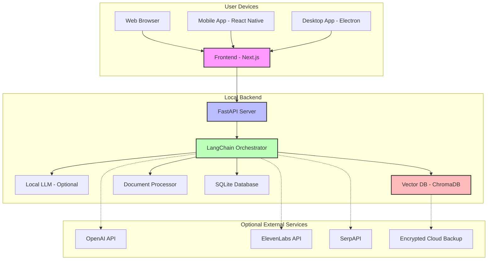
```mermaid
graph TD
    subgraph "User Devices"
        A[Web Browser] --> B[Frontend - Next.js]
        C[Mobile App - React Native] --> B
        D[Desktop App - Electron] --> B
    end
    
    subgraph "Local Backend"
        B --> E[FastAPI Server]
        E --> F[LangChain Orchestrator]
        F --> G[Local LLM - Optional]
        F --> H[Vector DB - ChromaDB]
        F --> I[Document Processor]
        F --> J[SQLite Database]
    end
    
    subgraph "Optional External Services"
        F -.-> K[OpenAI API]
        F -.-> L[ElevenLabs API]
        F -.-> M[SerpAPI]
        H -.-> N[Encrypted Cloud Backup]
    end
    
    style B fill:#f9f,stroke:#333,stroke-width:2px
    style E fill:#bbf,stroke:#333,stroke-width:2px
    style F fill:#bfb,stroke:#333,stroke-width:2px
    style H fill:#fbb,stroke:#333,stroke-width:2px
```

## 4. PROCESS FLOWCHART

### 4.1 SYSTEM WORKFLOWS

#### 4.1.1 Core Business Processes

##### User Onboarding and Setup Flow

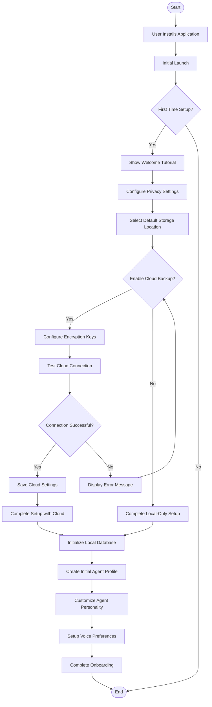
```mermaid
flowchart TD
    Start([Start]) --> A[User Installs Application]
    A --> B[Initial Launch]
    B --> C{First Time Setup?}
    C -->|Yes| D[Show Welcome Tutorial]
    C -->|No| Z([End])
    D --> E[Configure Privacy Settings]
    E --> F[Select Default Storage Location]
    F --> G{Enable Cloud Backup?}
    G -->|Yes| H[Configure Encryption Keys]
    G -->|No| I[Complete Local-Only Setup]
    H --> J[Test Cloud Connection]
    J --> K{Connection Successful?}
    K -->|Yes| L[Save Cloud Settings]
    K -->|No| M[Display Error Message]
    M --> G
    L --> N[Complete Setup with Cloud]
    I --> O[Initialize Local Database]
    N --> O
    O --> P[Create Initial Agent Profile]
    P --> Q[Customize Agent Personality]
    Q --> R[Setup Voice Preferences]
    R --> S[Complete Onboarding]
    S --> Z
```

##### Conversation Interaction Flow

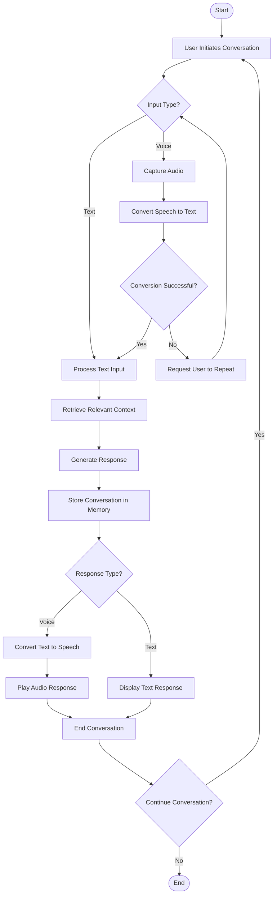
```mermaid
flowchart TD
    Start([Start]) --> A[User Initiates Conversation]
    A --> B{Input Type?}
    B -->|Text| C[Process Text Input]
    B -->|Voice| D[Capture Audio]
    D --> E[Convert Speech to Text]
    E --> F{Conversion Successful?}
    F -->|No| G[Request User to Repeat]
    G --> B
    F -->|Yes| C
    C --> H[Retrieve Relevant Context]
    H --> I[Generate Response]
    I --> J[Store Conversation in Memory]
    J --> K{Response Type?}
    K -->|Text| L[Display Text Response]
    K -->|Voice| M[Convert Text to Speech]
    M --> N[Play Audio Response]
    N --> O[End Conversation]
    L --> O
    O --> P{Continue Conversation?}
    P -->|Yes| A
    P -->|No| End([End])
```

##### Document Processing Flow

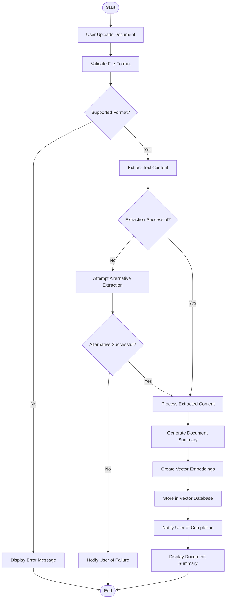
```mermaid
flowchart TD
    Start([Start]) --> A[User Uploads Document]
    A --> B[Validate File Format]
    B --> C{Supported Format?}
    C -->|No| D[Display Error Message]
    D --> End([End])
    C -->|Yes| E[Extract Text Content]
    E --> F{Extraction Successful?}
    F -->|No| G[Attempt Alternative Extraction]
    G --> H{Alternative Successful?}
    H -->|No| I[Notify User of Failure]
    I --> End
    H -->|Yes| J[Process Extracted Content]
    F -->|Yes| J
    J --> K[Generate Document Summary]
    K --> L[Create Vector Embeddings]
    L --> M[Store in Vector Database]
    M --> N[Notify User of Completion]
    N --> O[Display Document Summary]
    O --> End
```

##### Web Search and Information Retrieval

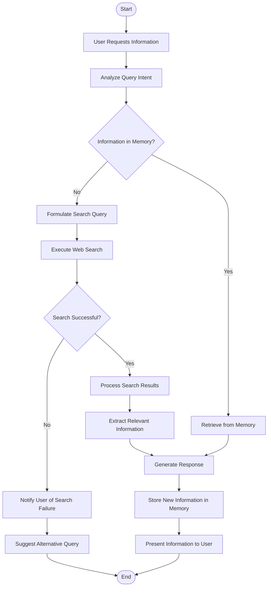
```mermaid
flowchart TD
    Start([Start]) --> A[User Requests Information]
    A --> B[Analyze Query Intent]
    B --> C{Information in Memory?}
    C -->|Yes| D[Retrieve from Memory]
    C -->|No| E[Formulate Search Query]
    E --> F[Execute Web Search]
    F --> G{Search Successful?}
    G -->|No| H[Notify User of Search Failure]
    H --> I[Suggest Alternative Query]
    I --> End([End])
    G -->|Yes| J[Process Search Results]
    J --> K[Extract Relevant Information]
    K --> L[Generate Response]
    L --> M[Store New Information in Memory]
    M --> N[Present Information to User]
    D --> L
    N --> End
```

#### 4.1.2 Integration Workflows

##### Memory Retrieval and Context Management

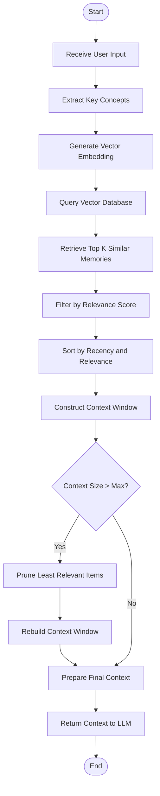
```mermaid
flowchart TD
    Start([Start]) --> A[Receive User Input]
    A --> B[Extract Key Concepts]
    B --> C[Generate Vector Embedding]
    C --> D[Query Vector Database]
    D --> E[Retrieve Top K Similar Memories]
    E --> F[Filter by Relevance Score]
    F --> G[Sort by Recency and Relevance]
    G --> H[Construct Context Window]
    H --> I{Context Size > Max?}
    I -->|Yes| J[Prune Least Relevant Items]
    J --> K[Rebuild Context Window]
    K --> L[Prepare Final Context]
    I -->|No| L
    L --> M[Return Context to LLM]
    M --> End([End])
```

##### External API Integration Flow

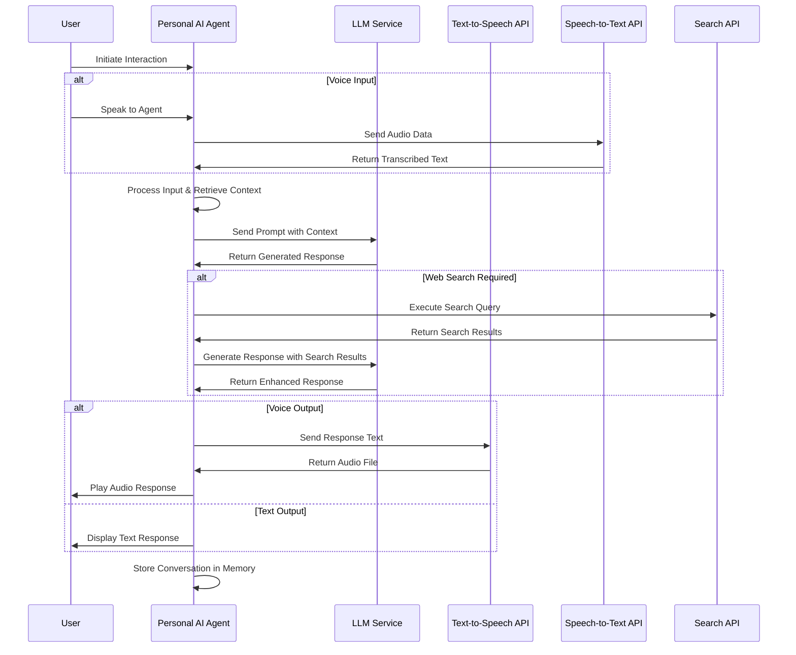
```mermaid
sequenceDiagram
    participant User
    participant App as Personal AI Agent
    participant LLM as LLM Service
    participant TTS as Text-to-Speech API
    participant STT as Speech-to-Text API
    participant Search as Search API
    
    User->>App: Initiate Interaction
    
    alt Voice Input
        User->>App: Speak to Agent
        App->>STT: Send Audio Data
        STT->>App: Return Transcribed Text
    end
    
    App->>App: Process Input & Retrieve Context
    App->>LLM: Send Prompt with Context
    LLM->>App: Return Generated Response
    
    alt Web Search Required
        App->>Search: Execute Search Query
        Search->>App: Return Search Results
        App->>LLM: Generate Response with Search Results
        LLM->>App: Return Enhanced Response
    end
    
    alt Voice Output
        App->>TTS: Send Response Text
        TTS->>App: Return Audio File
        App->>User: Play Audio Response
    else Text Output
        App->>User: Display Text Response
    end
    
    App->>App: Store Conversation in Memory
```

##### Optional Cloud Backup Synchronization

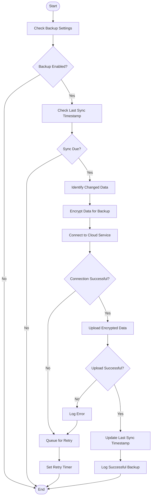
```mermaid
flowchart TD
    Start([Start]) --> A[Check Backup Settings]
    A --> B{Backup Enabled?}
    B -->|No| End([End])
    B -->|Yes| C[Check Last Sync Timestamp]
    C --> D{Sync Due?}
    D -->|No| End
    D -->|Yes| E[Identify Changed Data]
    E --> F[Encrypt Data for Backup]
    F --> G[Connect to Cloud Service]
    G --> H{Connection Successful?}
    H -->|No| I[Queue for Retry]
    I --> J[Set Retry Timer]
    J --> End
    H -->|Yes| K[Upload Encrypted Data]
    K --> L{Upload Successful?}
    L -->|No| M[Log Error]
    M --> I
    L -->|Yes| N[Update Last Sync Timestamp]
    N --> O[Log Successful Backup]
    O --> End
```

### 4.2 FLOWCHART REQUIREMENTS

#### 4.2.1 User Authentication and Privacy Flow

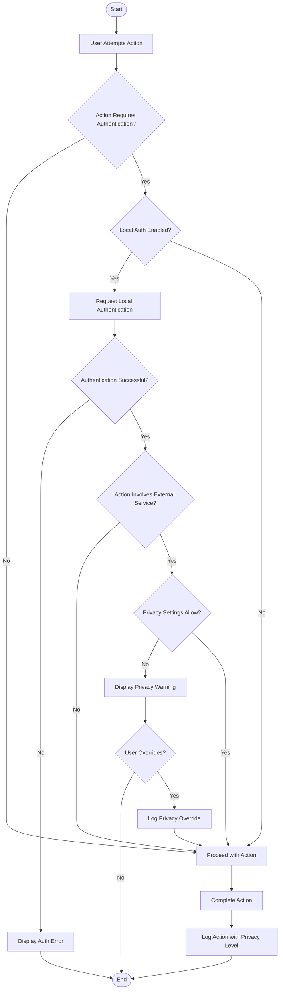
```mermaid
flowchart TD
    Start([Start]) --> A[User Attempts Action]
    A --> B{Action Requires Authentication?}
    B -->|No| C[Proceed with Action]
    B -->|Yes| D{Local Auth Enabled?}
    D -->|Yes| E[Request Local Authentication]
    D -->|No| C
    E --> F{Authentication Successful?}
    F -->|No| G[Display Auth Error]
    G --> End([End])
    F -->|Yes| H{Action Involves External Service?}
    H -->|No| C
    H -->|Yes| I{Privacy Settings Allow?}
    I -->|No| J[Display Privacy Warning]
    J --> K{User Overrides?}
    K -->|No| End
    K -->|Yes| L[Log Privacy Override]
    L --> C
    I -->|Yes| C
    C --> M[Complete Action]
    M --> N[Log Action with Privacy Level]
    N --> End
```

#### 4.2.2 Memory Management Workflow

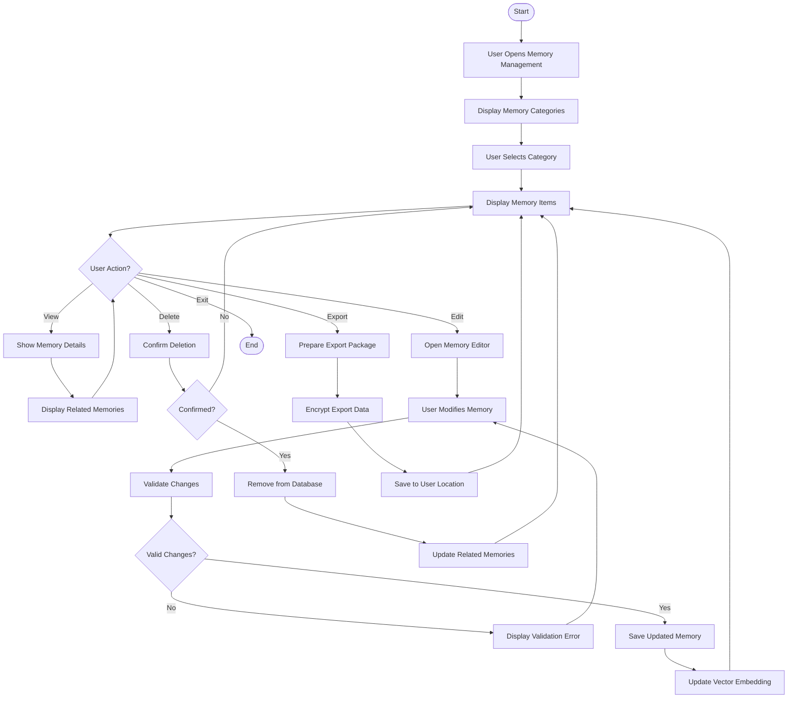
```mermaid
flowchart TD
    Start([Start]) --> A[User Opens Memory Management]
    A --> B[Display Memory Categories]
    B --> C[User Selects Category]
    C --> D[Display Memory Items]
    D --> E{User Action?}
    E -->|View| F[Show Memory Details]
    F --> G[Display Related Memories]
    G --> E
    E -->|Edit| H[Open Memory Editor]
    H --> I[User Modifies Memory]
    I --> J[Validate Changes]
    J --> K{Valid Changes?}
    K -->|No| L[Display Validation Error]
    L --> I
    K -->|Yes| M[Save Updated Memory]
    M --> N[Update Vector Embedding]
    N --> D
    E -->|Delete| O[Confirm Deletion]
    O --> P{Confirmed?}
    P -->|No| D
    P -->|Yes| Q[Remove from Database]
    Q --> R[Update Related Memories]
    R --> D
    E -->|Export| S[Prepare Export Package]
    S --> T[Encrypt Export Data]
    T --> U[Save to User Location]
    U --> D
    E -->|Exit| End([End])
```

#### 4.2.3 Error Handling and Recovery Flow

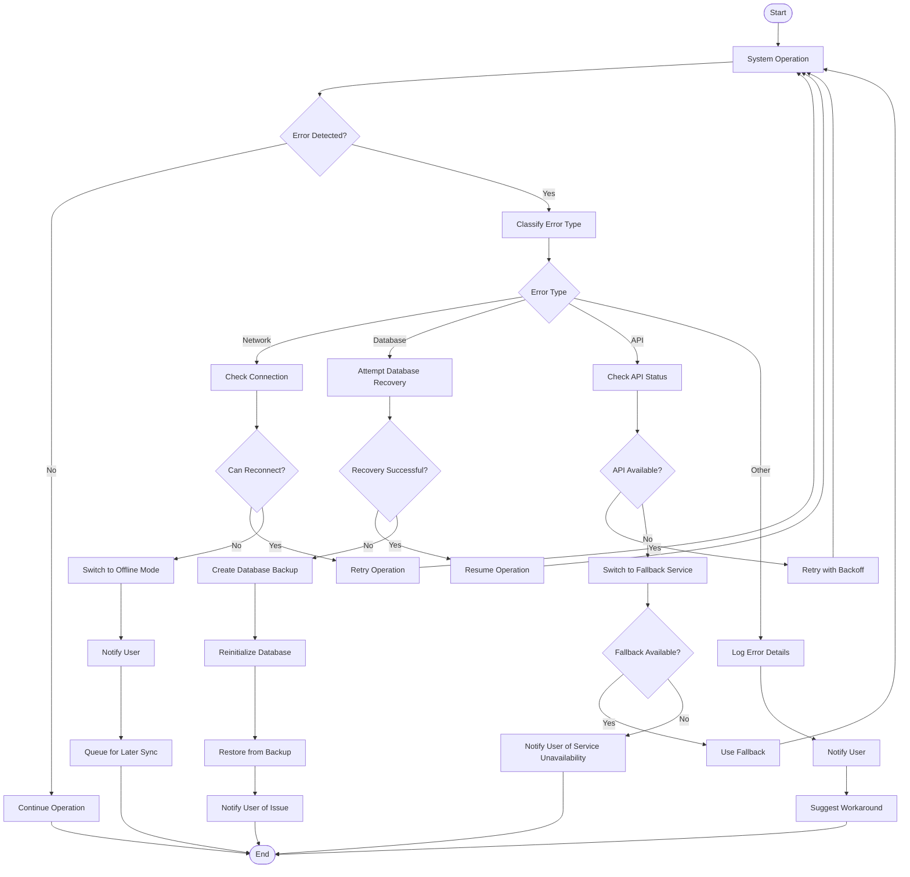
```mermaid
flowchart TD
    Start([Start]) --> A[System Operation]
    A --> B{Error Detected?}
    B -->|No| C[Continue Operation]
    C --> End([End])
    B -->|Yes| D[Classify Error Type]
    D --> E{Error Type}
    E -->|Network| F[Check Connection]
    F --> G{Can Reconnect?}
    G -->|Yes| H[Retry Operation]
    H --> A
    G -->|No| I[Switch to Offline Mode]
    I --> J[Notify User]
    J --> K[Queue for Later Sync]
    K --> End
    E -->|Database| L[Attempt Database Recovery]
    L --> M{Recovery Successful?}
    M -->|Yes| N[Resume Operation]
    N --> A
    M -->|No| O[Create Database Backup]
    O --> P[Reinitialize Database]
    P --> Q[Restore from Backup]
    Q --> R[Notify User of Issue]
    R --> End
    E -->|API| S[Check API Status]
    S --> T{API Available?}
    T -->|Yes| U[Retry with Backoff]
    U --> A
    T -->|No| V[Switch to Fallback Service]
    V --> W{Fallback Available?}
    W -->|Yes| X[Use Fallback]
    X --> A
    W -->|No| Y[Notify User of Service Unavailability]
    Y --> End
    E -->|Other| Z[Log Error Details]
    Z --> AA[Notify User]
    AA --> AB[Suggest Workaround]
    AB --> End
```

### 4.3 TECHNICAL IMPLEMENTATION

#### 4.3.1 State Management Flow

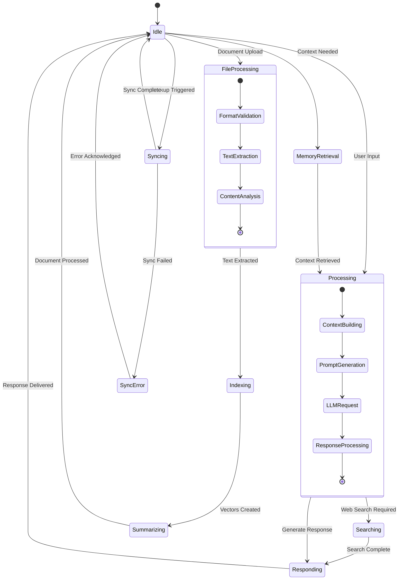
```mermaid
stateDiagram-v2
    [*] --> Idle
    Idle --> Processing: User Input
    Processing --> Responding: Generate Response
    Processing --> Searching: Web Search Required
    Searching --> Responding: Search Complete
    Responding --> Idle: Response Delivered
    
    Idle --> FileProcessing: Document Upload
    FileProcessing --> Indexing: Text Extracted
    Indexing --> Summarizing: Vectors Created
    Summarizing --> Idle: Document Processed
    
    Idle --> Syncing: Backup Triggered
    Syncing --> Idle: Sync Complete
    Syncing --> SyncError: Sync Failed
    SyncError --> Idle: Error Acknowledged
    
    Idle --> MemoryRetrieval: Context Needed
    MemoryRetrieval --> Processing: Context Retrieved
    
    state Processing {
        [*] --> ContextBuilding
        ContextBuilding --> PromptGeneration
        PromptGeneration --> LLMRequest
        LLMRequest --> ResponseProcessing
        ResponseProcessing --> [*]
    }
    
    state FileProcessing {
        [*] --> FormatValidation
        FormatValidation --> TextExtraction
        TextExtraction --> ContentAnalysis
        ContentAnalysis --> [*]
    }
```

#### 4.3.2 Transaction Boundaries and Data Persistence

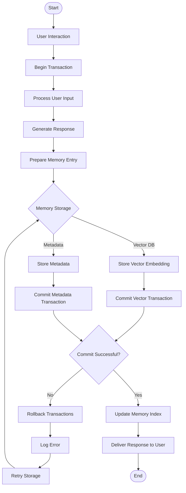
```mermaid
flowchart TD
    Start([Start]) --> A[User Interaction]
    A --> B[Begin Transaction]
    B --> C[Process User Input]
    C --> D[Generate Response]
    D --> E[Prepare Memory Entry]
    E --> F{Memory Storage}
    F -->|Vector DB| G[Store Vector Embedding]
    F -->|Metadata| H[Store Metadata]
    G --> I[Commit Vector Transaction]
    H --> J[Commit Metadata Transaction]
    I --> K{Commit Successful?}
    J --> K
    K -->|No| L[Rollback Transactions]
    L --> M[Log Error]
    M --> N[Retry Storage]
    N --> F
    K -->|Yes| O[Update Memory Index]
    O --> P[Deliver Response to User]
    P --> End([End])
```

#### 4.3.3 Caching and Performance Optimization

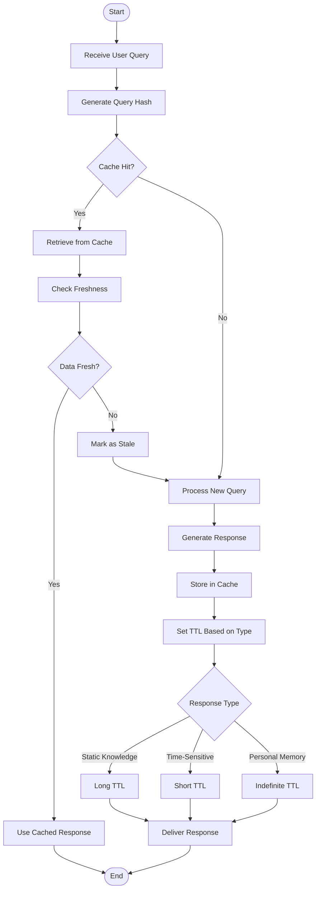
```mermaid
flowchart TD
    Start([Start]) --> A[Receive User Query]
    A --> B[Generate Query Hash]
    B --> C{Cache Hit?}
    C -->|Yes| D[Retrieve from Cache]
    D --> E[Check Freshness]
    E --> F{Data Fresh?}
    F -->|Yes| G[Use Cached Response]
    G --> End([End])
    F -->|No| H[Mark as Stale]
    C -->|No| I[Process New Query]
    H --> I
    I --> J[Generate Response]
    J --> K[Store in Cache]
    K --> L[Set TTL Based on Type]
    L --> M{Response Type}
    M -->|Static Knowledge| N[Long TTL]
    M -->|Time-Sensitive| O[Short TTL]
    M -->|Personal Memory| P[Indefinite TTL]
    N --> Q[Deliver Response]
    O --> Q
    P --> Q
    Q --> End
```

### 4.4 VALIDATION RULES

#### 4.4.1 Business Rules Enforcement

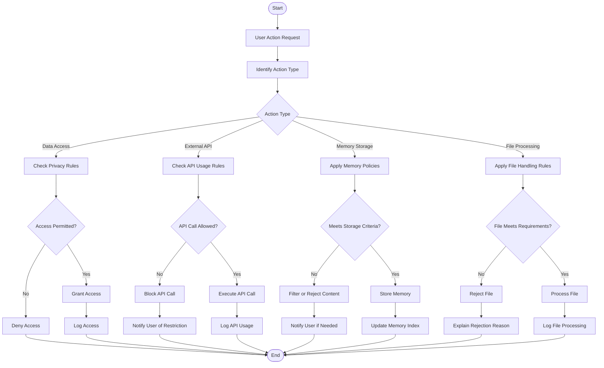
```mermaid
flowchart TD
    Start([Start]) --> A[User Action Request]
    A --> B[Identify Action Type]
    B --> C{Action Type}
    
    C -->|Data Access| D[Check Privacy Rules]
    D --> E{Access Permitted?}
    E -->|No| F[Deny Access]
    F --> End([End])
    E -->|Yes| G[Grant Access]
    G --> H[Log Access]
    H --> End
    
    C -->|External API| I[Check API Usage Rules]
    I --> J{API Call Allowed?}
    J -->|No| K[Block API Call]
    K --> L[Notify User of Restriction]
    L --> End
    J -->|Yes| M[Execute API Call]
    M --> N[Log API Usage]
    N --> End
    
    C -->|Memory Storage| O[Apply Memory Policies]
    O --> P{Meets Storage Criteria?}
    P -->|No| Q[Filter or Reject Content]
    Q --> R[Notify User if Needed]
    R --> End
    P -->|Yes| S[Store Memory]
    S --> T[Update Memory Index]
    T --> End
    
    C -->|File Processing| U[Apply File Handling Rules]
    U --> V{File Meets Requirements?}
    V -->|No| W[Reject File]
    W --> X[Explain Rejection Reason]
    X --> End
    V -->|Yes| Y[Process File]
    Y --> Z[Log File Processing]
    Z --> End
```

#### 4.4.2 Data Validation Flow

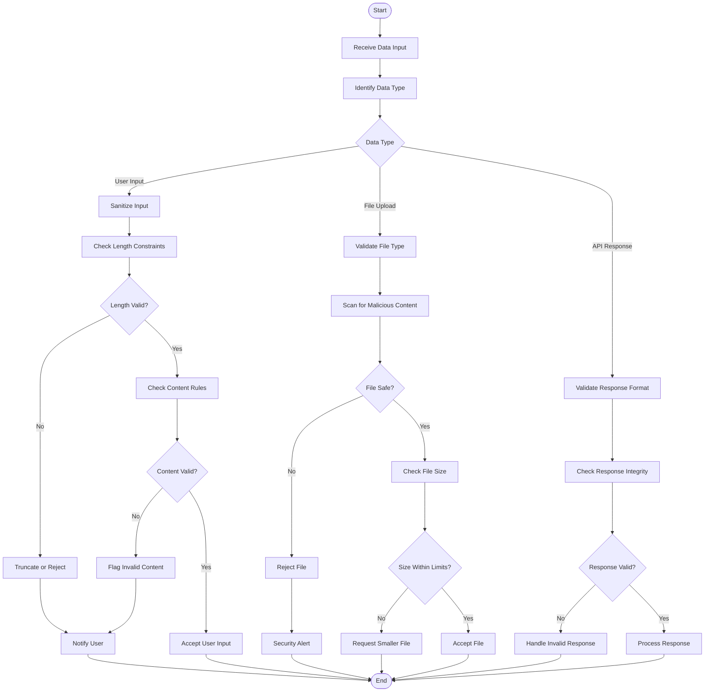
```mermaid
flowchart TD
    Start([Start]) --> A[Receive Data Input]
    A --> B[Identify Data Type]
    B --> C{Data Type}
    
    C -->|User Input| D[Sanitize Input]
    D --> E[Check Length Constraints]
    E --> F{Length Valid?}
    F -->|No| G[Truncate or Reject]
    G --> H[Notify User]
    H --> End([End])
    F -->|Yes| I[Check Content Rules]
    I --> J{Content Valid?}
    J -->|No| K[Flag Invalid Content]
    K --> H
    J -->|Yes| L[Accept User Input]
    L --> End
    
    C -->|File Upload| M[Validate File Type]
    M --> N[Scan for Malicious Content]
    N --> O{File Safe?}
    O -->|No| P[Reject File]
    P --> Q[Security Alert]
    Q --> End
    O -->|Yes| R[Check File Size]
    R --> S{Size Within Limits?}
    S -->|No| T[Request Smaller File]
    T --> End
    S -->|Yes| U[Accept File]
    U --> End
    
    C -->|API Response| V[Validate Response Format]
    V --> W[Check Response Integrity]
    W --> X{Response Valid?}
    X -->|No| Y[Handle Invalid Response]
    Y --> End
    X -->|Yes| Z[Process Response]
    Z --> End
```

### 4.5 INTEGRATION SEQUENCE DIAGRAMS

#### 4.5.1 LLM Integration Sequence

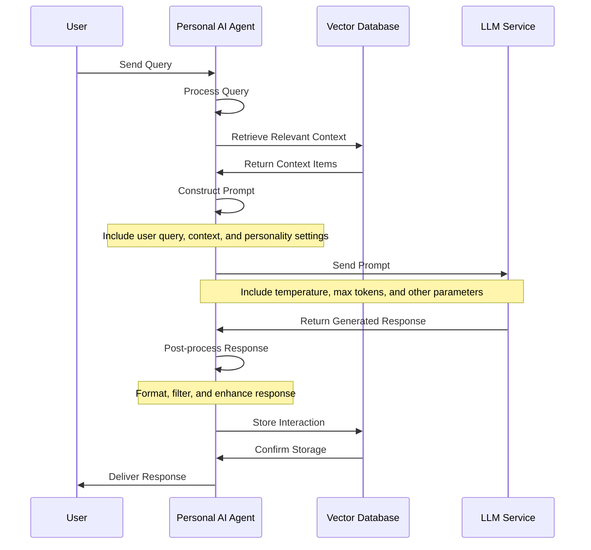
```mermaid
sequenceDiagram
    participant User
    participant App as Personal AI Agent
    participant Memory as Vector Database
    participant LLM as LLM Service
    
    User->>App: Send Query
    App->>App: Process Query
    App->>Memory: Retrieve Relevant Context
    Memory->>App: Return Context Items
    
    App->>App: Construct Prompt
    Note over App: Include user query, context, and personality settings
    
    App->>LLM: Send Prompt
    Note over App,LLM: Include temperature, max tokens, and other parameters
    
    LLM->>App: Return Generated Response
    
    App->>App: Post-process Response
    Note over App: Format, filter, and enhance response
    
    App->>Memory: Store Interaction
    Memory->>App: Confirm Storage
    
    App->>User: Deliver Response
```

#### 4.5.2 Document Processing Integration

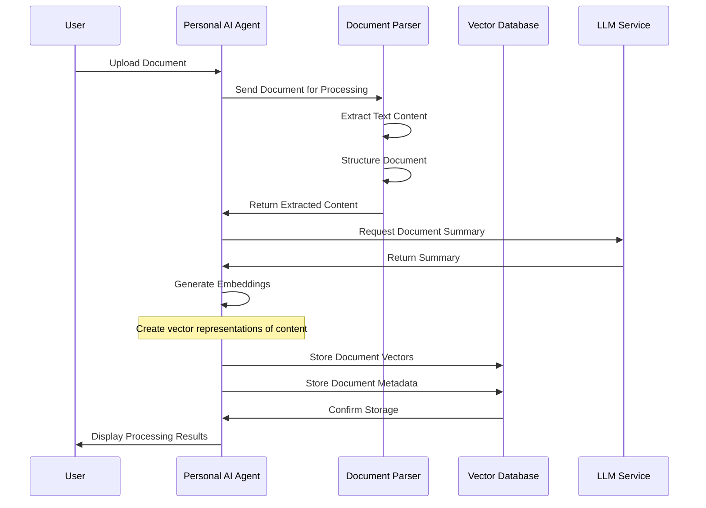
```mermaid
sequenceDiagram
    participant User
    participant App as Personal AI Agent
    participant Parser as Document Parser
    participant Memory as Vector Database
    participant LLM as LLM Service
    
    User->>App: Upload Document
    App->>Parser: Send Document for Processing
    Parser->>Parser: Extract Text Content
    Parser->>Parser: Structure Document
    Parser->>App: Return Extracted Content
    
    App->>LLM: Request Document Summary
    LLM->>App: Return Summary
    
    App->>App: Generate Embeddings
    Note over App: Create vector representations of content
    
    App->>Memory: Store Document Vectors
    App->>Memory: Store Document Metadata
    Memory->>App: Confirm Storage
    
    App->>User: Display Processing Results
```

#### 4.5.3 Web Search Integration

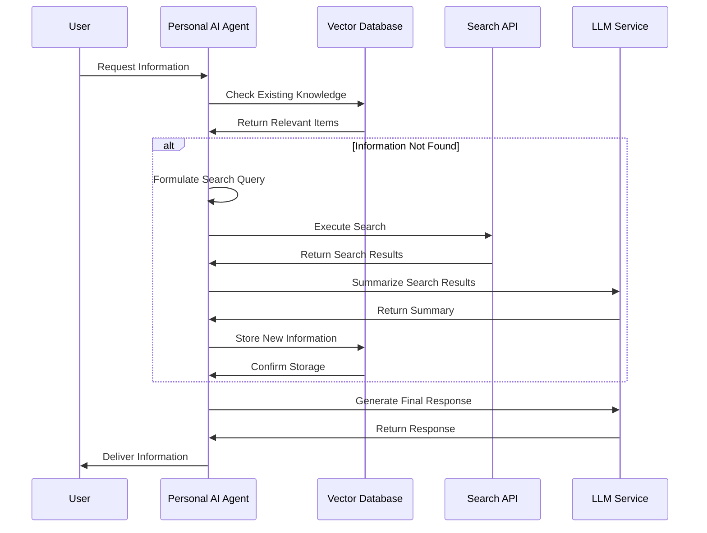
```mermaid
sequenceDiagram
    participant User
    participant App as Personal AI Agent
    participant Memory as Vector Database
    participant Search as Search API
    participant LLM as LLM Service
    
    User->>App: Request Information
    App->>Memory: Check Existing Knowledge
    Memory->>App: Return Relevant Items
    
    alt Information Not Found
        App->>App: Formulate Search Query
        App->>Search: Execute Search
        Search->>App: Return Search Results
        
        App->>LLM: Summarize Search Results
        LLM->>App: Return Summary
        
        App->>Memory: Store New Information
        Memory->>App: Confirm Storage
    end
    
    App->>LLM: Generate Final Response
    LLM->>App: Return Response
    
    App->>User: Deliver Information
```

### 4.6 ERROR HANDLING FLOWCHARTS

#### 4.6.1 LLM Service Error Handling

```mermaid
flowchart TD
    Start([Start]) --> A[Send Request to LLM]
    A --> B{Response Status?}
    B -->|Success| C[Process Response]
    C --> End([End])
    
    B -->|Rate Limit| D[Implement Exponential Backoff]
    D --> E[Wait for Backoff Period]
    E --> F{Retry Count < Max?}
    F -->|Yes| G[Increment Retry Counter]
    G --> A
    F -->|No| H[Switch to Fallback LLM]
    H --> I{Fallback Available?}
    I -->|Yes| J[Send Request to Fallback]
    J --> K{Fallback Successful?}
    K -->|Yes| C
    K -->|No| L[Use Cached Response if Available]
    I -->|No| L
    L --> M{Cache Available?}
    M -->|Yes| N[Deliver Cached Response]
    N --> O[Notify User of Service Issue]
    O --> End
    M -->|No| P[Generate Basic Response]
    P --> Q[Notify User of Limited Functionality]
    Q --> End
    
    B -->|Timeout| R[Check Network Connection]
    R --> S{Connection OK?}
    S -->|Yes| D
    S -->|No| T[Switch to Offline Mode]
    T --> U[Use Local Fallbacks]
    U --> V[Notify User of Offline Status]
    V --> End
    
    B -->|Invalid Input| W[Log Input Error]
    W --> X[Sanitize Input]
    X --> Y[Retry with Fixed Input]
    Y --> A
    
    B -->|Server Error| Z[Log Error Details]
    Z --> AA[Wait for Short Period]
    AA --> AB{Critical Request?}
    AB -->|Yes| D
    AB -->|No| AC[Notify User of Service Issue]
    AC --> End
```

#### 4.6.2 Database Error Recovery

```mermaid
flowchart TD
    Start([Start]) --> A[Database Operation]
    A --> B{Operation Result?}
    B -->|Success| C[Complete Operation]
    C --> End([End])
    
    B -->|Corruption| D[Create Database Snapshot]
    D --> E[Attempt Repair]
    E --> F{Repair Successful?}
    F -->|Yes| G[Resume Operation]
    G --> End
    F -->|No| H[Restore from Last Backup]
    H --> I{Restore Successful?}
    I -->|Yes| J[Replay Transactions Since Backup]
    J --> K[Resume Operation]
    K --> End
    I -->|No| L[Initialize New Database]
    L --> M[Import Essential Data]
    M --> N[Notify User of Data Loss]
    N --> O[Resume with Limited Data]
    O --> End
    
    B -->|Lock Timeout| P[Release Resources]
    P --> Q[Wait Random Interval]
    Q --> R[Retry Operation]
    R --> B
    
    B -->|Disk Full| S[Clear Temporary Files]
    S --> T[Compress Database if Possible]
    T --> U{Space Available?}
    U -->|Yes| V[Retry Operation]
    V --> B
    U -->|No| W[Notify User of Storage Issue]
    W --> X[Suggest Data Cleanup]
    X --> End
    
    B -->|Connection Lost| Y[Attempt Reconnection]
    Y --> Z{Reconnection Successful?}
    Z -->|Yes| AA[Retry Operation]
    AA --> B
    Z -->|No| AB[Switch to In-Memory Mode]
    AB --> AC[Queue Operations for Later]
    AC --> AD[Notify User of Connection Issue]
    AD --> End
```

### 4.7 STATE TRANSITION DIAGRAMS

#### 4.7.1 Conversation State Transitions

```mermaid
stateDiagram-v2
    [*] --> Idle
    
    Idle --> Listening: User Activates
    Listening --> Processing: Input Received
    Processing --> Thinking: Input Processed
    Thinking --> Responding: Response Generated
    Responding --> Idle: Response Delivered
    
    Listening --> Idle: Timeout
    Processing --> Error: Processing Failed
    Thinking --> Error: Generation Failed
    Error --> Idle: Error Handled
    
    Idle --> Searching: Search Requested
    Searching --> Thinking: Search Results Received
    Searching --> Error: Search Failed
    
    Idle --> Reading: Document Uploaded
    Reading --> Processing: Document Read
    Reading --> Error: Reading Failed
    
    state Thinking {
        [*] --> ContextRetrieval
        ContextRetrieval --> PromptConstruction
        PromptConstruction --> LLMGeneration
        LLMGeneration --> ResponseFormatting
        ResponseFormatting --> [*]
    }
    
    state Error {
        [*] --> ErrorClassification
        ErrorClassification --> UserNotification
        ErrorClassification --> RecoveryAttempt
        RecoveryAttempt --> RetryOperation
        RetryOperation --> [*]
        UserNotification --> [*]
    }
```

#### 4.7.2 Memory Management State Transitions

```mermaid
stateDiagram-v2
    [*] --> Ready
    
    Ready --> Storing: New Memory Created
    Storing --> Indexing: Storage Complete
    Indexing --> Ready: Indexing Complete
    
    Ready --> Retrieving: Memory Requested
    Retrieving --> Filtering: Raw Results Retrieved
    Filtering --> Ranking: Results Filtered
    Ranking --> Ready: Results Delivered
    
    Ready --> Updating: Memory Edit Requested
    Updating --> Reindexing: Update Complete
    Reindexing --> Ready: Reindexing Complete
    
    Ready --> Deleting: Deletion Requested
    Deleting --> Cleanup: Deletion Complete
    Cleanup --> Ready: References Updated
    
    Ready --> Backing_Up: Backup Triggered
    Backing_Up --> Encrypting: Data Collected
    Encrypting --> Uploading: Data Encrypted
    Uploading --> Ready: Backup Complete
    
    Ready --> Restoring: Restore Requested
    Restoring --> Downloading: Restore Initiated
    Downloading --> Decrypting: Download Complete
    Decrypting --> Importing: Decryption Complete
    Importing --> Ready: Restore Complete
    
    Storing --> Error: Storage Failed
    Retrieving --> Error: Retrieval Failed
    Updating --> Error: Update Failed
    Deleting --> Error: Deletion Failed
    Backing_Up --> Error: Backup Failed
    Restoring --> Error: Restore Failed
    
    Error --> Ready: Error Handled
```

## 5. SYSTEM ARCHITECTURE

### 5.1 HIGH-LEVEL ARCHITECTURE

#### 5.1.1 System Overview

The Personal AI Agent follows a local-first, modular architecture designed to prioritize user privacy while delivering a responsive and intelligent experience. The system employs a layered architecture with clear separation of concerns between the presentation, application, and data layers.

- **Architectural Style**: The system uses a hybrid architecture combining elements of:
  - Client-side MVC for the user interface
  - Microservices for modular functionality
  - Event-driven architecture for asynchronous processing
  - Repository pattern for data access

- **Key Architectural Principles**:
  - **Privacy by Design**: All user data remains on local devices by default
  - **Modularity**: Loosely coupled components that can be developed and tested independently
  - **Extensibility**: Plugin architecture for adding new capabilities
  - **Resilience**: Graceful degradation when external services are unavailable
  - **Asynchronous Processing**: Non-blocking operations for responsive user experience

- **System Boundaries**:
  - **Internal Boundary**: Local device environment (file system, database, processing)
  - **External Boundary**: Optional cloud services and third-party APIs
  - **Security Boundary**: Encryption for all stored data and external communications

#### 5.1.2 Core Components Table

| Component Name | Primary Responsibility | Key Dependencies | Critical Considerations |
|----------------|------------------------|------------------|-------------------------|
| User Interface | Provide text and voice interaction channels | Frontend Framework, Voice Processing | Accessibility, responsive design, offline capability |
| Conversation Manager | Orchestrate dialog flow and context management | LLM Service, Memory System | Context window management, conversation state tracking |
| Memory System | Store and retrieve user information and conversations | Vector Database, File System | Privacy, efficient retrieval, data integrity |
| Knowledge Processor | Extract, transform, and store information from documents and web | Document Parsers, Web Scrapers | Content extraction accuracy, format support |
| LLM Service | Generate responses based on context and user input | OpenAI API or Local LLM | Response quality, token optimization, fallback mechanisms |
| Voice Processing | Convert between speech and text | STT/TTS Services | Accuracy, latency, voice customization |
| Search Service | Retrieve real-time information from the web | Search API, Web Access | Query formulation, result filtering, source credibility |
| Local Storage | Persist all system data on user's device | File System, SQLite | Data integrity, encryption, backup/restore |
| Cloud Sync (Optional) | Securely back up and synchronize data across devices | Cloud Storage API, Encryption | End-to-end encryption, minimal data exposure |

#### 5.1.3 Data Flow Description

The Personal AI Agent's data flows are designed to keep user data local while enabling rich functionality:

1. **User Interaction Flow**:
   - User inputs (text/voice) are captured by the UI layer
   - Voice inputs are converted to text via the Voice Processing component
   - The Conversation Manager receives the processed input and retrieves relevant context
   - The LLM Service generates a response based on the input and context
   - Responses are delivered to the user as text and optionally converted to speech

2. **Memory Management Flow**:
   - Conversations are automatically stored in the Memory System
   - Document and web content is processed by the Knowledge Processor
   - Extracted information is vectorized and stored in the Vector Database
   - Memory retrieval uses similarity search to find relevant context
   - User can explicitly manage (view, edit, delete) stored memories

3. **External Integration Flow**:
   - Web searches are routed through the Search Service
   - LLM requests may be sent to cloud APIs (if local LLM is not used)
   - Voice processing may leverage external STT/TTS services
   - Optional encrypted backups are sent to cloud storage

4. **Data Persistence Flow**:
   - All data is stored locally by default
   - Vector embeddings are stored in the Vector Database
   - Structured data is stored in SQLite
   - Raw files and binary data are stored in the file system
   - Optional encrypted backups are created for cloud storage

#### 5.1.4 External Integration Points

| System Name | Integration Type | Data Exchange Pattern | Protocol/Format | SLA Requirements |
|-------------|------------------|------------------------|-----------------|------------------|
| OpenAI API | Service API | Request/Response | HTTPS/JSON | Response time < 2s, 99.9% availability |
| ElevenLabs/Coqui TTS | Service API | Request/Response | HTTPS/JSON, Audio Streams | Response time < 1s, 99% availability |
| OpenAI Whisper | Local or API | Stream Processing | Audio Streams, HTTPS/JSON | Recognition time < 1s, 95% accuracy |
| SerpAPI/DuckDuckGo | Service API | Request/Response | HTTPS/JSON | Response time < 3s, 99% availability |
| S3-Compatible Storage | Cloud Storage | Async Upload/Download | HTTPS/Binary | Transfer rate > 1MB/s, 99.9% availability |

### 5.2 COMPONENT DETAILS

#### 5.2.1 User Interface Component

- **Purpose**: Provide intuitive interaction channels for users to communicate with the AI agent
- **Responsibilities**:
  - Render chat interface for text-based communication
  - Capture and process voice input
  - Display AI responses in text format
  - Play audio responses when voice output is enabled
  - Provide document upload and processing interface
  - Enable web URL input for content extraction
  - Offer settings management for customization

- **Technologies**:
  - Next.js for web interface
  - React Native for mobile applications
  - Electron for desktop applications
  - TailwindCSS for styling
  - Zustand for state management

- **Key Interfaces**:
  - REST API to backend services
  - WebSocket for real-time updates
  - File system access for document processing
  - Audio capture and playback APIs

- **Data Persistence**:
  - Session state in memory
  - User preferences in local storage
  - Conversation cache for offline access

- **Scaling Considerations**:
  - Progressive enhancement for different device capabilities
  - Responsive design for various screen sizes
  - Offline functionality for core features

#### 5.2.2 Conversation Manager Component

- **Purpose**: Orchestrate the flow of conversation between user and AI
- **Responsibilities**:
  - Maintain conversation state and history
  - Retrieve relevant context from memory
  - Construct prompts for the LLM
  - Process and enhance LLM responses
  - Track conversation topics and references

- **Technologies**:
  - Python for backend logic
  - LangChain for LLM orchestration
  - Custom context management algorithms

- **Key Interfaces**:
  - Memory System API for context retrieval
  - LLM Service API for response generation
  - User Interface API for input/output

- **Data Persistence**:
  - Conversation state in memory
  - Conversation history in vector database
  - Prompt templates in configuration files

- **Scaling Considerations**:
  - Efficient context window management
  - Prioritization of recent and relevant memories
  - Graceful degradation with limited resources

```mermaid
sequenceDiagram
    participant User
    participant UI as User Interface
    participant CM as Conversation Manager
    participant MS as Memory System
    participant LLM as LLM Service
    
    User->>UI: Input message
    UI->>CM: Forward processed input
    CM->>MS: Request relevant context
    MS->>CM: Return context items
    CM->>CM: Construct prompt
    CM->>LLM: Send prompt for processing
    LLM->>CM: Return generated response
    CM->>CM: Post-process response
    CM->>MS: Store conversation
    CM->>UI: Return final response
    UI->>User: Display response
```

#### 5.2.3 Memory System Component

- **Purpose**: Store and retrieve user information, conversations, and knowledge
- **Responsibilities**:
  - Vectorize and store text content
  - Perform similarity searches for context retrieval
  - Manage memory categories and metadata
  - Provide CRUD operations for memory management
  - Handle memory export and import

- **Technologies**:
  - ChromaDB or FAISS for vector storage
  - SQLite for structured data and metadata
  - Custom embedding generation
  - Memory retrieval algorithms

- **Key Interfaces**:
  - Vector database API for similarity search
  - SQLite for metadata storage
  - File system for raw data storage
  - Conversation Manager API for context provision

- **Data Persistence**:
  - Vector embeddings in ChromaDB
  - Metadata and relationships in SQLite
  - Raw documents in file system
  - Backup archives for export/import

- **Scaling Considerations**:
  - Efficient vector indexing for large memory stores
  - Pruning strategies for memory optimization
  - Hierarchical storage for different access patterns

```mermaid
stateDiagram-v2
    [*] --> Idle
    
    Idle --> Storing: New Memory
    Storing --> Vectorizing: Raw Content
    Vectorizing --> Indexing: Embeddings
    Indexing --> Idle: Storage Complete
    
    Idle --> Retrieving: Context Request
    Retrieving --> Searching: Query Vector
    Searching --> Ranking: Raw Results
    Ranking --> Filtering: Ranked Results
    Filtering --> Idle: Context Returned
    
    Idle --> Managing: User Access
    Managing --> Viewing: Browse Memories
    Managing --> Editing: Modify Memory
    Managing --> Deleting: Remove Memory
    Viewing --> Idle: View Complete
    Editing --> Vectorizing: Update Content
    Deleting --> Idle: Deletion Complete
```

#### 5.2.4 Knowledge Processor Component

- **Purpose**: Extract, transform, and store information from documents and web content
- **Responsibilities**:
  - Parse various document formats (PDF, Word, text)
  - Extract text and structure from web pages
  - Summarize content for efficient storage
  - Segment documents into manageable chunks
  - Generate metadata for extracted content

- **Technologies**:
  - PyMuPDF for PDF processing
  - Pandas for structured data
  - BeautifulSoup for web scraping
  - Custom text chunking algorithms
  - LLM for summarization

- **Key Interfaces**:
  - File system for document access
  - HTTP client for web content retrieval
  - Memory System for storing processed content
  - LLM Service for content summarization

- **Data Persistence**:
  - Processed documents in vector database
  - Document metadata in SQLite
  - Raw documents in file system
  - Processing cache for efficiency

- **Scaling Considerations**:
  - Parallel processing for large documents
  - Incremental processing for web content
  - Caching of frequently accessed documents

```mermaid
flowchart TD
    A[Document Input] --> B{Format Type}
    B -->|PDF| C[PyMuPDF Parser]
    B -->|Word| D[Docx Parser]
    B -->|Text| E[Text Parser]
    B -->|Web| F[Web Scraper]
    
    C --> G[Text Extraction]
    D --> G
    E --> G
    F --> G
    
    G --> H[Content Chunking]
    H --> I[Chunk Processing]
    I --> J[Summarization]
    J --> K[Metadata Generation]
    K --> L[Vector Embedding]
    L --> M[Memory Storage]
```

#### 5.2.5 LLM Service Component

- **Purpose**: Generate intelligent responses based on user input and context
- **Responsibilities**:
  - Process natural language inputs
  - Generate contextually relevant responses
  - Apply personality and behavior settings
  - Handle specialized tasks (summarization, extraction)
  - Manage token usage and context windows

- **Technologies**:
  - OpenAI API for cloud-based LLM
  - Local LLM options (Llama 3) for offline use
  - Custom prompt engineering
  - Response filtering and enhancement

- **Key Interfaces**:
  - OpenAI API or local LLM interface
  - Conversation Manager for context and prompts
  - Memory System for knowledge retrieval

- **Data Persistence**:
  - Prompt templates in configuration
  - Response cache for efficiency
  - Usage metrics in local database

- **Scaling Considerations**:
  - Token optimization for context windows
  - Fallback mechanisms for service disruptions
  - Batching for efficient API usage

```mermaid
sequenceDiagram
    participant CM as Conversation Manager
    participant LLM as LLM Service
    participant Cloud as Cloud LLM API
    participant Local as Local LLM
    
    CM->>LLM: Send prompt with context
    
    alt Cloud LLM Available
        LLM->>Cloud: Forward to Cloud API
        Cloud->>LLM: Return response
    else Fallback to Local
        LLM->>Local: Process with Local LLM
        Local->>LLM: Return response
    end
    
    LLM->>LLM: Post-process response
    LLM->>CM: Return final response
```

#### 5.2.6 Voice Processing Component

- **Purpose**: Enable voice-based interaction through speech recognition and synthesis
- **Responsibilities**:
  - Convert user speech to text
  - Convert AI responses to speech
  - Apply voice customization settings
  - Manage audio capture and playback
  - Handle voice-specific error conditions

- **Technologies**:
  - OpenAI Whisper for speech-to-text
  - ElevenLabs or Coqui TTS for text-to-speech
  - WebRTC for audio capture
  - Web Audio API for playback

- **Key Interfaces**:
  - Audio capture APIs
  - Audio playback APIs
  - STT/TTS service APIs
  - User Interface for audio I/O

- **Data Persistence**:
  - Voice settings in user preferences
  - Temporary audio buffers
  - Voice model parameters

- **Scaling Considerations**:
  - Streaming for long audio inputs
  - Caching of frequent responses
  - Graceful degradation in poor audio conditions

```mermaid
stateDiagram-v2
    [*] --> Idle
    
    Idle --> Listening: Activate Voice Input
    Listening --> Processing: Speech Detected
    Processing --> Transcribing: Audio Captured
    Transcribing --> Idle: Text Generated
    
    Idle --> Generating: Text Response Ready
    Generating --> Synthesizing: TTS Request
    Synthesizing --> Playing: Audio Generated
    Playing --> Idle: Playback Complete
    
    Listening --> Idle: Timeout/Cancel
    Transcribing --> Error: STT Failed
    Synthesizing --> Error: TTS Failed
    Error --> Idle: Error Handled
```

#### 5.2.7 Search Service Component

- **Purpose**: Retrieve real-time information from the web
- **Responsibilities**:
  - Formulate search queries from user requests
  - Execute web searches via APIs
  - Filter and rank search results
  - Extract relevant information from results
  - Integrate search results with local knowledge

- **Technologies**:
  - SerpAPI or DuckDuckGo API for search
  - Custom result parsing
  - Web content extraction
  - Result ranking algorithms

- **Key Interfaces**:
  - Search API endpoints
  - Knowledge Processor for content extraction
  - Memory System for storing search results
  - Conversation Manager for query context

- **Data Persistence**:
  - Search cache for recent queries
  - Result metadata in local database
  - Extracted content in vector database

- **Scaling Considerations**:
  - Rate limiting for API usage
  - Caching for frequent queries
  - Fallback search providers

```mermaid
flowchart TD
    A[User Query] --> B[Query Analysis]
    B --> C[Search Query Formulation]
    C --> D[API Selection]
    D --> E{API Available?}
    
    E -->|Yes| F[Execute Search]
    E -->|No| G[Use Cached Results]
    
    F --> H[Process Results]
    G --> H
    
    H --> I[Extract Key Information]
    I --> J[Rank by Relevance]
    J --> K[Format for Response]
    K --> L[Store in Memory]
    L --> M[Return Results]
```

### 5.3 TECHNICAL DECISIONS

#### 5.3.1 Architecture Style Decisions

| Decision Area | Selected Approach | Alternatives Considered | Rationale |
|---------------|-------------------|-------------------------|-----------|
| Overall Architecture | Local-first with optional cloud | Cloud-based, Hybrid | Maximizes privacy, reduces latency, works offline |
| UI Architecture | Client-side MVC with state management | Server-rendered, SPA | Better responsiveness, works offline, rich interactions |
| Backend Architecture | Modular services with clear boundaries | Monolithic, Serverless | Easier maintenance, independent scaling, clear responsibilities |
| Data Storage | Local vector DB + SQLite | Cloud vector DB, Document DB | Privacy-first, no external dependencies, efficient for local use |

**Key Tradeoffs**:
- Local-first approach sacrifices some advanced cloud capabilities for privacy and control
- Modular architecture increases complexity but improves maintainability and extensibility
- Vector database requires more local resources but enables sophisticated memory retrieval
- Optional cloud integration balances privacy concerns with multi-device convenience

#### 5.3.2 Communication Pattern Choices

| Pattern | Use Cases | Benefits | Considerations |
|---------|-----------|----------|----------------|
| REST API | UI-to-Backend, External Services | Standard, stateless, cacheable | Higher latency for frequent calls |
| WebSockets | Real-time updates, Voice streaming | Low latency, bidirectional | Connection management overhead |
| Event-driven | Asynchronous processing, Notifications | Decoupling, scalability | Complexity in event tracking |
| Direct Function Calls | Internal component communication | Performance, simplicity | Tighter coupling between components |

**Implementation Details**:
- REST API for standard CRUD operations and external service integration
- WebSockets for real-time conversation updates and streaming audio
- Event bus for internal notifications and asynchronous processing
- Function calls for performance-critical paths within process boundaries

```mermaid
flowchart TD
    A[User Interface] <-->|REST API| B[Backend API Layer]
    A <-->|WebSocket| C[Real-time Service]
    
    B --> D[Conversation Manager]
    C --> D
    
    D <-->|Function Calls| E[Memory System]
    D <-->|Function Calls| F[LLM Service]
    
    F <-->|REST API| G[External LLM API]
    
    D -->|Events| H[Event Bus]
    H -->|Events| I[Knowledge Processor]
    H -->|Events| J[Search Service]
    
    I -->|Function Calls| E
    J -->|Function Calls| E
```

#### 5.3.3 Data Storage Solution Rationale

| Data Type | Storage Solution | Justification | Considerations |
|-----------|------------------|---------------|----------------|
| Vector Embeddings | ChromaDB/FAISS | Efficient similarity search, local-first support | Memory usage, indexing performance |
| Structured Data | SQLite | Lightweight, serverless, ACID compliant | Limited concurrency, single-user focus |
| Document Content | File System + Vector DB | Original preservation, efficient retrieval | Storage space, chunking strategy |
| User Preferences | SQLite + Local Storage | Fast access, persistence across sessions | Schema evolution, settings migration |
| Conversation History | Vector DB + SQLite | Semantic search, metadata filtering | Retention policy, privacy controls |

**Key Design Decisions**:
- ChromaDB selected for vector storage due to Python integration and local-first architecture
- SQLite chosen for structured data due to zero-configuration and cross-platform support
- File system used for raw document storage to preserve original formats
- Hybrid approach for conversations combines vector search with metadata filtering
- All storage components support encryption for data protection

#### 5.3.4 Caching Strategy Justification

| Cache Type | Implementation | Purpose | Invalidation Strategy |
|------------|----------------|---------|------------------------|
| Memory Retrieval | LRU Cache | Reduce vector search overhead | Time-based + capacity limits |
| LLM Responses | Response Cache | Reduce API calls for common queries | Context change + time-based |
| Document Processing | File System Cache | Avoid reprocessing documents | File modification detection |
| Web Search Results | SQLite Cache | Reduce API usage, faster responses | Time-based expiration |
| UI Assets | Browser Cache | Faster loading, offline support | Version-based invalidation |

**Implementation Approach**:
- In-memory LRU cache for frequent vector queries with configurable size limits
- Persistent cache in SQLite for search results with TTL based on query type
- Document processing results cached with document hash as key
- Response caching with context-aware invalidation to prevent stale responses
- Progressive Web App techniques for UI asset caching and offline support

#### 5.3.5 Security Mechanism Selection

| Security Concern | Selected Mechanism | Alternatives Considered | Rationale |
|------------------|--------------------|-----------------------|-----------|
| Data at Rest | AES-256 Encryption | Plain storage, Hashing | Strong protection for sensitive user data |
| Data in Transit | TLS 1.3 | Unencrypted, Custom encryption | Industry standard, broad compatibility |
| API Authentication | API Keys + Local Auth | OAuth, JWT | Simplicity for local-first approach |
| User Authentication | Device Authentication | Password, Biometrics | Leverage existing device security |
| Cloud Backup | End-to-end Encryption | Server-side encryption | User controls encryption keys |

**Security Architecture Decisions**:
- All local data encrypted using AES-256 with key derived from user passphrase
- External API calls use TLS with certificate validation
- API keys stored in secure local storage with access controls
- Optional biometric authentication for sensitive operations
- Zero-knowledge encryption for cloud backups where user holds the keys

```mermaid
flowchart TD
    A[User Data] --> B{Encryption Layer}
    B --> C[Encrypted Storage]
    
    D[User Request] --> E{Authentication}
    E -->|Success| F[Authorized Access]
    E -->|Failure| G[Access Denied]
    
    H[Cloud Backup] --> I{E2E Encryption}
    I --> J[Encrypted Backup]
    J --> K[Cloud Storage]
    
    L[External API] --> M{TLS + API Auth}
    M --> N[API Service]
```

### 5.4 CROSS-CUTTING CONCERNS

#### 5.4.1 Monitoring and Observability Approach

The Personal AI Agent implements a comprehensive monitoring strategy focused on local telemetry while respecting user privacy:

- **Performance Monitoring**:
  - Response time tracking for key operations
  - Memory and CPU usage monitoring
  - Storage utilization tracking
  - API call performance metrics

- **Error Tracking**:
  - Structured error logging with context
  - Error categorization and aggregation
  - Automatic recovery attempt tracking
  - Optional anonymous error reporting

- **Usage Analytics**:
  - Local-only usage statistics
  - Feature utilization metrics
  - Performance bottleneck identification
  - Optional opt-in for anonymous usage sharing

- **Implementation**:
  - Local metrics database for historical analysis
  - Real-time performance dashboards
  - Configurable logging levels
  - Privacy-preserving telemetry options

#### 5.4.2 Logging and Tracing Strategy

| Log Category | Information Captured | Retention Policy | Privacy Considerations |
|--------------|----------------------|------------------|------------------------|
| Application Logs | System events, errors, warnings | 30 days rolling | No personal data included |
| Performance Logs | Timing metrics, resource usage | 7 days rolling | Aggregated, non-identifiable |
| Security Logs | Authentication, access attempts | 90 days | Minimal personal information |
| User Activity | Feature usage, interaction patterns | User-configurable | Local-only by default |

**Logging Implementation**:
- Structured logging with consistent format across components
- Log levels (DEBUG, INFO, WARNING, ERROR, CRITICAL) with configurable thresholds
- Rotation and compression for log files to manage storage
- Sensitive data redaction in all logs
- User-accessible logs for transparency

**Tracing Approach**:
- Request ID propagation across components
- Operation timing at component boundaries
- Dependency call tracing (API calls, database operations)
- Context preservation in asynchronous operations

#### 5.4.3 Error Handling Patterns

The system implements a multi-layered error handling strategy:

- **User-Facing Error Handling**:
  - Friendly error messages with actionable information
  - Graceful degradation of functionality
  - Automatic retry for transient errors
  - Clear recovery instructions when needed

- **System-Level Error Handling**:
  - Exception catching and logging at component boundaries
  - Structured error responses with error codes
  - Fallback mechanisms for critical services
  - Circuit breakers for external dependencies

- **Recovery Mechanisms**:
  - Automatic database repair attempts
  - Configuration backup and restore
  - Incremental backup recovery
  - Safe mode operation for critical failures

```mermaid
flowchart TD
    A[Error Occurs] --> B{Error Type}
    
    B -->|User Input Error| C[Validate Input]
    C --> D[Provide Feedback]
    D --> E[Request Correction]
    
    B -->|External Service Error| F[Attempt Retry]
    F --> G{Retry Successful?}
    G -->|Yes| H[Continue Operation]
    G -->|No| I[Switch to Fallback]
    I --> J{Fallback Available?}
    J -->|Yes| K[Use Fallback Service]
    J -->|No| L[Degrade Functionality]
    
    B -->|Internal Error| M[Log Detailed Error]
    M --> N[Attempt Recovery]
    N --> O{Recovery Successful?}
    O -->|Yes| P[Resume Operation]
    O -->|No| Q[Safe Mode Operation]
    
    B -->|Data Error| R[Validate Data Integrity]
    R --> S[Attempt Repair]
    S --> T{Repair Successful?}
    T -->|Yes| U[Continue with Repaired Data]
    T -->|No| V[Use Backup Data]
    
    D --> W[Log User-Facing Error]
    L --> W
    Q --> W
    V --> W
    K --> X[Log Service Fallback]
    P --> Y[Log Recovery Success]
    U --> Y
```

#### 5.4.4 Authentication and Authorization Framework

The Personal AI Agent implements a privacy-focused authentication approach:

- **Local Authentication**:
  - Device-native authentication (fingerprint, face ID, PIN)
  - Optional application-level password
  - Session-based authentication with configurable timeout
  - Secure credential storage using platform keychain

- **External Service Authentication**:
  - API key management for third-party services
  - Secure storage of credentials in encrypted format
  - Minimal permission scopes for external APIs
  - Automatic token refresh and rotation

- **Authorization Model**:
  - Feature-based access control for sensitive operations
  - Data access permissions based on authentication level
  - Explicit consent for external service usage
  - Audit logging for sensitive operations

- **Implementation**:
  - Platform-native biometric APIs
  - Secure local storage for credentials
  - Permission-based feature access
  - Clear user consent workflows

#### 5.4.5 Performance Requirements and SLAs

| Operation | Performance Target | Degradation Threshold | Critical Path |
|-----------|-------------------|------------------------|---------------|
| Text Response Generation | < 2 seconds | > 5 seconds | Yes |
| Voice Recognition | < 1 second | > 3 seconds | Yes |
| Memory Retrieval | < 200ms | > 1 second | Yes |
| Document Processing | < 5 seconds per page | > 15 seconds per page | No |
| Web Search | < 3 seconds | > 8 seconds | No |
| Application Startup | < 3 seconds | > 8 seconds | Yes |

**Performance Optimization Strategies**:
- Asynchronous processing for non-blocking operations
- Progressive loading of UI components
- Caching of frequent operations and results
- Background processing for document indexing
- Lazy loading of non-critical components
- Optimized vector search algorithms

**Resource Utilization Targets**:
- CPU usage < 30% during idle state
- Memory footprint < 500MB baseline
- Storage growth < 100MB per day of active use
- Network usage < 50MB per hour of conversation

#### 5.4.6 Disaster Recovery Procedures

The system implements a comprehensive approach to data protection and recovery:

- **Backup Strategy**:
  - Automatic local backups on a configurable schedule
  - Incremental backups to minimize storage impact
  - Optional encrypted cloud backups if enabled
  - Export functionality for user-initiated backups

- **Recovery Procedures**:
  - Database integrity verification on startup
  - Automatic repair of corrupted databases when possible
  - Incremental restoration from backups
  - Point-in-time recovery options

- **Data Protection**:
  - Encryption of all sensitive data
  - Atomic write operations to prevent corruption
  - Transaction logging for critical operations
  - Versioning of critical configuration files

- **Failure Scenarios and Responses**:
  - Database corruption: Automatic repair or restore from backup
  - Storage exhaustion: Cleanup of temporary files, alert user
  - Application crash: State preservation, crash recovery on restart
  - External service failure: Fallback to offline mode, cached data

## 6. SYSTEM COMPONENTS DESIGN

### 6.1 COMPONENT SPECIFICATIONS

#### 6.1.1 User Interface Components

| Component | Type | Description | Responsibilities |
|-----------|------|-------------|------------------|
| ChatInterface | React Component | Main conversation interface | Display message history, input field, voice controls |
| MessageList | React Component | Scrollable message container | Render conversation history with proper formatting |
| MessageInput | React Component | Text input with controls | Handle text input, voice activation, file uploads |
| VoiceControl | React Component | Voice interaction panel | Manage microphone access, display voice status |
| MemoryBrowser | React Component | Interface for memory exploration | Display, filter, and search stored memories |
| DocumentViewer | React Component | Document display and processing | Show uploaded documents, extraction progress |
| SettingsPanel | React Component | User preferences interface | Manage voice, personality, privacy settings |
| WebReader | React Component | Web content extraction | URL input, content display, memory storage options |
| SearchInterface | React Component | Web search controls | Search query input, result display, source attribution |
| NotificationSystem | React Component | User alerts and status messages | Display processing status, errors, confirmations |

**UI Component Relationships:**

```mermaid
graph TD
    A[App Container] --> B[Navigation]
    A --> C[Main Content Area]
    
    B --> D[Chat Nav]
    B --> E[Memory Nav]
    B --> F[Settings Nav]
    
    C --> G[ChatInterface]
    C --> H[MemoryBrowser]
    C --> I[SettingsPanel]
    C --> J[DocumentViewer]
    C --> K[WebReader]
    
    G --> L[MessageList]
    G --> M[MessageInput]
    G --> N[VoiceControl]
    
    H --> O[MemoryCategories]
    H --> P[MemoryItems]
    H --> Q[MemoryDetail]
    
    I --> R[VoiceSettings]
    I --> S[PersonalitySettings]
    I --> T[PrivacySettings]
    I --> U[StorageSettings]
    
    J --> V[FileUploader]
    J --> W[DocumentContent]
    J --> X[ExtractionResults]
    
    K --> Y[UrlInput]
    K --> Z[WebContent]
    K --> AA[ContentActions]
```

#### 6.1.2 Backend Service Components

| Component | Type | Description | Responsibilities |
|-----------|------|-------------|------------------|
| APIServer | FastAPI Service | Main API endpoint handler | Route requests, manage authentication, coordinate services |
| ConversationService | Python Module | Conversation management | Process messages, maintain context, generate responses |
| MemoryService | Python Module | Memory storage and retrieval | Store conversations, retrieve relevant context |
| VectorDatabase | Service Adapter | Vector storage interface | Manage embeddings, perform similarity searches |
| DocumentProcessor | Python Module | Document parsing and extraction | Extract text from various file formats |
| WebExtractor | Python Module | Web content processing | Scrape and process web page content |
| SearchService | Python Module | Web search functionality | Execute search queries, process results |
| VoiceProcessor | Python Module | Speech processing | Convert speech to text, text to speech |
| LLMService | Service Adapter | LLM integration | Communicate with LLM API, handle responses |
| StorageManager | Python Module | Data persistence | Manage local storage, optional cloud backup |

**Backend Component Relationships:**

```mermaid
graph TD
    A[APIServer] --> B[ConversationService]
    A --> C[MemoryService]
    A --> D[DocumentProcessor]
    A --> E[WebExtractor]
    A --> F[SearchService]
    A --> G[VoiceProcessor]
    
    B --> H[LLMService]
    B --> C
    
    C --> I[VectorDatabase]
    C --> J[StorageManager]
    
    D --> C
    D --> J
    
    E --> C
    E --> J
    
    F --> H
    F --> C
    
    G --> B
    G --> J
    
    H --> C
```

#### 6.1.3 Data Storage Components

| Component | Type | Description | Schema Elements |
|-----------|------|-------------|----------------|
| VectorStore | ChromaDB | Vector database for embeddings | Collections, embeddings, metadata, documents |
| MetadataDB | SQLite | Structured data storage | Tables for conversations, documents, settings |
| FileStore | File System | Raw file storage | Original documents, audio recordings, exports |
| ConfigStore | JSON/YAML | Configuration storage | User preferences, system settings, API keys |
| CacheSystem | In-memory + Disk | Temporary data cache | LLM responses, search results, processed documents |
| BackupManager | Service | Data backup and restore | Encrypted archives, incremental backups, restore points |

**Data Schema Overview:**

```mermaid
erDiagram
    CONVERSATION {
        string id PK
        timestamp created_at
        timestamp updated_at
        string title
        json summary
    }
    
    MESSAGE {
        string id PK
        string conversation_id FK
        timestamp created_at
        string role
        text content
        json metadata
    }
    
    MEMORY_ITEM {
        string id PK
        string source_id FK
        timestamp created_at
        text content
        vector embedding
        json metadata
        string category
    }
    
    DOCUMENT {
        string id PK
        timestamp created_at
        string filename
        string file_type
        string storage_path
        json metadata
        boolean processed
    }
    
    WEB_PAGE {
        string id PK
        timestamp created_at
        string url
        string title
        timestamp last_accessed
        boolean processed
    }
    
    USER_SETTINGS {
        string id PK
        json voice_settings
        json personality_settings
        json privacy_settings
        json storage_settings
    }
    
    CONVERSATION ||--o{ MESSAGE : contains
    MESSAGE ||--o{ MEMORY_ITEM : generates
    DOCUMENT ||--o{ MEMORY_ITEM : generates
    WEB_PAGE ||--o{ MEMORY_ITEM : generates
```

### 6.2 COMPONENT INTERFACES

#### 6.2.1 API Endpoints

| Endpoint | Method | Purpose | Request Parameters | Response Format |
|----------|--------|---------|-------------------|-----------------|
| `/api/conversation` | POST | Send user message | `{ "message": string, "conversation_id": string?, "voice": boolean? }` | `{ "response": string, "conversation_id": string, "audio_url": string? }` |
| `/api/conversation/{id}` | GET | Get conversation history | Path: `id` | `{ "messages": Message[], "metadata": object }` |
| `/api/conversation/{id}` | DELETE | Delete conversation | Path: `id` | `{ "success": boolean }` |
| `/api/memory/search` | POST | Search memory | `{ "query": string, "limit": number?, "categories": string[]? }` | `{ "results": MemoryItem[] }` |
| `/api/memory/{id}` | GET | Get memory item | Path: `id` | `{ "item": MemoryItem, "related": MemoryItem[] }` |
| `/api/memory/{id}` | PUT | Update memory item | Path: `id`, Body: `{ "content": string, "metadata": object? }` | `{ "item": MemoryItem }` |
| `/api/memory/{id}` | DELETE | Delete memory item | Path: `id` | `{ "success": boolean }` |
| `/api/document/upload` | POST | Upload document | Form: `file` | `{ "document_id": string, "filename": string }` |
| `/api/document/{id}/process` | POST | Process document | Path: `id` | `{ "memory_items": string[], "summary": string }` |
| `/api/web/extract` | POST | Extract web content | `{ "url": string }` | `{ "content": string, "title": string, "memory_items": string[] }` |
| `/api/search` | POST | Perform web search | `{ "query": string, "num_results": number? }` | `{ "results": SearchResult[], "summary": string }` |
| `/api/voice/transcribe` | POST | Convert speech to text | Form: `audio` | `{ "text": string }` |
| `/api/voice/synthesize` | POST | Convert text to speech | `{ "text": string, "voice_id": string? }` | Binary audio data |
| `/api/settings` | GET | Get user settings | None | `{ "settings": UserSettings }` |
| `/api/settings` | PUT | Update user settings | `{ "settings": Partial<UserSettings> }` | `{ "settings": UserSettings }` |
| `/api/backup/create` | POST | Create backup | `{ "password": string?, "include_files": boolean? }` | `{ "backup_id": string, "size": number }` |
| `/api/backup/restore` | POST | Restore from backup | Form: `backup_file`, `password` | `{ "success": boolean, "items_restored": object }` |

#### 6.2.2 Internal Component Interfaces

| Interface | Provider | Consumer | Purpose | Key Methods |
|-----------|----------|----------|---------|------------|
| `IConversationService` | ConversationService | APIServer | Manage conversations | `processMessage()`, `getHistory()`, `deleteConversation()` |
| `IMemoryService` | MemoryService | ConversationService, DocumentProcessor | Memory operations | `storeMemory()`, `retrieveContext()`, `searchMemory()` |
| `IVectorDatabase` | VectorDatabase | MemoryService | Vector operations | `addEmbedding()`, `searchSimilar()`, `deleteEmbedding()` |
| `IDocumentProcessor` | DocumentProcessor | APIServer | Document handling | `extractText()`, `processDocument()`, `summarizeContent()` |
| `IWebExtractor` | WebExtractor | APIServer | Web content extraction | `extractFromUrl()`, `processWebContent()` |
| `ISearchService` | SearchService | APIServer, ConversationService | Web search | `executeSearch()`, `summarizeResults()` |
| `IVoiceProcessor` | VoiceProcessor | APIServer | Speech processing | `transcribeAudio()`, `synthesizeSpeech()` |
| `ILLMService` | LLMService | ConversationService | LLM integration | `generateResponse()`, `summarizeText()`, `extractInformation()` |
| `IStorageManager` | StorageManager | All components | Data persistence | `saveData()`, `loadData()`, `deleteData()`, `backupData()` |

**Interface Definitions Example (TypeScript):**

```typescript
interface IConversationService {
  processMessage(message: string, conversationId?: string, options?: ConversationOptions): Promise<ConversationResponse>;
  getHistory(conversationId: string): Promise<Message[]>;
  deleteConversation(conversationId: string): Promise<boolean>;
  summarizeConversation(conversationId: string): Promise<string>;
}

interface IMemoryService {
  storeMemory(content: string, metadata: MemoryMetadata): Promise<MemoryItem>;
  retrieveContext(query: string, options: ContextOptions): Promise<MemoryItem[]>;
  searchMemory(query: string, options: SearchOptions): Promise<MemoryItem[]>;
  updateMemory(id: string, updates: Partial<MemoryItem>): Promise<MemoryItem>;
  deleteMemory(id: string): Promise<boolean>;
}

interface IVectorDatabase {
  addEmbedding(id: string, vector: number[], metadata: object, text: string): Promise<void>;
  searchSimilar(vector: number[], limit: number, filters?: object): Promise<SearchResult[]>;
  deleteEmbedding(id: string): Promise<boolean>;
  updateMetadata(id: string, metadata: object): Promise<boolean>;
}
```

#### 6.2.3 Event-Based Communication

| Event | Publisher | Subscribers | Purpose | Payload |
|-------|-----------|-------------|---------|---------|
| `message:received` | APIServer | ConversationService | New user message | `{ message, conversationId, timestamp }` |
| `message:sent` | ConversationService | APIServer, MemoryService | AI response sent | `{ response, conversationId, timestamp }` |
| `memory:stored` | MemoryService | ConversationService | New memory created | `{ memoryId, source, category }` |
| `document:uploaded` | APIServer | DocumentProcessor | New document uploaded | `{ documentId, filename, fileType }` |
| `document:processed` | DocumentProcessor | MemoryService | Document processing complete | `{ documentId, memoryItems, summary }` |
| `web:extracted` | WebExtractor | MemoryService | Web content extracted | `{ url, content, title, memoryItems }` |
| `search:completed` | SearchService | ConversationService | Search results ready | `{ query, results, summary }` |
| `voice:transcribed` | VoiceProcessor | ConversationService | Speech converted to text | `{ text, audioId, confidence }` |
| `settings:updated` | APIServer | All components | User settings changed | `{ settings, changedFields }` |
| `backup:started` | StorageManager | All components | Backup process initiated | `{ backupId, timestamp }` |
| `backup:completed` | StorageManager | APIServer | Backup process finished | `{ backupId, size, location }` |

**Event Bus Implementation:**

```mermaid
sequenceDiagram
    participant Client
    participant API as APIServer
    participant EventBus
    participant Conv as ConversationService
    participant Mem as MemoryService
    participant Doc as DocumentProcessor
    
    Client->>API: Upload Document
    API->>EventBus: Publish document:uploaded
    EventBus->>Doc: Notify document:uploaded
    Doc->>Doc: Process Document
    Doc->>EventBus: Publish document:processed
    EventBus->>Mem: Notify document:processed
    Mem->>Mem: Store Memory Items
    Mem->>EventBus: Publish memory:stored
    EventBus->>Conv: Notify memory:stored
    API->>Client: Return Processing Status
```

### 6.3 COMPONENT BEHAVIOR

#### 6.3.1 Conversation Flow

**Sequence Diagram for Message Processing:**

```mermaid
sequenceDiagram
    participant User
    participant UI as User Interface
    participant API as API Server
    participant Conv as Conversation Service
    participant Mem as Memory Service
    participant LLM as LLM Service
    participant Voice as Voice Processor
    
    User->>UI: Send Message
    
    alt Voice Input
        UI->>API: POST /api/voice/transcribe
        API->>Voice: transcribeAudio()
        Voice->>API: Return transcribed text
        API->>UI: Return text
        UI->>UI: Display transcribed text
    end
    
    UI->>API: POST /api/conversation
    API->>Conv: processMessage()
    
    Conv->>Mem: retrieveContext()
    Mem->>Conv: Return relevant context
    
    Conv->>Conv: constructPrompt()
    Conv->>LLM: generateResponse()
    LLM->>Conv: Return generated response
    
    Conv->>Conv: processResponse()
    Conv->>Mem: storeMemory()
    Mem->>Conv: Confirm storage
    
    Conv->>API: Return response
    
    alt Voice Output
        API->>Voice: synthesizeSpeech()
        Voice->>API: Return audio data
        API->>UI: Return response with audio
        UI->>User: Display text & play audio
    else Text Output
        API->>UI: Return text response
        UI->>User: Display text response
    end
```

**State Machine for Conversation:**

```mermaid
stateDiagram-v2
    [*] --> Idle
    
    Idle --> ReceivingInput: User sends message
    ReceivingInput --> ProcessingInput: Input received
    ProcessingInput --> RetrievingContext: Input processed
    RetrievingContext --> GeneratingResponse: Context retrieved
    GeneratingResponse --> DeliveringResponse: Response generated
    DeliveringResponse --> StoringMemory: Response delivered
    StoringMemory --> Idle: Memory stored
    
    ReceivingInput --> Error: Input error
    ProcessingInput --> Error: Processing error
    RetrievingContext --> Error: Retrieval error
    GeneratingResponse --> Error: Generation error
    DeliveringResponse --> Error: Delivery error
    StoringMemory --> Error: Storage error
    
    Error --> Idle: Error handled
    
    Idle --> ProcessingDocument: Document uploaded
    ProcessingDocument --> StoringMemory: Document processed
    
    Idle --> ExtractingWeb: URL submitted
    ExtractingWeb --> StoringMemory: Web content extracted
    
    Idle --> Searching: Search requested
    Searching --> GeneratingResponse: Search completed
```

#### 6.3.2 Memory Retrieval Process

**Sequence Diagram for Context Retrieval:**

```mermaid
sequenceDiagram
    participant Conv as Conversation Service
    participant Mem as Memory Service
    participant Vec as Vector Database
    participant Cache as Cache System
    
    Conv->>Mem: retrieveContext(query, options)
    
    Mem->>Cache: checkCache(query)
    alt Cache Hit
        Cache->>Mem: Return cached results
    else Cache Miss
        Mem->>Mem: generateEmbedding(query)
        Mem->>Vec: searchSimilar(embedding, limit, filters)
        Vec->>Mem: Return similar items
        Mem->>Mem: rankResults(items, query)
        Mem->>Mem: filterResults(rankedItems)
        Mem->>Cache: storeInCache(query, results)
    end
    
    Mem->>Mem: formatContext(results)
    Mem->>Conv: Return formatted context
```

**Memory Retrieval Algorithm:**

1. Generate embedding for the user query
2. Search vector database for similar items
3. Apply filters based on:
   - Recency (prioritize recent memories)
   - Relevance score (similarity threshold)
   - Category (conversation, document, web)
   - User-defined importance
4. Rank results using a weighted scoring function:
   - Similarity score (0.6 weight)
   - Recency factor (0.3 weight)
   - Importance factor (0.1 weight)
5. Select top N items based on combined score
6. Format context for LLM consumption
7. Cache results for similar future queries

#### 6.3.3 Document Processing Workflow

**Activity Diagram for Document Processing:**

```mermaid
flowchart TD
    A[Receive Document] --> B{Validate Format}
    B -->|Valid| C[Determine Parser]
    B -->|Invalid| D[Return Error]
    
    C -->|PDF| E[Extract PDF Text]
    C -->|Word| F[Extract Word Text]
    C -->|Text| G[Process Plain Text]
    C -->|Other| H[Convert to Supported Format]
    
    E --> I[Clean Extracted Text]
    F --> I
    G --> I
    H --> I
    
    I --> J[Split into Chunks]
    J --> K[Generate Embeddings]
    K --> L[Store in Vector DB]
    
    L --> M[Generate Summary]
    M --> N[Create Memory Items]
    N --> O[Return Results]
```

**Document Chunking Strategy:**

- Text documents: Split by paragraphs, with overlap
- PDFs: Extract by page, then split by paragraphs
- Tables: Process as structured data with headers
- Images in documents: Extract text via OCR if available
- Maximum chunk size: 1000 tokens
- Overlap between chunks: 100 tokens
- Metadata preservation: Page numbers, section titles, document source

#### 6.3.4 Web Content Extraction

**Sequence Diagram for Web Extraction:**

```mermaid
sequenceDiagram
    participant User
    participant UI as User Interface
    participant API as API Server
    participant Web as Web Extractor
    participant LLM as LLM Service
    participant Mem as Memory Service
    
    User->>UI: Submit URL
    UI->>API: POST /api/web/extract
    API->>Web: extractFromUrl(url)
    
    Web->>Web: fetchWebContent(url)
    Web->>Web: parseHTML()
    Web->>Web: extractMainContent()
    Web->>Web: cleanContent()
    
    Web->>LLM: summarizeContent(content)
    LLM->>Web: Return summary
    
    Web->>Web: splitIntoChunks(content)
    Web->>Mem: storeMemory() for each chunk
    Mem->>Web: Return memory IDs
    
    Web->>API: Return processed content
    API->>UI: Return extraction results
    UI->>User: Display content and summary
```

**Web Content Processing Rules:**

1. Extract main content using readability algorithms
2. Remove ads, navigation, footers, and other non-content elements
3. Preserve important structural elements (headings, lists)
4. Extract metadata (title, author, publication date)
5. Handle paywalls and cookie notices when possible
6. Process images with alt text when relevant
7. Respect robots.txt and site policies
8. Store source URL with all extracted content
9. Generate summary of key points
10. Split content into semantic chunks for storage

### 6.4 COMPONENT IMPLEMENTATION DETAILS

#### 6.4.1 Frontend Implementation

**Component Structure:**

```
src/
├── components/
│   ├── chat/
│   │   ├── ChatInterface.tsx
│   │   ├── MessageList.tsx
│   │   ├── MessageItem.tsx
│   │   ├── MessageInput.tsx
│   │   └── VoiceControl.tsx
│   ├── memory/
│   │   ├── MemoryBrowser.tsx
│   │   ├── MemoryItem.tsx
│   │   ├── MemoryDetail.tsx
│   │   └── MemorySearch.tsx
│   ├── document/
│   │   ├── DocumentUploader.tsx
│   │   ├── DocumentViewer.tsx
│   │   └── DocumentSummary.tsx
│   ├── web/
│   │   ├── WebReader.tsx
│   │   ├── UrlInput.tsx
│   │   └── WebContent.tsx
│   ├── search/
│   │   ├── SearchInterface.tsx
│   │   └── SearchResults.tsx
│   └── settings/
│       ├── SettingsPanel.tsx
│       ├── VoiceSettings.tsx
│       ├── PersonalitySettings.tsx
│       └── PrivacySettings.tsx
├── hooks/
│   ├── useConversation.ts
│   ├── useMemory.ts
│   ├── useDocuments.ts
│   ├── useWebReader.ts
│   ├── useSearch.ts
│   ├── useVoice.ts
│   └── useSettings.ts
├── services/
│   ├── api.ts
│   ├── conversationService.ts
│   ├── memoryService.ts
│   ├── documentService.ts
│   ├── webService.ts
│   ├── searchService.ts
│   ├── voiceService.ts
│   └── settingsService.ts
├── utils/
│   ├── formatters.ts
│   ├── validators.ts
│   ├── storage.ts
│   └── errorHandlers.ts
├── types/
│   ├── conversation.ts
│   ├── memory.ts
│   ├── document.ts
│   ├── web.ts
│   ├── search.ts
│   ├── voice.ts
│   └── settings.ts
└── pages/
    ├── index.tsx
    ├── chat.tsx
    ├── memory.tsx
    ├── documents.tsx
    ├── web.tsx
    ├── search.tsx
    └── settings.tsx
```

**State Management Strategy:**

- Zustand for global state management
- React Query for API data fetching and caching
- Local component state for UI-specific state
- Context API for theme and settings propagation

**Key Frontend Stores:**

```typescript
// Conversation Store
interface ConversationState {
  conversations: Record<string, Conversation>;
  activeConversationId: string | null;
  messages: Record<string, Message[]>;
  isLoading: boolean;
  error: Error | null;
  
  sendMessage: (message: string, conversationId?: string) => Promise<void>;
  loadConversation: (conversationId: string) => Promise<void>;
  createConversation: () => Promise<string>;
  deleteConversation: (conversationId: string) => Promise<void>;
}

// Memory Store
interface MemoryState {
  memoryItems: Record<string, MemoryItem>;
  searchResults: MemoryItem[];
  isSearching: boolean;
  selectedMemoryId: string | null;
  error: Error | null;
  
  searchMemory: (query: string, options?: SearchOptions) => Promise<void>;
  loadMemoryItem: (id: string) => Promise<void>;
  updateMemoryItem: (id: string, updates: Partial<MemoryItem>) => Promise<void>;
  deleteMemoryItem: (id: string) => Promise<void>;
}

// Settings Store
interface SettingsState {
  voiceSettings: VoiceSettings;
  personalitySettings: PersonalitySettings;
  privacySettings: PrivacySettings;
  storageSettings: StorageSettings;
  isLoading: boolean;
  
  loadSettings: () => Promise<void>;
  updateSettings: (settings: Partial<UserSettings>) => Promise<void>;
  resetSettings: () => Promise<void>;
}
```

#### 6.4.2 Backend Implementation

**Module Structure:**

```
backend/
├── api/
│   ├── __init__.py
│   ├── server.py
│   ├── routes/
│   │   ├── __init__.py
│   │   ├── conversation.py
│   │   ├── memory.py
│   │   ├── document.py
│   │   ├── web.py
│   │   ├── search.py
│   │   ├── voice.py
│   │   └── settings.py
│   └── middleware/
│       ├── __init__.py
│       ├── error_handler.py
│       ├── logging.py
│       └── rate_limiter.py
├── services/
│   ├── __init__.py
│   ├── conversation_service.py
│   ├── memory_service.py
│   ├── document_processor.py
│   ├── web_extractor.py
│   ├── search_service.py
│   ├── voice_processor.py
│   ├── llm_service.py
│   └── storage_manager.py
├── database/
│   ├── __init__.py
│   ├── vector_db.py
│   ├── sqlite_db.py
│   ├── models.py
│   └── migrations/
├── utils/
│   ├── __init__.py
│   ├── embeddings.py
│   ├── text_processing.py
│   ├── document_parsers.py
│   ├── web_scraper.py
│   ├── encryption.py
│   └── validators.py
├── config/
│   ├── __init__.py
│   ├── settings.py
│   ├── logging.py
│   └── default_config.yaml
└── main.py
```

**Key Service Implementations:**

```python
# Conversation Service
class ConversationService:
    def __init__(self, memory_service, llm_service, event_bus):
        self.memory_service = memory_service
        self.llm_service = llm_service
        self.event_bus = event_bus
        self.context_window_size = 10
        
    async def process_message(self, message, conversation_id=None, options=None):
        # Create conversation if needed
        if not conversation_id:
            conversation_id = self._create_conversation()
            
        # Retrieve relevant context
        context = await self.memory_service.retrieve_context(
            query=message,
            conversation_id=conversation_id,
            limit=self.context_window_size
        )
        
        # Generate response
        prompt = self._construct_prompt(message, context, options)
        response = await self.llm_service.generate_response(prompt)
        
        # Store message and response
        await self._store_interaction(conversation_id, message, response)
        
        # Publish event
        self.event_bus.publish("message:sent", {
            "response": response,
            "conversation_id": conversation_id,
            "timestamp": datetime.now().isoformat()
        })
        
        return {
            "response": response,
            "conversation_id": conversation_id
        }
    
    async def _store_interaction(self, conversation_id, message, response):
        # Store user message
        await self.memory_service.store_memory(
            content=message,
            metadata={
                "conversation_id": conversation_id,
                "role": "user",
                "timestamp": datetime.now().isoformat()
            }
        )
        
        # Store AI response
        await self.memory_service.store_memory(
            content=response,
            metadata={
                "conversation_id": conversation_id,
                "role": "assistant",
                "timestamp": datetime.now().isoformat()
            }
        )
```

```python
# Memory Service
class MemoryService:
    def __init__(self, vector_db, metadata_db, embedding_service):
        self.vector_db = vector_db
        self.metadata_db = metadata_db
        self.embedding_service = embedding_service
        
    async def store_memory(self, content, metadata):
        # Generate embedding
        embedding = await self.embedding_service.generate_embedding(content)
        
        # Generate ID
        memory_id = str(uuid.uuid4())
        
        # Store in vector database
        await self.vector_db.add_embedding(
            id=memory_id,
            vector=embedding,
            metadata=metadata,
            text=content
        )
        
        # Store metadata
        await self.metadata_db.insert_memory_metadata(memory_id, metadata)
        
        return {
            "id": memory_id,
            "content": content,
            "metadata": metadata
        }
        
    async def retrieve_context(self, query, options=None):
        # Generate query embedding
        query_embedding = await self.embedding_service.generate_embedding(query)
        
        # Set default options
        options = options or {}
        limit = options.get("limit", 10)
        filters = options.get("filters", {})
        
        # Search vector database
        results = await self.vector_db.search_similar(
            vector=query_embedding,
            limit=limit,
            filters=filters
        )
        
        # Rank and filter results
        ranked_results = self._rank_results(results, query)
        
        # Format context
        context = self._format_context(ranked_results)
        
        return context
```

#### 6.4.3 Data Storage Implementation

**Vector Database Implementation:**

```python
class ChromaDBAdapter:
    def __init__(self, persist_directory):
        import chromadb
        self.client = chromadb.PersistentClient(path=persist_directory)
        self.collection = self.client.get_or_create_collection("memory")
        
    async def add_embedding(self, id, vector, metadata, text):
        self.collection.add(
            ids=[id],
            embeddings=[vector],
            metadatas=[metadata],
            documents=[text]
        )
        
    async def search_similar(self, vector, limit=10, filters=None):
        results = self.collection.query(
            query_embeddings=[vector],
            n_results=limit,
            where=filters
        )
        
        # Format results
        formatted_results = []
        for i in range(len(results['ids'][0])):
            formatted_results.append({
                'id': results['ids'][0][i],
                'text': results['documents'][0][i],
                'metadata': results['metadatas'][0][i],
                'score': results['distances'][0][i]
            })
            
        return formatted_results
        
    async def delete_embedding(self, id):
        self.collection.delete(ids=[id])
        return True
        
    async def update_metadata(self, id, metadata):
        # Get existing item
        results = self.collection.get(ids=[id])
        if not results['ids']:
            return False
            
        # Delete and re-add with updated metadata
        embedding = results['embeddings'][0]
        text = results['documents'][0]
        self.collection.delete(ids=[id])
        self.collection.add(
            ids=[id],
            embeddings=[embedding],
            metadatas=[metadata],
            documents=[text]
        )
        
        return True
```

**SQLite Database Schema:**

```sql
-- Conversations table
CREATE TABLE conversations (
    id TEXT PRIMARY KEY,
    created_at TIMESTAMP NOT NULL,
    updated_at TIMESTAMP NOT NULL,
    title TEXT,
    summary TEXT
);

-- Messages table
CREATE TABLE messages (
    id TEXT PRIMARY KEY,
    conversation_id TEXT NOT NULL,
    created_at TIMESTAMP NOT NULL,
    role TEXT NOT NULL,
    content TEXT NOT NULL,
    metadata TEXT,
    FOREIGN KEY (conversation_id) REFERENCES conversations(id) ON DELETE CASCADE
);

-- Documents table
CREATE TABLE documents (
    id TEXT PRIMARY KEY,
    created_at TIMESTAMP NOT NULL,
    filename TEXT NOT NULL,
    file_type TEXT NOT NULL,
    storage_path TEXT NOT NULL,
    metadata TEXT,
    processed BOOLEAN NOT NULL DEFAULT 0
);

-- Web pages table
CREATE TABLE web_pages (
    id TEXT PRIMARY KEY,
    created_at TIMESTAMP NOT NULL,
    url TEXT NOT NULL,
    title TEXT,
    last_accessed TIMESTAMP NOT NULL,
    processed BOOLEAN NOT NULL DEFAULT 0
);

-- Memory metadata table
CREATE TABLE memory_metadata (
    memory_id TEXT PRIMARY KEY,
    source_type TEXT NOT NULL,
    source_id TEXT,
    created_at TIMESTAMP NOT NULL,
    category TEXT,
    importance INTEGER DEFAULT 1,
    metadata TEXT
);

-- Settings table
CREATE TABLE settings (
    id TEXT PRIMARY KEY,
    voice_settings TEXT,
    personality_settings TEXT,
    privacy_settings TEXT,
    storage_settings TEXT,
    updated_at TIMESTAMP NOT NULL
);

-- Create indexes
CREATE INDEX idx_messages_conversation_id ON messages(conversation_id);
CREATE INDEX idx_memory_metadata_source ON memory_metadata(source_type, source_id);
CREATE INDEX idx_memory_metadata_category ON memory_metadata(category);
```

#### 6.4.4 LLM Integration Implementation

**LLM Service Implementation:**

```python
class LLMService:
    def __init__(self, config, event_bus):
        self.config = config
        self.event_bus = event_bus
        self.openai_client = None
        self.local_llm = None
        self.setup_llm()
        
    def setup_llm(self):
        if self.config.get("use_local_llm", False):
            self.setup_local_llm()
        else:
            self.setup_openai()
            
    def setup_openai(self):
        import openai
        openai.api_key = self.config.get("openai_api_key")
        self.openai_client = openai.Client()
        
    def setup_local_llm(self):
        # Setup local LLM (Llama 3)
        from llama_cpp import Llama
        model_path = self.config.get("local_model_path")
        self.local_llm = Llama(
            model_path=model_path,
            n_ctx=4096,
            n_threads=self.config.get("llm_threads", 4)
        )
        
    async def generate_response(self, prompt, options=None):
        options = options or {}
        temperature = options.get("temperature", 0.7)
        max_tokens = options.get("max_tokens", 1000)
        
        try:
            if self.openai_client:
                return await self._generate_with_openai(prompt, temperature, max_tokens)
            else:
                return await self._generate_with_local_llm(prompt, temperature, max_tokens)
        except Exception as e:
            self.event_bus.publish("llm:error", {"error": str(e)})
            # Fallback to simpler model or cached responses
            return await self._generate_fallback(prompt)
            
    async def _generate_with_openai(self, prompt, temperature, max_tokens):
        response = await self.openai_client.chat.completions.create(
            model="gpt-4o",
            messages=[{"role": "user", "content": prompt}],
            temperature=temperature,
            max_tokens=max_tokens
        )
        return response.choices[0].message.content
        
    async def _generate_with_local_llm(self, prompt, temperature, max_tokens):
        response = self.local_llm(
            prompt,
            max_tokens=max_tokens,
            temperature=temperature,
            echo=False
        )
        return response["choices"][0]["text"]
        
    async def summarize_text(self, text, max_length=100):
        prompt = f"Summarize the following text in {max_length} words or less:\n\n{text}"
        return await self.generate_response(prompt, {"max_tokens": 200})
        
    async def extract_information(self, text, instructions):
        prompt = f"Extract information from the following text according to these instructions: {instructions}\n\n{text}"
        return await self.generate_response(prompt)
```

### 6.5 COMPONENT TESTING STRATEGY

#### 6.5.1 Unit Testing Approach

| Component | Test Focus | Testing Tools | Key Test Cases |
|-----------|------------|--------------|----------------|
| ConversationService | Message processing, context management | pytest, unittest.mock | Process message with/without context, handle empty responses |
| MemoryService | Storage, retrieval, ranking | pytest, numpy | Store and retrieve memories, vector similarity accuracy |
| VectorDatabase | Embedding operations, search accuracy | pytest | Add/update/delete embeddings, search with filters |
| DocumentProcessor | Text extraction, chunking | pytest, test files | Process various file formats, handle malformed files |
| LLMService | Response generation, fallbacks | pytest, VCR.py | Generate responses, handle API errors, use fallbacks |
| APIServer | Endpoint handling, validation | pytest, FastAPI TestClient | Valid/invalid requests, error responses, rate limiting |
| UI Components | Rendering, user interactions | Jest, React Testing Library | Component rendering, user interactions, state updates |

**Example Unit Test for Memory Service:**

```python
import pytest
from unittest.mock import AsyncMock, MagicMock
from services.memory_service import MemoryService

@pytest.fixture
def mock_vector_db():
    return AsyncMock()
    
@pytest.fixture
def mock_metadata_db():
    return AsyncMock()
    
@pytest.fixture
def mock_embedding_service():
    service = AsyncMock()
    service.generate_embedding.return_value = [0.1, 0.2, 0.3, 0.4]
    return service
    
@pytest.fixture
def memory_service(mock_vector_db, mock_metadata_db, mock_embedding_service):
    return MemoryService(mock_vector_db, mock_metadata_db, mock_embedding_service)

async def test_store_memory(memory_service, mock_vector_db, mock_metadata_db, mock_embedding_service):
    # Arrange
    content = "Test memory content"
    metadata = {"source": "test", "importance": 2}
    
    # Act
    result = await memory_service.store_memory(content, metadata)
    
    # Assert
    mock_embedding_service.generate_embedding.assert_called_once_with(content)
    mock_vector_db.add_embedding.assert_called_once()
    mock_metadata_db.insert_memory_metadata.assert_called_once()
    assert "id" in result
    assert result["content"] == content
    assert result["metadata"] == metadata

async def test_retrieve_context(memory_service, mock_vector_db, mock_embedding_service):
    # Arrange
    query = "Test query"
    mock_vector_db.search_similar.return_value = [
        {"id": "1", "text": "Memory 1", "metadata": {"importance": 3}, "score": 0.9},
        {"id": "2", "text": "Memory 2", "metadata": {"importance": 1}, "score": 0.7}
    ]
    
    # Act
    result = await memory_service.retrieve_context(query)
    
    # Assert
    mock_embedding_service.generate_embedding.assert_called_once_with(query)
    mock_vector_db.search_similar.assert_called_once()
    assert len(result) > 0
    assert "Memory 1" in result  # Check that content is included in context
```

#### 6.5.2 Integration Testing Strategy

| Integration Point | Test Approach | Test Environment | Key Scenarios |
|-------------------|---------------|------------------|---------------|
| UI ↔ API | End-to-end testing | Cypress, TestCafe | Complete conversation flow, document upload and processing |
| API ↔ Services | API integration tests | FastAPI TestClient, pytest | API endpoints with service integration, error handling |
| Services ↔ Database | Service integration tests | pytest, test database | Data persistence, retrieval with real database |
| Services ↔ External APIs | Mock-based testing | VCR.py, pytest-mock | LLM integration, web search, with recorded responses |
| Component Chains | Workflow testing | pytest | Complete workflows like document upload → processing → memory storage |

**Example Integration Test for Conversation Flow:**

```python
import pytest
from fastapi.testclient import TestClient
from main import app
from unittest.mock import patch

client = TestClient(app)

@pytest.fixture
def mock_llm_service():
    with patch("services.llm_service.LLMService") as mock:
        instance = mock.return_value
        instance.generate_response.return_value = "This is a test response from the AI."
        yield instance

def test_conversation_flow(mock_llm_service):
    # Step 1: Create a new conversation
    response = client.post("/api/conversation", json={"message": "Hello, AI!"})
    assert response.status_code == 200
    data = response.json()
    assert "conversation_id" in data
    assert "response" in data
    conversation_id = data["conversation_id"]
    
    # Step 2: Continue the conversation
    response = client.post("/api/conversation", json={
        "message": "Tell me more about yourself.",
        "conversation_id": conversation_id
    })
    assert response.status_code == 200
    data = response.json()
    assert data["conversation_id"] == conversation_id
    
    # Step 3: Retrieve conversation history
    response = client.get(f"/api/conversation/{conversation_id}")
    assert response.status_code == 200
    data = response.json()
    assert "messages" in data
    assert len(data["messages"]) == 4  # 2 user messages + 2 AI responses
    
    # Step 4: Search memory from conversation
    response = client.post("/api/memory/search", json={
        "query": "AI",
        "filters": {"conversation_id": conversation_id}
    })
    assert response.status_code == 200
    data = response.json()
    assert "results" in data
    assert len(data["results"]) > 0
```

#### 6.5.3 Performance Testing Plan

| Test Type | Metrics | Tools | Acceptance Criteria |
|-----------|---------|-------|---------------------|
| Response Time | Time to first response | k6, custom timers | < 2 seconds for text responses |
| Memory Retrieval | Context retrieval time | pytest-benchmark | < 200ms for typical queries |
| Document Processing | Processing time per page | Custom benchmarks | < 5 seconds per page |
| Vector Search | Search latency | pytest-benchmark | < 100ms for 10k vectors |
| UI Responsiveness | Time to interactive | Lighthouse, WebPageTest | < 1.5 seconds TTI |
| Resource Usage | CPU, memory, disk | psutil, monitoring | < 500MB baseline memory usage |

**Example Performance Test for Vector Search:**

```python
import pytest
import numpy as np
import time
from database.vector_db import ChromaDBAdapter

@pytest.fixture
def populated_vector_db(tmp_path):
    # Create test vector database with 10,000 random vectors
    db = ChromaDBAdapter(str(tmp_path))
    
    # Generate random embeddings
    dimension = 384
    num_vectors = 10000
    
    for i in range(num_vectors):
        vector = np.random.rand(dimension).tolist()
        metadata = {"index": i, "category": f"category_{i % 10}"}
        text = f"Test document {i}"
        db.add_embedding(
            id=f"test_{i}",
            vector=vector,
            metadata=metadata,
            text=text
        )
    
    return db

@pytest.mark.benchmark
async def test_vector_search_performance(populated_vector_db, benchmark):
    # Generate random query vector
    query_vector = np.random.rand(384).tolist()
    
    # Benchmark search operation
    def search_operation():
        return populated_vector_db.search_similar(
            vector=query_vector,
            limit=10,
            filters={"category": "category_5"}
        )
    
    # Run benchmark
    result = benchmark(search_operation)
    
    # Verify results
    assert len(result) == 10
    
    # Additional assertions on benchmark
    assert benchmark.stats.stats.mean < 0.1  # Mean time < 100ms
```

#### 6.5.4 Security Testing Approach

| Security Aspect | Testing Method | Tools | Key Test Cases |
|-----------------|----------------|-------|----------------|
| Data Encryption | Verification testing | cryptography tools | Verify encryption at rest, key management |
| Input Validation | Penetration testing | OWASP ZAP, custom scripts | SQL injection, XSS, command injection |
| Authentication | Security review | Manual testing, OWASP tools | Access control, session management |
| API Security | Automated scanning | OWASP ZAP, API security tools | Rate limiting, authentication bypass |
| Dependency Security | Vulnerability scanning | OWASP Dependency Check, Snyk | Identify vulnerable dependencies |
| Privacy Controls | Manual verification | Custom test cases | Data access, deletion, export functionality |

**Example Security Test for Input Validation:**

```python
import pytest
from fastapi.testclient import TestClient
from main import app

client = TestClient(app)

@pytest.mark.security
def test_xss_prevention():
    # Test with potential XSS payload
    xss_payload = "<script>alert('XSS')</script>"
    
    response = client.post("/api/conversation", json={
        "message": xss_payload
    })
    
    assert response.status_code == 200
    
    # Get conversation to check if XSS was sanitized
    conversation_id = response.json()["conversation_id"]
    response = client.get(f"/api/conversation/{conversation_id}")
    
    # Verify that the script tags are escaped or sanitized
    messages = response.json()["messages"]
    for message in messages:
        assert "<script>" not in message["content"]

@pytest.mark.security
def test_sql_injection_prevention():
    # Test with potential SQL injection payload
    sql_payload = "'; DROP TABLE users; --"
    
    response = client.post("/api/memory/search", json={
        "query": sql_payload
    })
    
    assert response.status_code == 200
    # Verify the application didn't crash and handled the input safely
    
@pytest.mark.security
def test_rate_limiting():
    # Test rate limiting by making multiple requests
    for _ in range(50):
        client.post("/api/conversation", json={
            "message": "Test message"
        })
    
    # This request should be rate limited
    response = client.post("/api/conversation", json={
        "message": "Rate limited?"
    })
    
    # Should return 429 Too Many Requests
    assert response.status_code == 429
```

### 6.6 COMPONENT DEPLOYMENT CONSIDERATIONS

#### 6.6.1 Packaging and Distribution

| Component | Packaging Method | Distribution Channel | Update Mechanism |
|-----------|------------------|----------------------|------------------|
| Desktop Application | Electron bundling | Direct download, app stores | Auto-update service |
| Mobile Application | React Native bundling | App Store, Google Play | Store updates |
| Backend Services | Docker containers | Included in desktop app | Application updates |
| LLM Models | Optimized model files | Downloaded during setup | Background downloads |
| Database Schema | Migration scripts | Included in application | Automatic migrations |

**Packaging Strategy:**

1. **Desktop Application**:
   - Electron app bundled with Python backend
   - Backend runs as local service
   - Automatic updates via Electron updater
   - Platform-specific installers (Windows, macOS, Linux)

2. **Mobile Application**:
   - React Native app with native modules
   - Backend services run in separate process
   - App store distribution with review process
   - Reduced functionality compared to desktop

3. **Self-Hosted Option**:
   - Docker compose setup for advanced users
   - Documentation for custom deployment
   - Configuration options for different environments

#### 6.6.2 Installation Requirements

| Platform | Minimum Requirements | Recommended Specifications | Dependencies |
|----------|----------------------|----------------------------|--------------|
| Windows | Windows 10 64-bit, 4GB RAM, 2GB storage | Windows 11, 8GB RAM, SSD, 4GB storage | Microsoft Visual C++ Redistributable |
| macOS | macOS 12 (Monterey), 4GB RAM, 2GB storage | macOS 13+, 8GB RAM, SSD, 4GB storage | None |
| Linux | Ubuntu 20.04 or equivalent, 4GB RAM, 2GB storage | Ubuntu 22.04, 8GB RAM, SSD, 4GB storage | Python 3.11+, required libraries |
| iOS | iOS 14+, iPhone 8 or newer | iOS 16+, iPhone 12 or newer | None |
| Android | Android 10+, 3GB RAM | Android 12+, 4GB RAM | None |

**Installation Process:**

1. **Desktop Installation**:
   - Download platform-specific installer
   - Run installer with admin/sudo privileges
   - First-run setup wizard for configuration
   - Optional: Download additional models

2. **Mobile Installation**:
   - Install from app store
   - Grant required permissions
   - Complete onboarding process
   - Connect to desktop app (optional)

3. **Upgrade Process**:
   - Automatic update detection
   - Download updates in background
   - Apply updates on restart
   - Database migrations run automatically

#### 6.6.3 Resource Requirements

| Resource | Minimum | Recommended | Scaling Factors |
|----------|---------|-------------|-----------------|
| CPU | Dual-core 2GHz | Quad-core 3GHz+ | Document processing, local LLM |
| RAM | 4GB | 8GB+ | Vector database size, document complexity |
| Storage | 2GB | 10GB+ | Memory database size, document storage |
| Network | Occasional connection | Broadband connection | Web search, cloud LLM usage |
| GPU | Not required | CUDA-compatible (for local LLM) | Local LLM performance |

**Resource Management Strategy:**

1. **Memory Management**:
   - Configurable vector database size limits
   - Automatic cleanup of temporary files
   - Memory usage monitoring and alerts
   - Graceful degradation under low memory

2. **Storage Management**:
   - Configurable storage location
   - Storage usage monitoring
   - Automatic archiving of old conversations
   - Export/import functionality for backup

3. **CPU/GPU Utilization**:
   - Background processing for non-critical tasks
   - Configurable thread limits
   - Optional GPU acceleration for local LLM
   - Throttling under high load

#### 6.6.4 Configuration Management

| Configuration Area | Storage Method | User Access | Default Values |
|-------------------|----------------|-------------|----------------|
| General Settings | JSON config file | Settings UI | Conservative defaults for privacy |
| Voice Settings | JSON config file | Voice Settings UI | Text-only by default |
| Privacy Settings | JSON config file | Privacy Settings UI | Maximum privacy by default |
| API Keys | Encrypted storage | Settings UI with masking | None (user must provide) |
| LLM Settings | JSON config file | Advanced Settings UI | OpenAI GPT-4o, temperature 0.7 |
| Storage Settings | JSON config file | Storage Settings UI | Local storage only |

**Configuration Implementation:**

```python
# config/settings.py
import os
import json
import yaml
from pathlib import Path
from utils.encryption import encrypt_value, decrypt_value

class Settings:
    def __init__(self, config_dir=None):
        self.config_dir = config_dir or self._get_default_config_dir()
        self.config_file = Path(self.config_dir) / "config.json"
        self.secrets_file = Path(self.config_dir) / "secrets.enc"
        self.config = self._load_config()
        self.secrets = self._load_secrets()
        
    def _get_default_config_dir(self):
        # Platform-specific config directory
        if os.name == 'nt':  # Windows
            return os.path.join(os.environ['APPDATA'], 'PersonalAI')
        else:  # macOS/Linux
            return os.path.join(os.path.expanduser('~'), '.personalai')
            
    def _load_config(self):
        # Create config directory if it doesn't exist
        os.makedirs(self.config_dir, exist_ok=True)
        
        # Load or create config file
        if os.path.exists(self.config_file):
            with open(self.config_file, 'r') as f:
                return json.load(f)
        else:
            # Load default config
            default_config_path = Path(__file__).parent / "default_config.yaml"
            with open(default_config_path, 'r') as f:
                default_config = yaml.safe_load(f)
                
            # Save default config
            with open(self.config_file, 'w') as f:
                json.dump(default_config, f, indent=2)
                
            return default_config
            
    def _load_secrets(self):
        if os.path.exists(self.secrets_file):
            try:
                with open(self.secrets_file, 'rb') as f:
                    encrypted_data = f.read()
                return json.loads(decrypt_value(encrypted_data))
            except Exception:
                return {}
        return {}
        
    def get(self, key, default=None):
        """Get a configuration value."""
        keys = key.split('.')
        value = self.config
        
        for k in keys:
            if isinstance(value, dict) and k in value:
                value = value[k]
            else:
                return default
                
        return value
        
    def set(self, key, value):
        """Set a configuration value."""
        keys = key.split('.')
        config = self.config
        
        # Navigate to the nested dictionary
        for k in keys[:-1]:
            if k not in config:
                config[k] = {}
            config = config[k]
            
        # Set the value
        config[keys[-1]] = value
        
        # Save the updated config
        with open(self.config_file, 'w') as f:
            json.dump(self.config, f, indent=2)
            
    def get_secret(self, key, default=None):
        """Get a secret value."""
        return self.secrets.get(key, default)
        
    def set_secret(self, key, value):
        """Set a secret value."""
        self.secrets[key] = value
        
        # Encrypt and save secrets
        encrypted_data = encrypt_value(json.dumps(self.secrets).encode())
        with open(self.secrets_file, 'wb') as f:
            f.write(encrypted_data)
```

**Default Configuration Example:**

```yaml
# default_config.yaml
general:
  app_name: "Personal AI Agent"
  version: "1.0.0"
  language: "en"
  
privacy:
  local_storage_only: true
  analytics_enabled: false
  error_reporting: false
  
voice:
  enabled: false
  input_enabled: false
  output_enabled: false
  voice_id: "default"
  
personality:
  name: "Assistant"
  style: "helpful"
  formality: "neutral"
  verbosity: "balanced"
  
llm:
  provider: "openai"
  model: "gpt-4o"
  temperature: 0.7
  max_tokens: 1000
  use_local_llm: false
  local_model_path: ""
  
memory:
  vector_db_path: "memory/vectors"
  max_memory_items: 10000
  context_window_size: 10
  
storage:
  base_path: "data"
  backup_enabled: false
  backup_frequency: "weekly"
  backup_count: 5
  
search:
  enabled: true
  provider: "duckduckgo"
  max_results: 5
```

## 6.1 CORE SERVICES ARCHITECTURE

While the Personal AI Agent is primarily a local-first application rather than a distributed microservices system, it still employs a modular service-oriented architecture to maintain separation of concerns and enable extensibility. This section outlines how these services are organized and interact within the application boundary.

### 6.1.1 SERVICE COMPONENTS

The Personal AI Agent is composed of several core services that operate within the local application boundary:

| Service | Primary Responsibility | Key Dependencies |
|---------|------------------------|------------------|
| Conversation Service | Manages dialog flow and context | Memory Service, LLM Service |
| Memory Service | Stores and retrieves information | Vector Database, Storage Manager |
| Document Service | Processes and extracts content from files | Memory Service, LLM Service |
| Web Service | Extracts and processes web content | Memory Service, HTTP Client |
| Search Service | Retrieves information from the internet | LLM Service, Search API Client |
| Voice Service | Handles speech-to-text and text-to-speech | Audio Processing, STT/TTS APIs |
| LLM Service | Generates responses and processes text | OpenAI API or Local LLM |

#### Service Boundaries and Communication Patterns

```mermaid
graph TD
    UI[User Interface] --> API[API Layer]
    API --> CS[Conversation Service]
    API --> DS[Document Service]
    API --> WS[Web Service]
    API --> SS[Search Service]
    API --> VS[Voice Service]
    
    CS <--> MS[Memory Service]
    CS <--> LS[LLM Service]
    
    DS --> MS
    DS --> LS
    
    WS --> MS
    WS --> LS
    
    SS --> LS
    SS --> MS
    
    VS --> CS
    
    MS <--> VDB[(Vector Database)]
    MS <--> SM[Storage Manager]
    
    LS <--> LLMP[LLM Provider]
    
    subgraph "Local Application Boundary"
        API
        CS
        MS
        DS
        WS
        SS
        VS
        LS
        VDB
        SM
    end
    
    subgraph "Optional External Services"
        LLMP
        STT[Speech-to-Text API]
        TTS[Text-to-Speech API]
        SA[Search API]
    end
    
    VS <-.-> STT
    VS <-.-> TTS
    SS <-.-> SA
```

#### Inter-Service Communication

| Pattern | Use Case | Implementation |
|---------|----------|----------------|
| Direct Function Calls | Primary communication within process | Synchronous API calls between services |
| Event-Based | Asynchronous operations | Event bus for non-blocking operations |
| REST API | External service integration | HTTP clients for external APIs |
| Message Queue | Background processing | Local queue for document processing |

#### Fallback and Retry Mechanisms

```mermaid
sequenceDiagram
    participant CS as Conversation Service
    participant LS as LLM Service
    participant Cloud as Cloud LLM
    participant Local as Local LLM
    
    CS->>LS: Generate Response
    
    activate LS
    LS->>Cloud: Request Response
    
    alt Cloud Service Available
        Cloud->>LS: Return Response
    else Service Unavailable
        Cloud--xLS: Error/Timeout
        LS->>LS: Implement Backoff
        LS->>Cloud: Retry (1)
        Cloud--xLS: Still Unavailable
        LS->>Local: Fallback to Local LLM
        Local->>LS: Return Response
    end
    
    LS->>CS: Deliver Response
    deactivate LS
```

### 6.1.2 SCALABILITY DESIGN

As a local-first application, the Personal AI Agent's scalability concerns differ from traditional cloud services. The focus is on efficient resource utilization within the constraints of the user's device.

#### Resource Allocation Strategy

| Resource | Allocation Approach | Optimization Technique |
|----------|---------------------|------------------------|
| CPU | Dynamic thread pool sizing | Background processing for non-critical tasks |
| Memory | Configurable vector database size | LRU caching for frequent queries |
| Storage | User-configurable storage limits | Automatic archiving of old conversations |
| Network | Bandwidth throttling | Compressed data transfer, caching |

#### Performance Optimization Techniques

```mermaid
graph TD
    A[User Input] --> B{Response Type}
    
    B -->|Simple Query| C[Memory Cache Check]
    C -->|Cache Hit| D[Return Cached Response]
    C -->|Cache Miss| E[Generate New Response]
    
    B -->|Complex Query| F[Context Retrieval]
    F --> G[LLM Processing]
    
    B -->|Document Processing| H[Queue for Background Processing]
    H --> I[Process When Resources Available]
    
    E --> J[Store in Cache]
    G --> J
    
    subgraph "Resource Optimization"
        K[Adaptive Thread Pool]
        L[Memory Usage Monitor]
        M[Storage Cleanup Service]
    end
    
    K -.-> E
    K -.-> G
    K -.-> I
    
    L -.-> C
    L -.-> F
    
    M -.-> J
```

#### Vertical Scaling Considerations

| Device Capability | Adaptation Strategy | Impact |
|-------------------|---------------------|--------|
| Low-end Devices | Reduce vector DB size, disable local LLM | Maintains core functionality with cloud LLM |
| Mid-range Devices | Balanced resource allocation | Full functionality with moderate performance |
| High-end Devices | Enable local LLM, increase context window | Maximum privacy and performance |

### 6.1.3 RESILIENCE PATTERNS

The Personal AI Agent implements several resilience patterns to ensure reliable operation even when components fail or external services are unavailable.

#### Fault Tolerance Mechanisms

| Component | Fault Tolerance Approach | Recovery Mechanism |
|-----------|--------------------------|-------------------|
| Vector Database | Transaction logging, integrity checks | Automatic repair, restore from backup |
| LLM Service | Multiple provider options, local fallback | Graceful degradation to simpler models |
| Document Processing | Chunked processing, partial results | Resume from last successful chunk |
| Web/Search Services | Timeout management, result caching | Offline mode with cached results |

#### Data Redundancy and Recovery

```mermaid
flowchart TD
    A[User Data] --> B{Backup Enabled?}
    
    B -->|No| C[Local Storage Only]
    C --> D[Periodic Local Backups]
    D --> E[Automatic Integrity Checks]
    
    B -->|Yes| F[Local + Cloud Storage]
    F --> G[Encrypted Cloud Backup]
    G --> H[Versioned Backups]
    
    E --> I{Corruption Detected?}
    I -->|Yes| J[Attempt Repair]
    J --> K{Repair Successful?}
    K -->|No| L[Restore from Backup]
    K -->|Yes| M[Resume Normal Operation]
    
    I -->|No| M
    
    H --> N{Device Failure?}
    N -->|Yes| O[Restore from Cloud]
    O --> P[Rebuild Local Database]
    P --> M
    
    N -->|No| M
```

#### Service Degradation Policies

When resources are constrained or services are unavailable, the system implements graceful degradation:

| Scenario | Degradation Policy | User Experience |
|----------|-------------------|-----------------|
| Cloud LLM Unavailable | Switch to local LLM or cached responses | Potentially less accurate responses |
| Vector DB Performance Issues | Reduce context window size | Less contextual awareness |
| Low Storage Space | Compress older memories, suggest cleanup | Maintained functionality with warnings |
| Network Unavailable | Disable web search, use local knowledge only | Offline mode with transparent limitations |

```mermaid
stateDiagram-v2
    [*] --> FullFunctionality
    
    FullFunctionality --> ReducedContext: Memory Constraints
    FullFunctionality --> LocalLLMOnly: Cloud LLM Unavailable
    FullFunctionality --> OfflineMode: Network Unavailable
    FullFunctionality --> LimitedStorage: Storage Constraints
    
    ReducedContext --> FullFunctionality: Resources Available
    LocalLLMOnly --> FullFunctionality: Cloud LLM Available
    OfflineMode --> FullFunctionality: Network Available
    LimitedStorage --> FullFunctionality: Storage Available
    
    ReducedContext --> MinimalFunctionality: Severe Constraints
    LocalLLMOnly --> MinimalFunctionality: Local LLM Fails
    OfflineMode --> MinimalFunctionality: Critical Features Needed
    LimitedStorage --> MinimalFunctionality: Critical Storage Shortage
    
    MinimalFunctionality --> FullFunctionality: System Recovery
```

### 6.1.4 IMPLEMENTATION CONSIDERATIONS

While the Personal AI Agent is not a distributed microservices architecture, its modular design provides several benefits:

1. **Separation of Concerns**: Each service has a well-defined responsibility
2. **Extensibility**: New capabilities can be added as additional services
3. **Testability**: Services can be tested in isolation with mocked dependencies
4. **Resilience**: Failures in one service can be contained without affecting others
5. **Resource Management**: Services can be prioritized based on available resources

This architecture balances the benefits of service-oriented design with the constraints of a local-first application, providing a robust foundation that can scale from mobile devices to powerful desktops while maintaining consistent functionality.

## 6.2 DATABASE DESIGN

### 6.2.1 SCHEMA DESIGN

The Personal AI Agent employs a hybrid database approach with a vector database for semantic search and a relational database for structured data storage. All data is stored locally by default, with optional encrypted cloud backup.

#### Entity Relationships

```mermaid
erDiagram
    CONVERSATION {
        uuid id PK
        timestamp created_at
        timestamp updated_at
        string title
        text summary
    }
    
    MESSAGE {
        uuid id PK
        uuid conversation_id FK
        timestamp created_at
        string role
        text content
        jsonb metadata
    }
    
    MEMORY_ITEM {
        uuid id PK
        uuid source_id FK
        timestamp created_at
        text content
        vector embedding
        jsonb metadata
        string category
    }
    
    DOCUMENT {
        uuid id PK
        timestamp created_at
        string filename
        string file_type
        string storage_path
        jsonb metadata
        boolean processed
    }
    
    WEB_PAGE {
        uuid id PK
        timestamp created_at
        string url
        string title
        timestamp last_accessed
        boolean processed
    }
    
    USER_SETTINGS {
        uuid id PK
        jsonb voice_settings
        jsonb personality_settings
        jsonb privacy_settings
        jsonb storage_settings
    }
    
    CONVERSATION ||--o{ MESSAGE : contains
    MESSAGE ||--o{ MEMORY_ITEM : generates
    DOCUMENT ||--o{ MEMORY_ITEM : generates
    WEB_PAGE ||--o{ MEMORY_ITEM : generates
```

#### Data Models and Structures

| Entity | Purpose | Key Fields | Relationships |
|--------|---------|------------|---------------|
| Conversation | Stores conversation metadata | id, created_at, title, summary | One-to-many with Messages |
| Message | Individual messages in conversations | id, conversation_id, role, content | Belongs to Conversation |
| MemoryItem | Vector-embedded knowledge units | id, content, embedding, category | Generated from various sources |
| Document | Uploaded document metadata | id, filename, file_type, storage_path | One-to-many with MemoryItems |
| WebPage | Processed web page metadata | id, url, title, last_accessed | One-to-many with MemoryItems |
| UserSettings | User preferences and configuration | id, voice_settings, personality_settings | Standalone entity |

**Vector Database Schema:**

The vector database (ChromaDB) stores embeddings for efficient similarity search:

| Collection | Purpose | Vector Dimension | Metadata Fields |
|------------|---------|------------------|-----------------|
| memory | All memory items | 1536 (OpenAI) or 384 (Local) | id, source_type, source_id, category, timestamp |
| documents | Document chunks | 1536 (OpenAI) or 384 (Local) | document_id, page_num, chunk_num, filename |
| conversations | Conversation summaries | 1536 (OpenAI) or 384 (Local) | conversation_id, timestamp, title |

#### Indexing Strategy

| Database | Index Type | Target | Purpose |
|----------|------------|--------|---------|
| SQLite | B-Tree | conversation_id on messages | Fast message retrieval by conversation |
| SQLite | B-Tree | created_at on all tables | Chronological sorting and filtering |
| SQLite | B-Tree | category on memory_items | Category-based memory filtering |
| ChromaDB | HNSW | Vector embeddings | Approximate nearest neighbor search |
| ChromaDB | Metadata | source_type, category | Filtered vector searches |

#### Partitioning Approach

Given the local-first nature of the application, traditional database partitioning is not implemented. Instead, the system uses logical separation:

1. **Time-based organization**: Conversations and memories are organized chronologically
2. **Category-based organization**: Memories are categorized by type (conversation, document, web)
3. **Source-based organization**: Memories are linked to their source entities

#### Replication Configuration

```mermaid
graph TD
    A[Local Primary Database] --> B{Cloud Backup Enabled?}
    B -->|Yes| C[Encrypted Cloud Backup]
    B -->|No| D[Local Backup Only]
    
    C --> E[Incremental Sync]
    D --> F[Local File Backup]
    
    E --> G[End-to-End Encrypted Storage]
    F --> H[Encrypted Local Archive]
    
    subgraph "Local Device"
        A
        D
        F
        H
    end
    
    subgraph "Cloud Storage"
        C
        E
        G
    end
```

The system uses a simple replication model:

1. **Primary storage**: Local device database (SQLite + ChromaDB)
2. **Optional backup**: Encrypted cloud storage (user-configured)
3. **Synchronization**: One-way sync from local to cloud (backup only)
4. **Multi-device**: Optional sync between user devices via cloud backup

#### Backup Architecture

| Backup Type | Frequency | Retention | Encryption |
|-------------|-----------|-----------|------------|
| Automatic Local | Daily | Last 7 days | AES-256 |
| Manual Local | User-initiated | Until deleted | AES-256 |
| Cloud Backup | Configurable (daily/weekly) | Configurable | End-to-end encryption |
| Export | User-initiated | N/A | Optional password protection |

### 6.2.2 DATA MANAGEMENT

#### Migration Procedures

The database schema evolves with application updates using a version-based migration system:

1. **Schema version tracking**: Each database has a version table
2. **Forward-only migrations**: Incremental updates from version to version
3. **Automatic migration**: Runs on application startup
4. **Backup before migration**: Creates safety backup before schema changes

```mermaid
flowchart TD
    A[Application Start] --> B[Check DB Version]
    B --> C{Updates Needed?}
    C -->|No| D[Normal Operation]
    C -->|Yes| E[Create Backup]
    E --> F[Apply Migrations Sequentially]
    F --> G{Migration Successful?}
    G -->|Yes| H[Update Version Number]
    G -->|No| I[Restore from Backup]
    H --> D
    I --> J[Notify User of Issue]
```

#### Versioning Strategy

| Component | Versioning Approach | Compatibility |
|-----------|---------------------|---------------|
| Schema | Semantic versioning (major.minor.patch) | Backward compatible within major version |
| Vector Embeddings | Model version tracking | Recomputed on model change |
| User Data | Content versioning with timestamps | Maintains original and updated versions |
| Backups | Timestamped snapshots | Restorable to specific points in time |

#### Archival Policies

| Data Type | Default Retention | User Control | Archival Process |
|-----------|-------------------|--------------|------------------|
| Conversations | Indefinite | Manual deletion | Optional automatic archiving of old conversations |
| Documents | Indefinite | Manual deletion | Original files stored separately from extracted content |
| Web Content | 90 days | Configurable | Automatic purging of web cache, retention of important items |
| Vector Embeddings | Linked to source | Follows source | Regenerated as needed from source content |

#### Data Storage and Retrieval Mechanisms

```mermaid
flowchart TD
    A[User Input] --> B[Text Processing]
    B --> C[Store in SQLite]
    B --> D[Generate Embedding]
    D --> E[Store in Vector DB]
    
    F[User Query] --> G[Generate Query Embedding]
    G --> H[Vector Similarity Search]
    H --> I[Retrieve Similar Items]
    I --> J[Rank by Relevance]
    J --> K[Format Response]
    
    L[Document Upload] --> M[Document Processing]
    M --> N[Text Chunking]
    N --> O[Generate Chunk Embeddings]
    O --> P[Store Chunks in Vector DB]
    M --> Q[Store Metadata in SQLite]
```

The system employs different storage mechanisms based on data type:

| Data Type | Storage Mechanism | Retrieval Method | Optimization |
|-----------|-------------------|------------------|--------------|
| Text Content | Vector DB + SQLite | Similarity search + metadata filtering | Chunking for long content |
| Structured Data | SQLite | SQL queries with indexes | Denormalization for performance |
| Binary Files | File System | Direct file access | Content hashing for deduplication |
| Settings | SQLite + Config Files | Direct key-value access | Caching for frequent access |

#### Caching Policies

| Cache Type | Implementation | Invalidation Strategy | Size Limit |
|------------|----------------|------------------------|-----------|
| Query Results | In-memory LRU | Time-based (5 minutes) + explicit | 100MB |
| Vector Embeddings | In-memory | Reference counting | 50MB |
| Frequent Settings | In-memory | On update | 5MB |
| Document Chunks | Disk cache | On document update | 500MB |
| Web Content | Disk cache | Time-based (24 hours) | 200MB |

### 6.2.3 COMPLIANCE CONSIDERATIONS

#### Data Retention Rules

The Personal AI Agent prioritizes user control over data retention:

| Data Category | Default Retention | User Controls | Implementation |
|---------------|-------------------|---------------|----------------|
| Conversations | Indefinite | Delete individual or all | Soft delete with hard delete option |
| User Profiles | Until deleted | Full export and deletion | Complete removal on request |
| System Logs | 30 days | Configurable | Automatic rotation and purging |
| Usage Analytics | None (opt-in only) | Enable/disable | Anonymized if enabled |

#### Backup and Fault Tolerance Policies

| Aspect | Policy | Implementation |
|--------|--------|----------------|
| Automatic Backups | Daily local backups | Scheduled background task |
| Manual Backups | User-initiated | Export to user-specified location |
| Fault Detection | Integrity checks on startup | Database verification routines |
| Recovery | Automatic from latest valid backup | Progressive fallback to older backups |
| Corruption Handling | Quarantine and repair | Isolated recovery of affected segments |

#### Privacy Controls

```mermaid
flowchart TD
    A[User Data] --> B{Storage Location}
    B -->|Local Only| C[Device Storage]
    B -->|Cloud Backup| D[Encrypted Backup]
    
    C --> E{Access Control}
    D --> E
    
    E -->|Device Authentication| F[Authorized Access]
    E -->|No Authentication| G[Blocked Access]
    
    F --> H{Data Request Type}
    H -->|Read| I[Return Data]
    H -->|Delete| J[Permanent Deletion]
    H -->|Export| K[Data Export]
    
    J --> L[Remove from Local]
    J --> M[Remove from Backup]
    
    subgraph "Privacy Guarantees"
        N[No Third-Party Access]
        O[End-to-End Encryption]
        P[User-Controlled Retention]
    end
```

The system implements several privacy controls:

1. **Local-first storage**: All data remains on user's device by default
2. **End-to-end encryption**: Any cloud backup is encrypted before transmission
3. **Granular deletion**: Users can delete specific conversations or memories
4. **Complete purge**: Option to completely reset all stored data
5. **No telemetry**: No usage data collection without explicit opt-in
6. **Transparency**: Clear indication of what data is stored and where

#### Audit Mechanisms

| Audit Type | Purpose | Implementation | User Access |
|------------|---------|----------------|------------|
| Data Access Log | Track data access | Local logging | Viewable in settings |
| Operation History | Record system actions | Transaction log | Summary in UI |
| Configuration Changes | Track settings changes | Settings history | Viewable in settings |
| External API Usage | Monitor external services | API call log | Usage statistics |

#### Access Controls

| Access Level | Scope | Authentication Method | Implementation |
|--------------|-------|------------------------|----------------|
| Full Access | All data and settings | Device authentication | OS-level security |
| Read-Only | Conversation history | Optional PIN/biometric | Application-level |
| No Access | Locked state | Failed authentication | Data encryption |

### 6.2.4 PERFORMANCE OPTIMIZATION

#### Query Optimization Patterns

| Query Type | Optimization Technique | Implementation |
|------------|------------------------|----------------|
| Vector Similarity | Approximate nearest neighbors | HNSW index in ChromaDB |
| Recent Conversations | Time-based indexing | Created_at index + limit |
| Category Filtering | Metadata filtering | Combined vector + metadata query |
| Full-text Search | Inverted index | SQLite FTS5 virtual table |

**Key Query Patterns:**

1. **Context Retrieval**: Find relevant memories for conversation context
   ```sql
   -- Pseudocode for hybrid query
   SELECT * FROM memory_items
   WHERE category IN ('conversation', 'document')
   ORDER BY vector_similarity(embedding, :query_embedding) DESC
   LIMIT 10
   ```

2. **Conversation History**: Retrieve messages from a conversation
   ```sql
   SELECT * FROM messages
   WHERE conversation_id = :conversation_id
   ORDER BY created_at ASC
   ```

3. **Category Search**: Find memories by category and relevance
   ```sql
   -- Pseudocode for hybrid query
   SELECT * FROM memory_items
   WHERE category = :category
   ORDER BY vector_similarity(embedding, :query_embedding) DESC
   LIMIT 20
   ```

#### Caching Strategy

```mermaid
flowchart TD
    A[User Query] --> B{Cache Hit?}
    B -->|Yes| C[Return Cached Result]
    B -->|No| D[Execute Query]
    D --> E[Store in Cache]
    E --> F[Return Result]
    
    G[Cache Management] --> H[LRU Eviction]
    G --> I[Time-based Invalidation]
    G --> J[Manual Purge]
    
    K[Memory Pressure] --> L{Cache Size > Limit?}
    L -->|Yes| M[Evict Least Recently Used]
    L -->|No| N[Normal Operation]
```

The system implements a multi-level caching strategy:

1. **L1 Cache**: In-memory for frequent queries (LRU eviction)
2. **L2 Cache**: Disk-based for larger result sets (time-based expiration)
3. **Query Cache**: Stores results of common queries (invalidated on data change)
4. **Embedding Cache**: Reuses embeddings for identical text (reference counted)

#### Connection Pooling

Since the application uses local databases, traditional connection pooling is less critical. However, the system still implements efficient connection management:

1. **SQLite Connection**: Single persistent connection with prepared statements
2. **Vector DB Connection**: Maintained throughout application lifecycle
3. **External API Connections**: Pooled HTTP connections for web requests

#### Read/Write Splitting

The local-first nature of the application means traditional read/write splitting is not implemented. However, the system does optimize access patterns:

1. **Read-heavy optimization**: Indexes and caching for frequent read operations
2. **Write batching**: Grouped writes for efficiency
3. **Background processing**: Non-critical writes performed asynchronously

#### Batch Processing Approach

| Operation | Batch Strategy | Implementation |
|-----------|----------------|----------------|
| Document Processing | Chunk-based processing | Process document in manageable chunks |
| Vector Generation | Batched embedding requests | Group text chunks for embedding generation |
| Memory Retrieval | Multi-query batching | Combine similar queries when possible |
| Database Updates | Transaction batching | Group related updates in single transaction |

**Batch Processing Workflow:**

```mermaid
sequenceDiagram
    participant User
    participant App
    participant Processor
    participant VectorDB
    participant SQLite
    
    User->>App: Upload Document
    App->>Processor: Process Document
    
    Processor->>Processor: Split into Chunks
    
    loop For each batch of chunks
        Processor->>Processor: Generate Embeddings
        Processor->>VectorDB: Store Batch of Vectors
        Processor->>SQLite: Store Batch Metadata
    end
    
    Processor->>App: Processing Complete
    App->>User: Document Ready
```

## 6.3 INTEGRATION ARCHITECTURE

The Personal AI Agent requires integration with several external systems and services to provide its full functionality while maintaining its local-first architecture. This section outlines the integration patterns, API designs, and message processing approaches used to connect with external services while preserving user privacy and control.

### 6.3.1 API DESIGN

#### Protocol Specifications

| Protocol | Usage | Implementation | Security Considerations |
|----------|-------|----------------|------------------------|
| HTTPS | All external API communication | TLS 1.3 with strong cipher suites | Certificate validation, HSTS |
| WebSockets | Real-time voice streaming | Secure WebSocket (wss://) | Connection authentication, timeout management |
| REST | Primary API pattern | JSON payloads, standard HTTP methods | Input validation, content type verification |
| GraphQL | Optional for complex queries | Limited to specific services | Query complexity limits, depth restrictions |

#### Authentication Methods

| Service | Authentication Method | Token Storage | Refresh Strategy |
|---------|----------------------|---------------|------------------|
| OpenAI API | API Key | Encrypted local storage | Manual rotation |
| ElevenLabs | API Key | Encrypted local storage | Manual rotation |
| SerpAPI | API Key | Encrypted local storage | Manual rotation |
| Cloud Storage | OAuth 2.0 / API Key | Encrypted local storage | Automatic refresh with user consent |

**Authentication Flow:**

```mermaid
sequenceDiagram
    participant User
    participant App as Personal AI Agent
    participant KeyStore as Secure Key Storage
    participant Service as External Service
    
    User->>App: Configure service
    App->>User: Request API key/credentials
    User->>App: Provide credentials
    App->>KeyStore: Encrypt and store
    
    Note over App,Service: Later, when service is needed
    
    App->>KeyStore: Retrieve encrypted credentials
    KeyStore->>App: Return decrypted credentials
    App->>Service: Authenticate request
    Service->>App: Return authentication token/session
    
    Note over App,Service: For subsequent requests
    
    App->>Service: Send request with authentication
    Service->>App: Process request and respond
```

#### Authorization Framework

The Personal AI Agent implements a capability-based authorization model for external services:

| Capability | Description | User Control |
|------------|-------------|--------------|
| LLM Access | Generate text responses via external LLM | Enable/disable, select provider |
| Voice Processing | Convert speech to text and text to speech | Enable/disable, select voice |
| Web Search | Retrieve information from search engines | Enable/disable, configure sources |
| Cloud Backup | Store encrypted backups in cloud storage | Enable/disable, select provider |

**Authorization Implementation:**

1. **Explicit Consent**: User must explicitly enable each external service
2. **Granular Control**: Individual permissions for each service type
3. **Transparency**: Clear indication when external services are being used
4. **Revocation**: Ability to disable services at any time

#### Rate Limiting Strategy

| Service | Rate Limit Approach | Handling Strategy | User Impact |
|---------|---------------------|-------------------|------------|
| OpenAI API | Token-based quota | Token optimization, batching | Throttling of requests when approaching limits |
| ElevenLabs | Character-based quota | Audio caching, text compression | Fallback to basic TTS when limits reached |
| SerpAPI | Query-based quota | Result caching, query optimization | Throttling of web searches, use of cached results |
| Cloud Storage | Bandwidth/operation quotas | Incremental backups, compression | Background sync with retry mechanism |

**Rate Limit Implementation:**

```mermaid
flowchart TD
    A[API Request] --> B{Rate Limit Check}
    B -->|Below Threshold| C[Process Normally]
    B -->|Near Threshold| D[Apply Optimization]
    B -->|At Threshold| E[Use Fallback]
    
    D --> F[Batch Requests]
    D --> G[Compress Data]
    D --> H[Use Cache]
    
    E --> I[Local Alternative]
    E --> J[Degraded Service]
    E --> K[User Notification]
    
    C --> L[External API]
    F --> L
    G --> L
    H --> M[Return Result]
    I --> M
    J --> M
```

#### Versioning Approach

| Component | Versioning Strategy | Compatibility Approach | Migration Path |
|-----------|---------------------|------------------------|----------------|
| External APIs | Semantic versioning | Specify version in requests | Gradual migration with fallbacks |
| Internal APIs | API version header | Backward compatibility | Automatic client updates |
| Data Formats | Schema versioning | Bidirectional conversion | Data migration on update |
| Integration Contracts | Interface versioning | Adapter pattern for changes | Parallel support during transition |

**API Version Management:**

1. **External APIs**: Use explicit version in URL path or header
   ```
   https://api.openai.com/v1/chat/completions
   ```

2. **Version Negotiation**: Client and server negotiate compatible version
   ```
   Accept-Version: 1.x
   ```

3. **Graceful Degradation**: Fall back to supported version if preferred version unavailable

#### Documentation Standards

| Documentation Type | Format | Location | Update Frequency |
|--------------------|--------|----------|------------------|
| API Specifications | OpenAPI 3.0 | Code repository | With each API change |
| Integration Guides | Markdown | Developer portal | Major version releases |
| Authentication Docs | Markdown + Diagrams | Developer portal | With security updates |
| Sample Code | Multiple languages | Code repository | With feature additions |

### 6.3.2 MESSAGE PROCESSING

#### Event Processing Patterns

The Personal AI Agent uses several event processing patterns for different integration scenarios:

| Pattern | Use Case | Implementation | Benefits |
|---------|----------|----------------|----------|
| Request-Response | Synchronous API calls | Direct HTTP requests | Simplicity, immediate feedback |
| Publish-Subscribe | Asynchronous notifications | Local event bus | Decoupling, parallel processing |
| Event Sourcing | User interaction history | Append-only conversation log | Complete history, replay capability |
| Command Query Responsibility Segregation | Memory management | Separate write/read paths | Performance, scalability |

**Event Flow Diagram:**

```mermaid
flowchart TD
    A[User Input] --> B[Input Processor]
    B --> C{Processing Type}
    
    C -->|Synchronous| D[Direct Processing]
    C -->|Asynchronous| E[Event Queue]
    
    D --> F[LLM Service]
    D --> G[Memory Service]
    
    E --> H[Background Processor]
    H --> I[Document Service]
    H --> J[Web Service]
    H --> K[Search Service]
    
    F --> L[Response Generator]
    G --> L
    I --> M[Memory Updater]
    J --> M
    K --> M
    
    M --> N[Event Store]
    N --> G
```

#### Message Queue Architecture

While the Personal AI Agent is primarily a local application, it implements a lightweight message queue for handling asynchronous operations:

| Queue | Purpose | Implementation | Processing Strategy |
|-------|---------|----------------|---------------------|
| Document Processing | Handle document uploads | In-memory queue with persistence | Sequential processing with progress tracking |
| Web Content | Process web page extraction | Priority queue | Concurrent processing with rate limiting |
| Memory Indexing | Update vector database | Batch queue | Grouped processing for efficiency |
| Cloud Sync | Manage backup operations | Persistent queue with retry | Background processing with error recovery |

**Message Queue Implementation:**

```mermaid
sequenceDiagram
    participant User
    participant App as Personal AI Agent
    participant Queue as Message Queue
    participant Worker as Background Worker
    participant Service as Processing Service
    
    User->>App: Upload document
    App->>App: Validate document
    App->>Queue: Enqueue document job
    App->>User: Acknowledge receipt
    
    loop Background Processing
        Worker->>Queue: Poll for jobs
        Queue->>Worker: Return next job
        Worker->>Service: Process job
        Service->>Worker: Return result
        Worker->>Queue: Mark job complete
    end
    
    User->>App: Check status
    App->>Queue: Query job status
    Queue->>App: Return status
    App->>User: Display status/result
```

#### Stream Processing Design

The Personal AI Agent implements stream processing for real-time data handling:

| Stream | Data Type | Processing Approach | Latency Requirements |
|--------|-----------|---------------------|----------------------|
| Voice Input | Audio stream | Chunked processing | Near real-time (<500ms) |
| Voice Output | Generated speech | Streaming synthesis | Real-time playback |
| Chat Messages | Text | Incremental processing | Interactive (<1s) |
| Search Results | Web data | Progressive rendering | As-available basis |

**Voice Processing Stream:**

```mermaid
sequenceDiagram
    participant User
    participant UI as User Interface
    participant VAD as Voice Activity Detector
    participant Buffer as Audio Buffer
    participant STT as Speech-to-Text
    participant NLP as Natural Language Processing
    
    User->>UI: Start speaking
    
    loop While speaking
        UI->>VAD: Audio chunk
        VAD->>VAD: Detect speech
        VAD->>Buffer: Add to buffer if speech
    end
    
    User->>UI: Stop speaking
    UI->>VAD: End of input
    
    Buffer->>STT: Complete audio buffer
    STT->>NLP: Transcribed text
    NLP->>UI: Process and display
    UI->>User: Show transcription
```

#### Batch Processing Flows

For operations that don't require immediate processing, the system uses batch processing:

| Batch Process | Trigger | Batch Size | Processing Window |
|---------------|---------|------------|-------------------|
| Vector Embedding Generation | Document upload, conversation chunks | 20-50 text chunks | Background, low priority |
| Memory Optimization | Scheduled or manual | Full database | Off-peak hours |
| Cloud Backup | Scheduled or manual | Delta changes | Background, network-aware |
| Usage Analytics | Opt-in only | Daily aggregation | Background, low priority |

**Document Processing Batch Flow:**

```mermaid
flowchart TD
    A[Document Upload] --> B[Document Parser]
    B --> C[Text Extraction]
    C --> D[Text Chunking]
    
    D --> E{Batch Ready?}
    E -->|No| F[Add to Batch]
    E -->|Yes| G[Process Batch]
    F --> E
    
    G --> H[Generate Embeddings]
    H --> I[Store in Vector DB]
    I --> J[Update Metadata]
    
    J --> K{More Chunks?}
    K -->|Yes| D
    K -->|No| L[Complete Processing]
    L --> M[Notify User]
```

#### Error Handling Strategy

The integration architecture implements a comprehensive error handling strategy:

| Error Type | Detection Method | Recovery Approach | User Impact |
|------------|------------------|-------------------|------------|
| Network Errors | Timeout, connection failure | Retry with exponential backoff | Transparent retry, fallback to cached data |
| API Errors | Error status codes | Service-specific handling | Graceful degradation, alternative services |
| Rate Limiting | 429 responses | Throttling, queuing | Transparent handling, user notification if persistent |
| Authentication Failures | 401/403 responses | Credential refresh, user prompt | Request for updated credentials |
| Data Format Errors | Schema validation | Fallback parsing, sanitization | Best-effort processing, error logging |

**Error Handling Flow:**

```mermaid
sequenceDiagram
    participant App as Personal AI Agent
    participant Service as External Service
    participant Fallback as Fallback Mechanism
    participant User
    
    App->>Service: API Request
    
    alt Successful Response
        Service->>App: Return Data
        App->>App: Process Data
    else Network Error
        Service--xApp: Connection Failed
        App->>App: Implement Backoff
        App->>Service: Retry Request
    else Rate Limit
        Service->>App: 429 Too Many Requests
        App->>App: Queue Request
        App->>App: Apply Throttling
        Note over App,Service: Retry after delay
    else Authentication Error
        Service->>App: 401 Unauthorized
        App->>User: Request Credential Update
        User->>App: Provide Updated Credentials
        App->>Service: Retry with New Credentials
    else Service Error
        Service->>App: 5xx Server Error
        App->>Fallback: Activate Fallback
        Fallback->>App: Provide Alternative
    end
    
    App->>User: Present Result or Error
```

### 6.3.3 EXTERNAL SYSTEMS

#### Third-party Integration Patterns

The Personal AI Agent integrates with several third-party services using these patterns:

| Integration Pattern | Services | Implementation | Advantages |
|---------------------|----------|----------------|------------|
| API Client | OpenAI, ElevenLabs, SerpAPI | Direct HTTP clients with retry logic | Simplicity, control over requests |
| Adapter | Various LLM providers | Common interface with provider-specific adapters | Flexibility to switch providers |
| Gateway | Search services | Unified search interface with multiple backends | Redundancy, feature normalization |
| Circuit Breaker | All external services | Failure detection with service isolation | Resilience, prevent cascading failures |

**Integration Architecture:**

```mermaid
graph TD
    A[Personal AI Agent] --> B[Integration Layer]
    
    B --> C[LLM Integration]
    B --> D[Voice Integration]
    B --> E[Search Integration]
    B --> F[Storage Integration]
    
    C --> G[OpenAI Adapter]
    C --> H[Anthropic Adapter]
    C --> I[Local LLM Adapter]
    
    D --> J[ElevenLabs Adapter]
    D --> K[Coqui TTS Adapter]
    D --> L[Whisper Adapter]
    
    E --> M[SerpAPI Adapter]
    E --> N[DuckDuckGo Adapter]
    
    F --> O[S3 Compatible Adapter]
    F --> P[Dropbox Adapter]
    
    G --> Q[OpenAI API]
    H --> R[Anthropic API]
    I --> S[Local LLM]
    
    J --> T[ElevenLabs API]
    K --> U[Local TTS]
    L --> V[Whisper API/Local]
    
    M --> W[SerpAPI]
    N --> X[DuckDuckGo API]
    
    O --> Y[S3 Services]
    P --> Z[Dropbox API]
```

#### Legacy System Interfaces

Not applicable for this system as it is a new application without legacy dependencies.

#### API Gateway Configuration

While the Personal AI Agent doesn't implement a traditional API gateway, it does include a local API layer that serves as a gateway to external services:

| Gateway Function | Implementation | Purpose | Configuration Options |
|------------------|----------------|---------|------------------------|
| Request Routing | Service registry | Direct requests to appropriate service | Provider selection, endpoint configuration |
| Authentication | Credential manager | Secure storage and retrieval of API keys | Key rotation, secure storage location |
| Rate Limiting | Token bucket algorithm | Prevent excessive API usage | Bucket size, refill rate, per-service limits |
| Caching | LRU cache with TTL | Reduce duplicate requests | Cache size, TTL configuration, invalidation rules |
| Circuit Breaking | Failure threshold monitoring | Prevent calls to failing services | Failure threshold, reset timeout, fallback configuration |

**API Gateway Flow:**

```mermaid
sequenceDiagram
    participant App as Application Logic
    participant Gateway as Local API Gateway
    participant Auth as Auth Manager
    participant Cache as Response Cache
    participant RateLimit as Rate Limiter
    participant Circuit as Circuit Breaker
    participant Service as External Service
    
    App->>Gateway: Request External Service
    Gateway->>Auth: Get Credentials
    Auth->>Gateway: Return Credentials
    
    Gateway->>Cache: Check Cache
    alt Cache Hit
        Cache->>Gateway: Return Cached Response
        Gateway->>App: Return Response
    else Cache Miss
        Gateway->>RateLimit: Check Rate Limit
        alt Rate Limit Exceeded
            RateLimit->>Gateway: Throttle Request
            Gateway->>App: Return Rate Limit Error
        else Rate Limit OK
            RateLimit->>Gateway: Allow Request
            Gateway->>Circuit: Check Circuit Status
            alt Circuit Open
                Circuit->>Gateway: Circuit Open
                Gateway->>App: Return Service Unavailable
            else Circuit Closed
                Circuit->>Gateway: Circuit Closed
                Gateway->>Service: Forward Request
                alt Service Success
                    Service->>Gateway: Return Response
                    Gateway->>Cache: Store in Cache
                    Gateway->>Circuit: Record Success
                    Gateway->>App: Return Response
                else Service Failure
                    Service->>Gateway: Error Response
                    Gateway->>Circuit: Record Failure
                    Gateway->>App: Return Error or Fallback
                end
            end
        end
    end
```

#### External Service Contracts

| Service | Contract Type | Version | Key Endpoints | Data Exchange Format |
|---------|---------------|---------|--------------|----------------------|
| OpenAI API | REST | v1 | /chat/completions, /embeddings | JSON |
| ElevenLabs | REST | v1 | /text-to-speech, /voices | JSON, audio/mpeg |
| SerpAPI | REST | v1 | /search | JSON |
| S3 Compatible | REST | v4 | Various object operations | Binary, XML |
| Whisper API | REST | v1 | /audio/transcriptions | JSON, audio/wav |

**OpenAI Integration Contract:**

```mermaid
sequenceDiagram
    participant Agent as Personal AI Agent
    participant OpenAI as OpenAI API
    
    Agent->>OpenAI: POST /v1/chat/completions
    Note right of Agent: {<br>  "model": "gpt-4o",<br>  "messages": [{<br>    "role": "user",<br>    "content": "User query"<br>  }],<br>  "temperature": 0.7<br>}
    
    OpenAI->>Agent: 200 OK
    Note left of OpenAI: {<br>  "id": "chatcmpl-123",<br>  "object": "chat.completion",<br>  "choices": [{<br>    "message": {<br>      "role": "assistant",<br>      "content": "Response"<br>    }<br>  }]<br>}
    
    Agent->>OpenAI: POST /v1/embeddings
    Note right of Agent: {<br>  "model": "text-embedding-3-small",<br>  "input": "Text to embed"<br>}
    
    OpenAI->>Agent: 200 OK
    Note left of OpenAI: {<br>  "data": [{<br>    "embedding": [0.1, 0.2, ...]<br>  }]<br>}
```

**ElevenLabs Integration Contract:**

```mermaid
sequenceDiagram
    participant Agent as Personal AI Agent
    participant ElevenLabs as ElevenLabs API
    
    Agent->>ElevenLabs: GET /v1/voices
    ElevenLabs->>Agent: 200 OK
    Note left of ElevenLabs: {<br>  "voices": [{<br>    "voice_id": "voice1",<br>    "name": "Voice Name"<br>  }]<br>}
    
    Agent->>ElevenLabs: POST /v1/text-to-speech/{voice_id}
    Note right of Agent: {<br>  "text": "Text to speak",<br>  "model_id": "eleven_monolingual_v1"<br>}
    
    ElevenLabs->>Agent: 200 OK
    Note left of ElevenLabs: Binary audio data
```

### 6.3.4 INTEGRATION SECURITY

#### Data Protection in Transit

| Integration Point | Protection Method | Implementation | Verification |
|-------------------|-------------------|----------------|--------------|
| External APIs | TLS 1.3 | Strong cipher suites, certificate validation | Connection testing, security headers |
| Cloud Storage | TLS + Client-side encryption | Data encrypted before transmission | Encryption verification |
| Local API | HTTPS with self-signed certificate | Local certificate authority | Certificate validation |
| Voice Streaming | Secure WebSockets | TLS with stream encryption | Connection security testing |

#### API Key Management

The Personal AI Agent implements secure API key management:

1. **Storage**: Keys stored in encrypted format using platform-specific secure storage
2. **Access**: Keys only decrypted in memory when needed for requests
3. **Rotation**: Support for key rotation with minimal user intervention
4. **Isolation**: Each service's credentials isolated from others

**Key Management Flow:**

```mermaid
flowchart TD
    A[API Key Setup] --> B[Encrypt Key]
    B --> C[Store in Secure Storage]
    
    D[API Request] --> E[Retrieve Encrypted Key]
    E --> F[Decrypt in Memory]
    F --> G[Use for Request]
    G --> H[Clear from Memory]
    
    I[Key Rotation] --> J[Generate New Key]
    J --> K[Validate New Key]
    K --> L[Update Stored Key]
    L --> M[Revoke Old Key]
```

#### Privacy Controls

| Data Category | Privacy Measure | User Control | Implementation |
|---------------|-----------------|--------------|----------------|
| User Queries | Minimal sharing | Configurable context window | Send only necessary context |
| Generated Content | Local storage | Optional cloud backup | End-to-end encryption for backups |
| API Usage | Anonymous when possible | Opt-in for improvements | No user identification in requests |
| Voice Data | Temporary storage | Delete after processing | Stream processing without persistence |

### 6.3.5 INTEGRATION MONITORING

| Monitoring Aspect | Metrics | Storage | User Visibility |
|-------------------|---------|---------|----------------|
| API Performance | Response time, success rate | Local logs | Summary in settings |
| Rate Limit Status | Remaining quota, reset time | In-memory | Warning when approaching limits |
| Service Health | Availability, error rate | Local logs | Status indicators in UI |
| Data Transfer | Bandwidth usage, request count | Local database | Usage statistics in settings |

**Integration Health Dashboard:**

```mermaid
graph TD
    A[Integration Health] --> B[LLM Services]
    A --> C[Voice Services]
    A --> D[Search Services]
    A --> E[Storage Services]
    
    B --> F[OpenAI: Healthy]
    B --> G[Local LLM: Available]
    
    C --> H[ElevenLabs: Quota 80%]
    C --> I[Whisper: Healthy]
    
    D --> J[SerpAPI: Healthy]
    D --> K[DuckDuckGo: Degraded]
    
    E --> L[Local: 2.3GB Free]
    E --> M[Cloud: Disconnected]
    
    style F fill:#9f9,stroke:#333
    style G fill:#9f9,stroke:#333
    style H fill:#ff9,stroke:#333
    style I fill:#9f9,stroke:#333
    style J fill:#9f9,stroke:#333
    style K fill:#f99,stroke:#333
    style L fill:#9f9,stroke:#333
    style M fill:#f99,stroke:#333
```

### 6.3.6 INTEGRATION TESTING

| Test Type | Focus | Implementation | Frequency |
|-----------|-------|----------------|-----------|
| Unit Tests | Individual adapters | Mocked external services | Every build |
| Integration Tests | Service interactions | Sandbox environments | Daily |
| Contract Tests | API specifications | Automated contract validation | Weekly |
| Failure Tests | Error handling | Chaos testing, service disruption | Release cycle |

**Integration Test Flow:**

```mermaid
flowchart TD
    A[Integration Test Suite] --> B[API Contract Tests]
    A --> C[Authentication Tests]
    A --> D[Error Handling Tests]
    A --> E[Performance Tests]
    
    B --> F[Validate Request Format]
    B --> G[Validate Response Parsing]
    
    C --> H[Valid Credentials]
    C --> I[Invalid Credentials]
    C --> J[Expired Credentials]
    
    D --> K[Network Errors]
    D --> L[Service Errors]
    D --> M[Rate Limiting]
    
    E --> N[Response Time]
    E --> O[Throughput]
    E --> P[Resource Usage]
```

## 6.4 SECURITY ARCHITECTURE

### 6.4.1 AUTHENTICATION FRAMEWORK

The Personal AI Agent employs a local-first authentication approach that prioritizes user privacy while ensuring appropriate security controls.

#### Identity Management

| Approach | Implementation | User Experience |
|----------|----------------|-----------------|
| Device-based authentication | Leverages native OS security | No separate login required for basic access |
| Optional application-level security | PIN, password, or biometric | Additional protection for sensitive data |
| No cloud accounts by default | Local-only identity | Privacy-preserving design |

The system does not maintain traditional user accounts since it operates as a personal agent on the user's device. Instead, it relies on device-level security with optional application-level protection.

#### Authentication Methods

```mermaid
flowchart TD
    A[User Access Request] --> B{Authentication Type}
    
    B -->|Device Level| C[OS Authentication]
    C -->|Success| G[Grant Access]
    C -->|Failure| H[Deny Access]
    
    B -->|App Level| D{Authentication Method}
    D -->|Biometric| E[Fingerprint/Face ID]
    D -->|PIN/Password| F[Verify Credentials]
    
    E -->|Success| G
    E -->|Failure| H
    
    F -->|Success| G
    F -->|Failure| H
    
    G --> I[Access Application]
    H --> J[Show Authentication Error]
```

#### Session Management

| Session Type | Duration | Termination Triggers | Implementation |
|--------------|----------|----------------------|----------------|
| Application Session | Configurable (default: 30 minutes) | Inactivity timeout, explicit logout | Local session token |
| API Session | Duration of API call | Request completion | Request-specific tokens |
| Voice Session | Duration of conversation | Voice inactivity, explicit end | Temporary session ID |

The application maintains minimal session state since it operates locally. For security-sensitive operations, the system may require re-authentication based on the configured security level.

#### Token Handling

For external API integrations, the system implements secure token management:

1. **Storage**: API tokens stored in encrypted format using platform-specific secure storage
   - Windows: Windows Data Protection API
   - macOS: Keychain
   - Linux: Secret Service API
   - Mobile: Secure Enclave / Keystore

2. **Usage**: Tokens decrypted only in memory when needed for API calls

3. **Rotation**: Support for automatic and manual token rotation

```mermaid
sequenceDiagram
    participant User
    participant App as Personal AI Agent
    participant SecStore as Secure Storage
    participant API as External API
    
    User->>App: Configure API access
    App->>User: Request API key
    User->>App: Provide API key
    App->>SecStore: Encrypt and store key
    
    Note over App,API: Later, when API access is needed
    
    App->>SecStore: Request encrypted key
    SecStore->>App: Return decrypted key (in memory only)
    App->>API: Make authenticated request
    API->>App: Return response
    App->>App: Clear key from memory
```

#### Password Policies

For optional application-level authentication:

| Policy | Requirement | Enforcement |
|--------|-------------|------------|
| PIN Complexity | Minimum 6 digits, no repeating patterns | Input validation |
| Password Complexity | 8+ chars, mixed case, numbers, symbols | Strength meter, validation |
| Biometric | Device-native biometric security | Platform API integration |
| Failed Attempts | Exponential backoff after 3 failed attempts | Timed lockout |

### 6.4.2 AUTHORIZATION SYSTEM

The Personal AI Agent implements a capability-based authorization model focused on controlling access to sensitive features and external services.

#### Access Control Model

```mermaid
flowchart TD
    A[User Request] --> B{Authentication Level}
    
    B -->|Unauthenticated| C[Basic Features Only]
    B -->|Device Auth| D[Standard Features]
    B -->|App Auth| E[All Features + Sensitive Data]
    
    C --> F[Read Public Data]
    
    D --> F
    D --> G[Basic Conversation]
    D --> H[Document Processing]
    
    E --> F
    E --> G
    E --> H
    E --> I[Memory Management]
    E --> J[External API Access]
    E --> K[Settings Management]
    
    subgraph "Feature Authorization"
        F
        G
        H
        I
        J
        K
    end
```

#### Permission Management

| Feature | Default Permission | Override Options | Justification |
|---------|-------------------|------------------|---------------|
| Basic Conversation | Allowed | None | Core functionality |
| Memory Access | Requires authentication | Configurable sensitivity levels | Privacy protection |
| External APIs | Opt-in only | Per-API granular control | Privacy and cost control |
| File System Access | Explicit permission | Per-folder access | Data protection |
| Web Access | Configurable | Allow/deny lists | Privacy and security |

The system implements a principle of least privilege, requiring explicit user consent for any operation that:
1. Accesses external services
2. Modifies system settings
3. Exports or imports data
4. Accesses sensitive stored information

#### Resource Authorization

```mermaid
flowchart TD
    A[Resource Request] --> B{Resource Type}
    
    B -->|Local Data| C{Authentication Level}
    C -->|None| D[Public Data Only]
    C -->|Basic| E[User Data with Restrictions]
    C -->|Full| F[Complete Data Access]
    
    B -->|External API| G{API Configured?}
    G -->|No| H[Request Configuration]
    G -->|Yes| I{User Consented?}
    I -->|No| J[Request Permission]
    I -->|Yes| K[Access External API]
    
    B -->|File System| L{Path Authorized?}
    L -->|No| M[Request Path Permission]
    L -->|Yes| N[Access File System]
    
    D --> O[Return Limited Data]
    E --> P[Return Filtered Data]
    F --> Q[Return Complete Data]
    
    H --> R[Show Configuration UI]
    J --> S[Show Permission Dialog]
    M --> T[Show File Permission Dialog]
    
    K --> U[Execute API Request]
    N --> V[Execute File Operation]
    
    O --> W[Complete Request]
    P --> W
    Q --> W
    R --> X[Abort Request]
    S --> X
    T --> X
    U --> W
    V --> W
```

#### Policy Enforcement Points

The system implements multiple layers of policy enforcement:

1. **UI Layer**: Controls access to features based on authentication state
2. **API Layer**: Validates all requests against permission policies
3. **Service Layer**: Enforces fine-grained access control to resources
4. **External Integration Layer**: Manages API access based on user consent

#### Audit Logging

| Event Category | Logged Information | Retention | Access Control |
|----------------|-------------------|-----------|----------------|
| Authentication | Timestamp, success/failure, method | 30 days | User viewable |
| Authorization | Resource, action, decision | 30 days | User viewable |
| External API | Service, request type, timestamp | 90 days | User viewable |
| Data Access | Resource type, operation type | 30 days | User viewable |

All logs are stored locally with the option to export or delete them. No logs are sent to external services without explicit user consent.

### 6.4.3 DATA PROTECTION

#### Encryption Standards

| Data Category | Encryption Standard | Implementation | Key Source |
|---------------|---------------------|----------------|-----------|
| Data at Rest | AES-256-GCM | SQLite encryption, file encryption | Device-derived key |
| Vector Database | AES-256-GCM | ChromaDB encryption | User passphrase |
| Cloud Backup | AES-256-GCM | End-to-end encryption | User-controlled key |
| External API Credentials | Platform-specific secure storage | OS security APIs | N/A |

```mermaid
flowchart TD
    A[User Data] --> B{Storage Type}
    
    B -->|Local Database| C[SQLite Encryption]
    B -->|Vector Database| D[ChromaDB Encryption]
    B -->|File System| E[File Encryption]
    B -->|Cloud Backup| F[E2E Encryption]
    
    C --> G[AES-256-GCM]
    D --> G
    E --> G
    F --> G
    
    G --> H{Key Source}
    
    H -->|Device-derived| I[Secure Device Storage]
    H -->|User Passphrase| J[PBKDF2 Key Derivation]
    H -->|Biometric| K[Biometric-protected Key]
    
    I --> L[Protected Data]
    J --> L
    K --> L
```

#### Key Management

The system implements a hierarchical key management approach:

1. **Master Key**: Derived from user passphrase or device security
   - Protected by platform-specific secure storage
   - Optional biometric protection

2. **Data Encryption Keys**: Generated per data category
   - Encrypted with master key
   - Rotated periodically (configurable)

3. **Backup Keys**: User-controlled keys for cloud backup
   - Separate from master key for isolation
   - Recovery phrases provided to user

```mermaid
sequenceDiagram
    participant User
    participant App as Personal AI Agent
    participant KeyMgr as Key Manager
    participant Storage as Encrypted Storage
    
    User->>App: Set up encryption
    App->>KeyMgr: Generate master key
    KeyMgr->>KeyMgr: Derive from password/device
    KeyMgr->>App: Return master key
    
    App->>KeyMgr: Generate data keys
    KeyMgr->>KeyMgr: Create random keys
    KeyMgr->>KeyMgr: Encrypt with master key
    KeyMgr->>Storage: Store encrypted keys
    
    Note over App,Storage: When accessing data
    
    App->>KeyMgr: Request data key
    KeyMgr->>Storage: Retrieve encrypted key
    Storage->>KeyMgr: Return encrypted key
    KeyMgr->>KeyMgr: Decrypt with master key
    KeyMgr->>App: Return data key (memory only)
    App->>Storage: Access encrypted data
    Storage->>App: Return encrypted data
    App->>App: Decrypt data with key
    App->>App: Clear key from memory
```

#### Data Masking Rules

| Data Type | Masking Approach | Display Rules | Export Rules |
|-----------|------------------|--------------|--------------|
| API Keys | Full masking | Show first/last 4 chars | Never exported |
| Sensitive Memory | Configurable | Based on authentication level | Encrypted if exported |
| User Preferences | No masking | Fully visible to authenticated user | Included in backups |
| Conversation History | No masking by default | Configurable privacy filter | User-controlled export |

#### Secure Communication

For all external communications, the system implements:

1. **TLS 1.3**: All external API calls use TLS 1.3 with strong cipher suites
2. **Certificate Validation**: Strict certificate validation with pinning for critical services
3. **Encrypted Payloads**: Additional payload encryption for sensitive data
4. **Minimal Data Transfer**: Only necessary data sent to external services

```mermaid
sequenceDiagram
    participant App as Personal AI Agent
    participant TLS as TLS Layer
    participant API as External API
    
    App->>App: Prepare request data
    App->>App: Minimize sensitive data
    App->>App: Apply additional encryption
    
    App->>TLS: Send via TLS 1.3
    TLS->>TLS: Validate certificates
    TLS->>API: Transmit encrypted data
    
    API->>TLS: Return encrypted response
    TLS->>App: Deliver verified response
    App->>App: Decrypt and process
```

#### Compliance Controls

| Regulation | Control Implementation | Verification Method |
|------------|------------------------|---------------------|
| GDPR | Local data storage, export, deletion | Self-assessment |
| CCPA | User data transparency, deletion rights | Self-assessment |
| HIPAA | Not applicable by default* | N/A |
| PCI DSS | No payment data processing | N/A |

*Note: The system is not designed for processing protected health information by default. Users should not input PHI without implementing additional controls.

### 6.4.4 SECURITY ZONES

The Personal AI Agent implements a layered security architecture with distinct security zones:

```mermaid
graph TD
    subgraph "User Device"
        A[User Interface] --> B[Local API Layer]
        B --> C[Core Services]
        C --> D[Local Storage]
        
        subgraph "High Security Zone"
            D
            E[Credential Storage]
            F[Encryption Keys]
        end
        
        subgraph "Standard Security Zone"
            C
            G[Memory System]
            H[Document Processor]
        end
        
        subgraph "User Interaction Zone"
            A
            I[Voice Interface]
        end
    end
    
    subgraph "External Zone"
        J[LLM API]
        K[Voice Services]
        L[Search Services]
        M[Cloud Backup]
    end
    
    B <--> J
    B <--> K
    B <--> L
    B <--> M
    
    E --> B
    
    style A fill:#f9f,stroke:#333
    style B fill:#bbf,stroke:#333
    style C fill:#bfb,stroke:#333
    style D fill:#fbb,stroke:#333
    style E fill:#fbb,stroke:#333
    style F fill:#fbb,stroke:#333
    style G fill:#bfb,stroke:#333
    style H fill:#bfb,stroke:#333
    style I fill:#f9f,stroke:#333
    style J fill:#ddd,stroke:#333
    style K fill:#ddd,stroke:#333
    style L fill:#ddd,stroke:#333
    style M fill:#ddd,stroke:#333
```

#### Zone Definitions and Controls

| Security Zone | Components | Access Controls | Data Protection |
|---------------|------------|-----------------|-----------------|
| High Security Zone | Credential storage, encryption keys, sensitive data | Full authentication, limited API | Strongest encryption, minimal access |
| Standard Security Zone | Core services, memory system, processors | Basic authentication | Standard encryption, functional access |
| User Interaction Zone | UI components, voice interface | User presence | Input validation, minimal data retention |
| External Zone | Third-party APIs and services | API authentication, minimal data sharing | TLS, data minimization, E2E encryption |

### 6.4.5 THREAT MITIGATION

| Threat | Mitigation Approach | Implementation |
|--------|---------------------|----------------|
| Unauthorized Access | Multi-layered authentication | Device + optional app-level security |
| Data Exfiltration | Local-first design, encryption | No cloud storage by default, E2E encryption |
| API Key Compromise | Secure storage, minimal scope | Platform secure storage, per-service keys |
| Malicious Files | Content scanning, sandboxed processing | File validation, isolated processing |
| Network Interception | TLS, additional payload encryption | Certificate validation, encrypted payloads |
| Memory Attacks | Secure memory handling | Key clearing, minimal sensitive data in memory |

### 6.4.6 SECURITY TESTING AND VALIDATION

| Test Type | Frequency | Scope | Methodology |
|-----------|-----------|-------|-------------|
| Static Analysis | Continuous | All code | Automated SAST tools |
| Dependency Scanning | Weekly | All dependencies | Vulnerability database checks |
| Encryption Validation | Release cycle | All encrypted data | Cryptographic testing |
| Authentication Testing | Release cycle | All auth mechanisms | Penetration testing |
| API Security | Release cycle | External integrations | API security scanning |

The Personal AI Agent follows secure development practices including:

1. Secure coding standards
2. Regular security reviews
3. Dependency vulnerability monitoring
4. Principle of least privilege
5. Defense in depth approach

By implementing these security controls, the Personal AI Agent provides a robust security architecture that prioritizes user privacy while enabling the necessary functionality for an effective AI assistant.

## 6.5 MONITORING AND OBSERVABILITY

### 6.5.1 MONITORING INFRASTRUCTURE

The Personal AI Agent implements a local-first monitoring approach focused on application health, performance, and resource utilization while respecting user privacy.

#### Metrics Collection

| Metric Category | Collection Method | Storage Location | Retention Period |
|-----------------|-------------------|------------------|------------------|
| System Resources | OS-level monitoring | Local time-series DB | 30 days rolling |
| Application Performance | In-app instrumentation | Local SQLite database | 14 days rolling |
| API Usage | Request/response tracking | Local logs | 7 days rolling |
| User Interaction | Anonymized usage patterns | Local analytics store | User-configurable |

The metrics collection system operates entirely on the user's device with no data sent to external services unless explicitly enabled by the user for diagnostic purposes.

```mermaid
flowchart TD
    A[Application Events] --> B[Metrics Collector]
    C[System Events] --> B
    D[API Events] --> B
    E[User Events] --> B
    
    B --> F{User Privacy Settings}
    
    F -->|Local Only| G[Local Storage]
    F -->|Opt-in Diagnostics| H[Anonymized Telemetry]
    
    G --> I[Local Dashboard]
    H --> J[Diagnostic Service]
    J --> K[Aggregated Insights]
    K --> L[Development Team]
    
    I --> M[User]
```

#### Log Aggregation

The system implements a structured logging approach with multiple severity levels:

| Log Level | Purpose | Examples | Retention |
|-----------|---------|----------|-----------|
| ERROR | Critical failures | API errors, database corruption | 30 days |
| WARNING | Potential issues | Performance degradation, retry attempts | 14 days |
| INFO | Normal operations | Successful operations, state changes | 7 days |
| DEBUG | Detailed tracing | Function calls, parameter values | 1 day |

Logs are stored locally in a compressed, rotating format with configurable retention periods. Users can access logs through the settings interface and optionally export them for troubleshooting.

#### Distributed Tracing

While the Personal AI Agent is primarily a local application rather than a distributed system, it implements lightweight tracing for operations that span multiple components:

1. **Request Tracing**: Each user request receives a unique trace ID
2. **Component Spans**: Operations within components are tracked as spans
3. **External API Tracing**: Calls to external services include trace context
4. **Performance Timing**: Critical path operations are timed and recorded

```mermaid
sequenceDiagram
    participant User
    participant UI as User Interface
    participant API as API Layer
    participant Conv as Conversation Service
    participant Mem as Memory Service
    participant LLM as LLM Service
    
    User->>UI: Send Message
    
    Note over UI,LLM: Trace ID: abc-123
    
    UI->>+API: Process Message
    Note over UI,API: Span: ui.submit (10ms)
    
    API->>+Conv: Handle Conversation
    Note over API,Conv: Span: api.process (15ms)
    
    Conv->>+Mem: Retrieve Context
    Note over Conv,Mem: Span: memory.retrieve (150ms)
    Mem-->>-Conv: Return Context
    
    Conv->>+LLM: Generate Response
    Note over Conv,LLM: Span: llm.generate (1200ms)
    LLM-->>-Conv: Return Response
    
    Conv-->>-API: Return Result
    API-->>-UI: Display Response
    
    Note over UI,LLM: Total Request Time: 1375ms
```

#### Alert Management

The Personal AI Agent implements a local alert system to notify users of important conditions:

| Alert Category | Trigger Conditions | Notification Method | Severity |
|----------------|-------------------|---------------------|----------|
| Resource Usage | Memory > 80%, Storage < 10% | In-app notification | Warning |
| Performance | Response time > 5s | Status indicator | Info |
| API Issues | External API failures | Error message | Error |
| Data Integrity | Database corruption detected | Critical alert | Critical |

Alerts are displayed within the application interface and optionally as system notifications based on user preferences.

#### Dashboard Design

The monitoring dashboard is accessible through the application settings and provides users with visibility into system health and performance:

```mermaid
graph TD
    subgraph "System Health Dashboard"
        A[Resource Usage] --> A1[Memory]
        A --> A2[Storage]
        A --> A3[CPU]
        
        B[Performance] --> B1[Response Times]
        B --> B2[API Latency]
        B --> B3[Memory Retrieval]
        
        C[External Services] --> C1[LLM API Status]
        C --> C2[Voice Services]
        C --> C3[Search Services]
        
        D[Data Storage] --> D1[Database Size]
        D --> D2[Vector DB Stats]
        D --> D3[Backup Status]
    end
```

### 6.5.2 OBSERVABILITY PATTERNS

#### Health Checks

The system implements multi-level health checks to ensure reliable operation:

| Component | Health Check Method | Frequency | Recovery Action |
|-----------|---------------------|-----------|-----------------|
| Database | Integrity validation | Startup + Daily | Auto-repair or restore |
| Vector DB | Index verification | Startup + Weekly | Rebuild index if needed |
| External APIs | Connectivity test | Before usage | Fallback to alternatives |
| File System | Storage availability | Hourly | Alert user if low |

Health check results are logged and surfaced to users when issues are detected that require attention.

#### Performance Metrics

The system tracks key performance indicators to ensure optimal user experience:

| Metric | Description | Target | Critical Threshold |
|--------|-------------|--------|-------------------|
| Response Time | Time to generate AI response | < 2 seconds | > 5 seconds |
| Memory Retrieval | Time to find relevant context | < 200ms | > 1 second |
| UI Responsiveness | Time to interactive | < 100ms | > 500ms |
| Document Processing | Time per page | < 5 seconds | > 15 seconds |

Performance metrics are collected continuously and analyzed for trends to identify potential degradation before it impacts user experience.

#### Business Metrics

While the Personal AI Agent is a personal tool rather than a business service, it tracks usage metrics to help users understand their interaction patterns:

| Metric | Purpose | Visualization | User Value |
|--------|---------|---------------|------------|
| Conversation Count | Track usage frequency | Time-series chart | Usage patterns |
| Memory Growth | Monitor knowledge base size | Growth chart | Storage planning |
| Query Categories | Categorize types of questions | Pie chart | Usage insights |
| Feature Usage | Track which features are used | Bar chart | Discover features |

All business metrics are stored locally and presented to the user through the dashboard interface.

#### SLA Monitoring

Although formal SLAs are not applicable for a personal application, the system defines internal service level objectives:

| Service | Objective | Measurement | Action if Violated |
|---------|-----------|-------------|-------------------|
| Conversation Response | 95% < 3 seconds | Response time histogram | Optimize or suggest settings |
| Application Startup | 99% < 5 seconds | Startup time tracking | Cleanup recommendations |
| Memory Availability | 99.9% uptime | Error rate monitoring | Repair or restore |
| Local API | 99.99% success rate | Error rate tracking | Restart service |

These objectives help ensure the application remains responsive and reliable for daily use.

#### Capacity Tracking

The system monitors resource utilization to prevent performance degradation:

```mermaid
flowchart TD
    A[Resource Monitoring] --> B{Threshold Check}
    
    B -->|Normal| C[Continue Operation]
    B -->|Warning| D[Optimize Resources]
    B -->|Critical| E[Alert User]
    
    D --> F[Clean Temporary Files]
    D --> G[Optimize Database]
    D --> H[Reduce Memory Usage]
    
    E --> I[Suggest Cleanup]
    E --> J[Recommend Settings]
    E --> K[Offer Troubleshooting]
```

Key capacity metrics include:

1. **Storage Utilization**: Tracking database size, document storage, and available space
2. **Memory Usage**: Monitoring application memory consumption and available system memory
3. **CPU Utilization**: Tracking processing demands during intensive operations
4. **Vector Database Size**: Monitoring growth of the vector store and retrieval performance

### 6.5.3 INCIDENT RESPONSE

#### Alert Routing

Since the Personal AI Agent operates locally, alert routing is primarily focused on notifying the user:

| Alert Type | Routing Path | Notification Method | User Action Required |
|------------|--------------|---------------------|----------------------|
| Critical | Immediate user notification | Pop-up + System notification | Yes - immediate attention |
| Warning | In-app alert | Status indicator + Message | Yes - when convenient |
| Information | Status update | Status bar indicator | No - awareness only |
| Background | Logged only | Viewable in logs | No |

```mermaid
flowchart TD
    A[Incident Detected] --> B{Severity Level}
    
    B -->|Critical| C[Immediate Alert]
    B -->|Warning| D[Status Alert]
    B -->|Info| E[Status Update]
    B -->|Background| F[Log Only]
    
    C --> G[Pop-up Dialog]
    C --> H[System Notification]
    
    D --> I[Status Bar Alert]
    D --> J[Alert Center]
    
    E --> K[Status Indicator]
    F --> L[Log Entry]
    
    G --> M[User Action Required]
    H --> M
    I --> N[User Attention Suggested]
    J --> N
    K --> O[No Action Required]
    L --> P[Not Visible to User]
```

#### Escalation Procedures

For issues that cannot be resolved automatically, the system implements a progressive escalation approach:

1. **Automatic Recovery**: System attempts to resolve issues automatically
2. **User Notification**: User is alerted if automatic recovery fails
3. **Guided Troubleshooting**: System provides step-by-step resolution guidance
4. **Support Resources**: Links to documentation and community support
5. **Diagnostic Report**: Option to generate anonymized diagnostic report

#### Runbooks

The system includes built-in troubleshooting guides for common issues:

| Issue Type | Runbook | Automation Level | User Guidance |
|------------|---------|------------------|--------------|
| Database Corruption | Repair and restore procedure | Partially automated | Step-by-step instructions |
| External API Failures | Connectivity troubleshooting | Diagnostic tools | Connection verification steps |
| Performance Degradation | Optimization procedure | Automated cleanup | Resource management guidance |
| Storage Issues | Space recovery procedure | Automated analysis | Cleanup recommendations |

Runbooks are accessible through the help system and automatically suggested when relevant issues are detected.

#### Post-mortem Processes

After critical incidents, the system captures relevant information for analysis:

1. **Incident Timeline**: Sequence of events leading to the issue
2. **System State**: Snapshot of system conditions during the incident
3. **Resolution Steps**: Actions taken to resolve the issue
4. **Root Cause Analysis**: Automated analysis of potential causes
5. **Prevention Recommendations**: Suggestions to prevent recurrence

This information is stored locally and can be reviewed by the user or optionally shared (anonymized) with the development team to improve the application.

#### Improvement Tracking

The system maintains a local database of incidents and resolutions to identify patterns:

```mermaid
flowchart TD
    A[Incident Occurs] --> B[Record in Incident DB]
    B --> C[Resolve Issue]
    C --> D[Document Resolution]
    D --> E[Update Incident Record]
    
    E --> F{Recurring Issue?}
    F -->|Yes| G[Pattern Analysis]
    F -->|No| H[Standard Post-mortem]
    
    G --> I[Identify Root Cause]
    H --> I
    
    I --> J[Generate Recommendations]
    J --> K[Apply Preventive Measures]
    K --> L[Monitor Effectiveness]
    
    L --> M{Issue Resolved?}
    M -->|Yes| N[Close Improvement Cycle]
    M -->|No| O[Reassess Approach]
    O --> I
```

### 6.5.4 MONITORING DASHBOARD LAYOUT

The monitoring dashboard provides users with visibility into system health and performance:

```mermaid
graph TD
    subgraph "Personal AI Agent Monitoring Dashboard"
        A[System Overview]
        B[Performance Metrics]
        C[Resource Utilization]
        D[External Services]
        E[Data Storage]
        F[Alert History]
        
        A --> A1[Health Status]
        A --> A2[Active Alerts]
        A --> A3[Quick Actions]
        
        B --> B1[Response Time Chart]
        B --> B2[Memory Retrieval]
        B --> B3[Document Processing]
        
        C --> C1[Memory Usage]
        C --> C2[CPU Utilization]
        C --> C3[Storage Usage]
        
        D --> D1[LLM API Status]
        D --> D2[Voice Services]
        D --> D3[Search Services]
        
        E --> E1[Database Size]
        E --> E2[Vector DB Stats]
        E --> E3[Backup Status]
        
        F --> F1[Recent Alerts]
        F --> F2[Resolved Issues]
        F --> F3[Pending Actions]
    end
```

The dashboard is accessible through the application settings and provides users with:

1. **At-a-glance Health**: Overall system status with color-coded indicators
2. **Performance Trends**: Charts showing performance metrics over time
3. **Resource Monitoring**: Current and historical resource utilization
4. **Alert Management**: List of active and recent alerts with resolution options
5. **Service Status**: Health of connected external services
6. **Storage Analytics**: Database and file storage utilization

### 6.5.5 ALERT THRESHOLDS MATRIX

| Metric | Warning Threshold | Critical Threshold | Reset Threshold | Alert Action |
|--------|-------------------|-------------------|-----------------|--------------|
| Memory Usage | > 70% | > 85% | < 65% | Suggest cleanup |
| Storage Space | < 20% | < 10% | > 25% | Recommend cleanup |
| Response Time | > 3 seconds | > 8 seconds | < 2.5 seconds | Suggest optimization |
| API Error Rate | > 5% | > 15% | < 3% | Check connectivity |
| Database Size | > 1GB | > 2GB | < 900MB | Suggest archiving |
| Vector DB Size | > 100k items | > 250k items | < 90k items | Recommend pruning |

These thresholds are configurable through the advanced settings interface to accommodate different device capabilities and user preferences.

### 6.5.6 SLA REQUIREMENTS

While formal SLAs are not applicable for a personal application, the system defines internal service level objectives to ensure quality of experience:

| Service Component | Target | Measurement Method | Reporting |
|-------------------|--------|-------------------|-----------|
| Conversation Response | 95% < 3 seconds | Response time tracking | Performance dashboard |
| Memory Retrieval | 99% < 200ms | Query timing | Performance dashboard |
| Application Startup | 99% < 5 seconds | Startup timing | System logs |
| Document Processing | 90% < 5s per page | Processing timing | Processing logs |
| Local API Availability | 99.9% uptime | Error rate monitoring | System health |

These objectives help ensure the application remains responsive and reliable for daily use while providing transparency to users about expected performance.

## 6.6 TESTING STRATEGY

### 6.6.1 TESTING APPROACH

#### Unit Testing

The Personal AI Agent will implement a comprehensive unit testing strategy to ensure the reliability and correctness of individual components.

| Framework/Tool | Purpose | Version | Configuration |
|----------------|---------|---------|---------------|
| Pytest | Python backend testing | 7.0+ | Fixtures, parameterization, markers |
| Jest | TypeScript/React frontend testing | 29.0+ | React Testing Library integration |
| Mock | Service mocking for Python | Built-in | Context managers, patch decorators |
| MSW | API mocking for frontend | 1.0+ | Request interception, response mocking |

**Test Organization Structure:**

```
backend/
├── tests/
│   ├── unit/
│   │   ├── services/
│   │   │   ├── test_conversation_service.py
│   │   │   ├── test_memory_service.py
│   │   │   ├── test_document_processor.py
│   │   │   └── ...
│   │   ├── utils/
│   │   │   ├── test_embeddings.py
│   │   │   ├── test_text_processing.py
│   │   │   └── ...
│   │   └── api/
│   │       ├── test_conversation_routes.py
│   │       ├── test_memory_routes.py
│   │       └── ...
│   └── conftest.py

frontend/
├── __tests__/
│   ├── components/
│   │   ├── chat/
│   │   │   ├── MessageInput.test.tsx
│   │   │   ├── MessageList.test.tsx
│   │   │   └── ...
│   │   └── ...
│   ├── hooks/
│   │   ├── useConversation.test.ts
│   │   ├── useMemory.test.ts
│   │   └── ...
│   └── utils/
│       ├── formatters.test.ts
│       ├── validators.test.ts
│       └── ...
```

**Mocking Strategy:**

| Component Type | Mocking Approach | Tools | Example |
|----------------|------------------|-------|---------|
| External APIs | Response mocking | Pytest monkeypatch, MSW | Mock OpenAI API responses |
| Database | In-memory implementation | SQLite in-memory, Mock ChromaDB | Test vector storage without persistence |
| File System | Virtual file system | pyfakefs, mock-fs | Test document processing without real files |
| Time-dependent code | Time freezing | freezegun, Jest timers | Test scheduling and timeouts |

**Code Coverage Requirements:**

- Backend: Minimum 85% line coverage, 80% branch coverage
- Frontend: Minimum 80% line coverage, 75% branch coverage
- Critical components (security, data storage): 90%+ coverage
- Exclusions: Generated code, third-party integrations

**Test Naming Conventions:**

```python
# Python (Backend)
def test_should_store_conversation_in_memory_when_message_processed():
    # Test implementation

def test_should_raise_exception_when_invalid_document_format():
    # Test implementation
```

```typescript
// TypeScript (Frontend)
test('should display message when submitted', () => {
  // Test implementation
});

test('should show error when API fails', () => {
  // Test implementation
});
```

**Test Data Management:**

- Fixtures for common test data (conversations, documents, settings)
- Factory patterns for generating test entities
- Parameterized tests for edge cases
- Separation of test data from test logic
- Cleanup of test data after test execution

#### Integration Testing

| Test Type | Approach | Tools | Focus Areas |
|-----------|----------|-------|------------|
| API Integration | HTTP client testing | Pytest + httpx, Supertest | API contract validation |
| Service Integration | Component interaction | Pytest fixtures, Jest integration | Cross-service functionality |
| Database Integration | Real database testing | TestContainers, in-memory DB | Data persistence, migrations |
| External Service | Recorded responses | VCR.py, nock | Third-party API integration |

**Service Integration Test Approach:**

```mermaid
flowchart TD
    A[Test Setup] --> B[Initialize Services]
    B --> C[Prepare Test Data]
    C --> D[Execute Integration Flow]
    D --> E[Verify Results]
    E --> F[Cleanup Resources]
    
    subgraph "Integration Boundaries"
        G[Memory Service]
        H[Conversation Service]
        I[Document Processor]
        J[LLM Service]
        
        H <--> G
        H <--> J
        I <--> G
        I <--> J
    end
```

**API Testing Strategy:**

- Contract testing for all API endpoints
- Request validation testing (invalid inputs, edge cases)
- Authentication and authorization testing
- Error handling and status code verification
- Response schema validation

**Database Integration Testing:**

- Schema validation tests
- CRUD operation verification
- Transaction integrity testing
- Migration testing (forward/backward compatibility)
- Performance testing for critical queries

**External Service Mocking:**

| Service | Mocking Approach | Recording Strategy | Validation |
|---------|------------------|-------------------|------------|
| OpenAI API | VCR.py recorded responses | Sanitized API keys | Response structure |
| ElevenLabs | Mock server with recorded audio | Sample responses | Audio format |
| SerpAPI | Fixture-based responses | Cached search results | Result parsing |
| Cloud Storage | Local file system mock | N/A | Storage operations |

**Test Environment Management:**

- Docker Compose for local integration testing
- Ephemeral test databases with seeded data
- Isolated test networks for service communication
- Environment variable management for test configuration
- Automatic cleanup after test execution

#### End-to-End Testing

**E2E Test Scenarios:**

1. Complete conversation flow
   - User sends message
   - System retrieves context
   - LLM generates response
   - Response is displayed to user

2. Document processing workflow
   - User uploads document
   - System processes and extracts content
   - Content is stored in memory
   - User can query document information

3. Web search and integration
   - User requests information not in memory
   - System performs web search
   - Results are presented and stored
   - Information is available in future queries

4. Voice interaction flow
   - User speaks to system
   - Speech is converted to text
   - System processes and responds
   - Response is converted to speech

**UI Automation Approach:**

| Tool | Purpose | Test Types | Browser Support |
|------|---------|------------|----------------|
| Cypress | Web UI testing | User flows, component interaction | Chrome, Firefox, Edge |
| Playwright | Cross-browser testing | Visual regression, accessibility | All major browsers |
| Detox | Mobile app testing | User flows, native features | iOS, Android |

**Test Data Setup/Teardown:**

```mermaid
flowchart TD
    A[Start E2E Test] --> B[Prepare Test Environment]
    B --> C[Seed Database]
    C --> D[Mock External Services]
    D --> E[Execute Test Steps]
    E --> F[Capture Results/Screenshots]
    F --> G[Verify Expectations]
    G --> H[Cleanup Test Data]
    H --> I[Reset Environment]
    I --> J[End Test]
```

**Performance Testing Requirements:**

| Metric | Target | Tool | Test Scenario |
|--------|--------|------|--------------|
| Response Time | < 2s for text responses | k6, Lighthouse | Conversation flow |
| Memory Retrieval | < 200ms | Custom benchmarks | Context retrieval |
| Document Processing | < 5s per page | Custom timers | PDF processing |
| UI Responsiveness | Time to interactive < 1.5s | Lighthouse | Application startup |

**Cross-Browser Testing Strategy:**

- Automated tests on Chrome, Firefox, Safari, and Edge
- Mobile browser testing on iOS Safari and Android Chrome
- Visual regression testing for UI components
- Accessibility testing across browsers
- Responsive design verification

### 6.6.2 TEST AUTOMATION

**CI/CD Integration:**

```mermaid
flowchart TD
    A[Code Commit] --> B[Trigger CI Pipeline]
    
    B --> C[Lint & Static Analysis]
    C --> D{Pass?}
    D -->|No| E[Fail Build]
    D -->|Yes| F[Unit Tests]
    
    F --> G{Pass?}
    G -->|No| E
    G -->|Yes| H[Integration Tests]
    
    H --> I{Pass?}
    I -->|No| E
    I -->|Yes| J[Build Artifacts]
    
    J --> K[Deploy to Test Environment]
    K --> L[E2E Tests]
    
    L --> M{Pass?}
    M -->|No| E
    M -->|Yes| N[Security Scans]
    
    N --> O{Pass?}
    O -->|No| E
    O -->|Yes| P[Ready for Release]
    
    E --> Q[Notify Team]
```

**Automated Test Triggers:**

| Trigger | Test Types | Environment | Parallelization |
|---------|------------|-------------|----------------|
| Pull Request | Lint, Unit, Integration | CI environment | Full parallel |
| Merge to Main | All tests including E2E | Test environment | Full parallel |
| Nightly | Performance, Security | Production-like | Sequential |
| Release Branch | Full regression suite | Staging | Full parallel |

**Parallel Test Execution:**

- Unit tests: Full parallelization by test file
- Integration tests: Parallelization by service boundary
- E2E tests: Sharded execution based on test groups
- Resource isolation for parallel test execution

**Test Reporting Requirements:**

- JUnit XML format for CI integration
- HTML reports with screenshots for E2E failures
- Test coverage reports (HTML and XML)
- Performance test trend reports
- Test execution time tracking

**Failed Test Handling:**

- Automatic retry for potentially flaky tests (max 2 retries)
- Detailed failure logs with context
- Screenshots and video capture for UI test failures
- Slack/email notifications for critical test failures
- Quarantine mechanism for known issues

**Flaky Test Management:**

- Tagging system for identifying flaky tests
- Automatic detection based on historical data
- Separate execution track for flaky tests
- Dedicated time allocation for flaky test fixes
- Trend analysis for flaky test patterns

### 6.6.3 QUALITY METRICS

**Code Coverage Targets:**

| Component | Line Coverage | Branch Coverage | Statement Coverage |
|-----------|--------------|----------------|-------------------|
| Core Services | 90% | 85% | 90% |
| API Layer | 85% | 80% | 85% |
| UI Components | 80% | 75% | 80% |
| Utilities | 90% | 85% | 90% |

**Test Success Rate Requirements:**

- Unit tests: 100% pass rate required for merge
- Integration tests: 100% pass rate required for merge
- E2E tests: 95% pass rate required for release
- Performance tests: 90% of tests must meet thresholds

**Performance Test Thresholds:**

| Operation | P50 | P90 | P99 | Max |
|-----------|-----|-----|-----|-----|
| Text Response | 1.5s | 2.5s | 4.0s | 6.0s |
| Voice Processing | 1.0s | 2.0s | 3.0s | 5.0s |
| Memory Retrieval | 150ms | 300ms | 500ms | 1.0s |
| Document Processing | 3.0s | 6.0s | 10.0s | 15.0s |

**Quality Gates:**

```mermaid
flowchart TD
    A[Code Changes] --> B{Lint & Format}
    B -->|Fail| C[Reject]
    B -->|Pass| D{Unit Tests}
    
    D -->|Fail| C
    D -->|Pass| E{Code Coverage}
    
    E -->|Below Threshold| C
    E -->|Pass| F{Integration Tests}
    
    F -->|Fail| C
    F -->|Pass| G{Security Scan}
    
    G -->|Fail| C
    G -->|Pass| H{E2E Tests}
    
    H -->|Fail| C
    H -->|Pass| I[Approve for Merge]
    
    C --> J[Feedback to Developer]
```

**Documentation Requirements:**

- Test plan for each major feature
- API test documentation with examples
- Test coverage reports with each release
- Known issues and limitations documentation
- Test environment setup instructions

### 6.6.4 TEST ENVIRONMENT ARCHITECTURE

```mermaid
graph TD
    subgraph "Development Environment"
        A[Local Dev Machine] --> B[Unit Tests]
        A --> C[Component Tests]
    end
    
    subgraph "CI Environment"
        D[CI Runner] --> E[Linting]
        D --> F[Unit Tests]
        D --> G[Integration Tests]
        D --> H[Build Verification]
    end
    
    subgraph "Test Environment"
        I[Test Server] --> J[E2E Tests]
        I --> K[API Tests]
        I --> L[Performance Tests]
        
        M[Test Database] <--> I
        N[Mocked External Services] <--> I
    end
    
    subgraph "Staging Environment"
        O[Staging Server] --> P[Regression Tests]
        O --> Q[User Acceptance Tests]
        O --> R[Security Tests]
        
        S[Staging Database] <--> O
        T[Limited External Services] <--> O
    end
    
    A --> D
    D --> I
    I --> O
```

### 6.6.5 SPECIALIZED TESTING

#### Security Testing

| Test Type | Tools | Frequency | Focus Areas |
|-----------|-------|-----------|------------|
| SAST | Bandit, ESLint Security | Every build | Code vulnerabilities |
| Dependency Scanning | OWASP Dependency Check, npm audit | Daily | Vulnerable dependencies |
| Secret Scanning | git-secrets, trufflehog | Every commit | Exposed credentials |
| Penetration Testing | OWASP ZAP, manual testing | Pre-release | API security, authentication |

**Security Test Cases:**

1. Data encryption verification
2. Authentication bypass attempts
3. Input validation and sanitization
4. Local storage security
5. API endpoint security
6. Secure communication testing

#### Accessibility Testing

| Test Type | Tools | Standards | Verification |
|-----------|-------|-----------|--------------|
| Automated Checks | axe-core, Lighthouse | WCAG 2.1 AA | CI integration |
| Screen Reader Testing | NVDA, VoiceOver | Section 508 | Manual verification |
| Keyboard Navigation | Manual testing | WCAG 2.1 AA | Test scripts |
| Color Contrast | Contrast Analyzer | WCAG 2.1 AA | Design review |

#### Localization Testing

While the initial release supports English only, the testing framework will include:

- Text expansion/contraction verification
- Date/time format handling
- Right-to-left layout support testing
- Character encoding validation

#### Privacy Testing

| Test Focus | Approach | Verification |
|------------|----------|--------------|
| Data Storage | Verify local-only storage | File system inspection |
| Data Transmission | Network traffic analysis | Proxy monitoring |
| Data Deletion | Verify complete removal | Storage verification |
| Permission Usage | Verify minimal permissions | Platform tools |

### 6.6.6 TEST DATA FLOW

```mermaid
flowchart TD
    A[Test Data Sources] --> B[Static Test Fixtures]
    A --> C[Generated Test Data]
    A --> D[Recorded API Responses]
    
    B --> E[Test Data Preparation]
    C --> E
    D --> E
    
    E --> F[Test Execution]
    
    F --> G[Test Database]
    F --> H[In-Memory Storage]
    F --> I[File System Storage]
    
    G --> J[Database Reset]
    H --> K[Memory Cleanup]
    I --> L[File Cleanup]
    
    J --> M[Test Completion]
    K --> M
    L --> M
    
    M --> N[Test Results]
    N --> O[Test Reports]
    N --> P[Coverage Analysis]
    N --> Q[Performance Metrics]
```

### 6.6.7 EXAMPLE TEST PATTERNS

**Backend Unit Test Example (Python/Pytest):**

```python
@pytest.mark.parametrize("input_text,expected_chunks", [
    ("Short text", ["Short text"]),
    ("This is a longer text that should be split into chunks based on length",
     ["This is a longer text", "that should be split", "into chunks based on length"]),
])
def test_text_chunking(input_text, expected_chunks):
    # Arrange
    chunker = TextChunker(chunk_size=20, overlap=5)
    
    # Act
    result = chunker.split_text(input_text)
    
    # Assert
    assert result == expected_chunks
```

**Frontend Component Test Example (TypeScript/Jest):**

```typescript
describe('MessageInput Component', () => {
  it('should submit message when enter key is pressed', () => {
    // Arrange
    const handleSubmit = jest.fn();
    render(<MessageInput onSubmit={handleSubmit} />);
    const input = screen.getByPlaceholderText('Type your message...');
    
    // Act
    fireEvent.change(input, { target: { value: 'Hello AI' } });
    fireEvent.keyDown(input, { key: 'Enter', code: 'Enter' });
    
    // Assert
    expect(handleSubmit).toHaveBeenCalledWith('Hello AI');
    expect(input).toHaveValue('');
  });
  
  it('should not submit empty messages', () => {
    // Arrange
    const handleSubmit = jest.fn();
    render(<MessageInput onSubmit={handleSubmit} />);
    const input = screen.getByPlaceholderText('Type your message...');
    
    // Act
    fireEvent.keyDown(input, { key: 'Enter', code: 'Enter' });
    
    // Assert
    expect(handleSubmit).not.toHaveBeenCalled();
  });
});
```

**API Integration Test Example (Python/Pytest):**

```python
def test_conversation_api_returns_response(client, mock_llm_service):
    # Arrange
    mock_llm_service.generate_response.return_value = "I'm an AI assistant."
    payload = {"message": "Hello, who are you?"}
    
    # Act
    response = client.post("/api/conversation", json=payload)
    
    # Assert
    assert response.status_code == 200
    data = response.json()
    assert "response" in data
    assert data["response"] == "I'm an AI assistant."
    assert "conversation_id" in data
```

**E2E Test Example (Cypress):**

```javascript
describe('Conversation Flow', () => {
  beforeEach(() => {
    cy.intercept('POST', '/api/conversation', {
      statusCode: 200,
      body: {
        response: "I'm an AI assistant, how can I help you today?",
        conversation_id: '123-abc'
      }
    }).as('sendMessage');
    
    cy.visit('/chat');
  });
  
  it('should send message and display response', () => {
    // Act
    cy.get('[data-testid=message-input]')
      .type('Hello AI{enter}');
    
    cy.wait('@sendMessage');
    
    // Assert
    cy.get('[data-testid=message-list]')
      .should('contain.text', 'Hello AI')
      .and('contain.text', "I'm an AI assistant, how can I help you today?");
  });
});
```

### 6.6.8 RESOURCE REQUIREMENTS

| Resource | Development | CI/CD | Test Environment |
|----------|-------------|-------|-----------------|
| CPU | 4+ cores | 8+ cores | 8+ cores |
| Memory | 8GB+ | 16GB+ | 16GB+ |
| Storage | 10GB+ | 20GB+ | 50GB+ |
| Network | Standard | High bandwidth | High bandwidth |
| External Services | Mocked locally | Test accounts | Test accounts |

**Testing Tools Infrastructure:**

- Self-hosted CI runners for performance testing
- Cloud-based CI for regular builds
- Containerized test environments for consistency
- Dedicated test databases for integration testing
- Test result storage and analysis system

## 7. USER INTERFACE DESIGN

The Personal AI Agent features a modern, intuitive user interface designed to provide seamless interaction with the AI companion while maintaining a focus on privacy and personalization. The interface is built using Next.js for web and React Native for mobile platforms, with a consistent design language across all platforms.

### 7.1 DESIGN PRINCIPLES

- **Privacy-First**: UI elements clearly indicate when data is stored locally vs. sent to external services
- **Contextual Awareness**: Interface adapts based on conversation context and available information
- **Accessibility**: Support for keyboard navigation, screen readers, and voice interaction
- **Responsive Design**: Adapts to different screen sizes from mobile to desktop
- **Minimalist Aesthetic**: Clean, distraction-free interface that focuses on conversation

### 7.2 WIREFRAME KEY

```
SYMBOLS AND NOTATION:
[=] - Settings/Menu button
[@] - User profile/Memory access
[#] - Dashboard/Home
[+] - Add/Create new
[x] - Close/Delete
[?] - Help/Information
[!] - Alert/Warning
[*] - Favorite/Important
[^] - Upload
[<] [>] - Navigation (back/forward)
[$] - Payment/Premium features
[i] - Information

UI COMPONENTS:
[ ] - Checkbox
( ) - Radio button
[Button] - Button
[...] - Text input field
[====] - Progress bar
[v] - Dropdown menu
+--+ - Container/Box border
|  | - Vertical border/separator
```

### 7.3 MAIN SCREENS

#### 7.3.1 Home/Dashboard Screen

```
+------------------------------------------------------+
| Personal AI Agent                 [@]    [?]    [=]  |
+------------------------------------------------------+
|                                                      |
|  [#] Dashboard  [Chat]  [Files]  [Web]  [Settings]   |
|                                                      |
+------------------------------------------------------+
|                                                      |
|  +------------------------------------------+        |
|  | Recent Conversations                     |        |
|  +------------------------------------------+        |
|  |                                          |        |
|  | > Project discussion - 2 hours ago       |        |
|  | > Travel plans - Yesterday               |        |
|  | > Book recommendations - 3 days ago      |        |
|  |                                    [>]   |        |
|  +------------------------------------------+        |
|                                                      |
|  +------------------------------------------+        |
|  | Quick Actions                            |        |
|  +------------------------------------------+        |
|  |                                          |        |
|  |  [New Chat]    [Upload File]    [Search] |        |
|  |                                          |        |
|  +------------------------------------------+        |
|                                                      |
|  +------------------------------------------+        |
|  | Memory Highlights                [*]     |        |
|  +------------------------------------------+        |
|  |                                          |        |
|  | • Meeting with Alex scheduled tomorrow   |        |
|  | • Flight to Boston on June 15th          |        |
|  | • Project deadline: June 30th            |        |
|  |                                          |        |
|  +------------------------------------------+        |
|                                                      |
+------------------------------------------------------+
| [i] All data stored locally             [Local Only] |
+------------------------------------------------------+
```

**Interaction Notes:**
- Recent conversations are clickable and lead to the chat interface with that conversation loaded
- Quick Actions provide one-click access to core functionality
- Memory Highlights show important information extracted from conversations and documents
- Status bar at bottom indicates data storage status (local only or cloud backup enabled)

#### 7.3.2 Chat Interface

```
+------------------------------------------------------+
| Personal AI Agent                 [@]    [?]    [=]  |
+------------------------------------------------------+
|                                                      |
|  [#]  [Chat]  [Files]  [Web]  [Settings]             |
|                                                      |
+------------------------------------------------------+
|                                                      |
|  +------------------------------------------+        |
|  | Today - 2:15 PM                          |        |
|  +------------------------------------------+        |
|  |                                          |        |
|  | You: Can you remind me what we discussed |        |
|  | about the project timeline yesterday?    |        |
|  |                                          |        |
|  |                                          |        |
|  | AI: Based on our conversation yesterday, |        |
|  | you mentioned the following timeline:    |        |
|  |                                          |        |
|  | • Research phase: 2 weeks                |        |
|  | • Design phase: 3 weeks                  |        |
|  | • Development: 6 weeks                   |        |
|  | • Testing: 2 weeks                       |        |
|  |                                          |        |
|  | You also noted that the client meeting   |        |
|  | is scheduled for July 10th.              |        |
|  |                                          |        |
|  | [Related Memory: Project Discussion]     |        |
|  |                                          |        |
|  +------------------------------------------+        |
|                                                      |
|  +------------------------------------------+        |
|  | [^] [+] [...........................] [>]         |
|  +------------------------------------------+        |
|  | [Microphone]                                      |
|  +------------------------------------------+        |
|                                                      |
+------------------------------------------------------+
| [i] Using local context only             [Web: OFF]  |
+------------------------------------------------------+
```

**Interaction Notes:**
- Text input field at bottom for typing messages
- Microphone button toggles voice input mode
- Upload button [^] allows quick file sharing in conversation
- [+] button provides additional options (web search, location sharing, etc.)
- Related Memory links show source of information and allow exploration
- Status bar indicates if web search is enabled for this conversation

#### 7.3.3 File Reader Interface

```
+------------------------------------------------------+
| Personal AI Agent                 [@]    [?]    [=]  |
+------------------------------------------------------+
|                                                      |
|  [#]  [Chat]  [Files]  [Web]  [Settings]             |
|                                                      |
+------------------------------------------------------+
|                                                      |
|  +------------------------------------------+        |
|  | Document Processing                       |        |
|  +------------------------------------------+        |
|  |                                          |        |
|  | [^] Upload Document  or  [Drag & Drop]   |        |
|  |                                          |        |
|  | Recent Documents:                        |        |
|  | > Project_Proposal.pdf                   |        |
|  | > Meeting_Notes.docx                     |        |
|  | > Research_Data.xlsx                     |        |
|  |                                          |        |
|  +------------------------------------------+        |
|                                                      |
|  +------------------------------------------+        |
|  | Document: Project_Proposal.pdf           |        |
|  +------------------------------------------+        |
|  |                                          |        |
|  | [============================] 100%      |        |
|  |                                          |        |
|  | Summary:                                 |        |
|  | This proposal outlines a 12-week project |        |
|  | plan for developing a new customer       |        |
|  | portal. Key components include user      |        |
|  | authentication, dashboard, and reporting |        |
|  | features. Budget: $75,000.               |        |
|  |                                          |        |
|  | [View Full Text]  [Ask Questions]        |        |
|  |                                          |        |
|  | [Store in Memory] [Delete]               |        |
|  |                                          |        |
|  +------------------------------------------+        |
|                                                      |
+------------------------------------------------------+
| [i] Document processed locally          [Local Only] |
+------------------------------------------------------+
```

**Interaction Notes:**
- Upload area accepts drag-and-drop or file selection
- Progress bar shows document processing status
- Summary is automatically generated after processing
- "View Full Text" opens the complete document
- "Ask Questions" starts a chat focused on this document
- "Store in Memory" saves document information for future reference

#### 7.3.4 Web Reader Interface

```
+------------------------------------------------------+
| Personal AI Agent                 [@]    [?]    [=]  |
+------------------------------------------------------+
|                                                      |
|  [#]  [Chat]  [Files]  [Web]  [Settings]             |
|                                                      |
+------------------------------------------------------+
|                                                      |
|  +------------------------------------------+        |
|  | Web Content Reader                        |        |
|  +------------------------------------------+        |
|  |                                          |        |
|  | URL: [https://example.com/article...] [>]|        |
|  |                                          |        |
|  | [!] This will send the URL to external   |        |
|  |     services for content extraction.     |        |
|  |                                          |        |
|  +------------------------------------------+        |
|                                                      |
|  +------------------------------------------+        |
|  | Content: AI Research Breakthroughs       |        |
|  +------------------------------------------+        |
|  |                                          |        |
|  | [============================] 100%      |        |
|  |                                          |        |
|  | Summary:                                 |        |
|  | This article discusses recent advances   |        |
|  | in large language models, focusing on    |        |
|  | improvements in reasoning and context    |        |
|  | handling. Key researchers mentioned:     |        |
|  | Dr. Smith, Dr. Johnson, and Dr. Lee.     |        |
|  |                                          |        |
|  | Published: June 5, 2023                  |        |
|  | Source: AI Research Journal              |        |
|  |                                          |        |
|  | [View Full Text]  [Ask Questions]        |        |
|  |                                          |        |
|  | [Store in Memory] [Delete]               |        |
|  |                                          |        |
|  +------------------------------------------+        |
|                                                      |
+------------------------------------------------------+
| [!] External service used for web access  [Web: ON]  |
+------------------------------------------------------+
```

**Interaction Notes:**
- URL input field accepts web addresses
- Warning indicates that external services will be used
- Progress bar shows content extraction status
- Summary is automatically generated after processing
- Source information is displayed for reference
- "Store in Memory" saves web content for future reference
- Status bar clearly indicates external service usage

#### 7.3.5 Settings Interface

```
+------------------------------------------------------+
| Personal AI Agent                 [@]    [?]    [=]  |
+------------------------------------------------------+
|                                                      |
|  [#]  [Chat]  [Files]  [Web]  [Settings]             |
|                                                      |
+------------------------------------------------------+
|                                                      |
|  +------------------------------------------+        |
|  | Settings                                  |        |
|  +------------------------------------------+        |
|  |                                          |        |
|  | +----------------------------------+     |        |
|  | | Voice & Personality              |     |        |
|  | +----------------------------------+     |        |
|  | |                                  |     |        |
|  | | Voice:                           |     |        |
|  | | ( ) Default                      |     |        |
|  | | ( ) Professional                 |     |        |
|  | | (•) Friendly                     |     |        |
|  | | ( ) Custom                       |     |        |
|  | |                                  |     |        |
|  | | Personality Style:               |     |        |
|  | | [v] Friendly                     |     |        |
|  | |                                  |     |        |
|  | | Response Length:                 |     |        |
|  | | Short [==•=======] Detailed      |     |        |
|  | |                                  |     |        |
|  | | [Test Voice] [Save Changes]      |     |        |
|  | +----------------------------------+     |        |
|  |                                          |        |
|  | +----------------------------------+     |        |
|  | | Privacy & Storage                |     |        |
|  | +----------------------------------+     |        |
|  | |                                  |     |        |
|  | | Data Storage:                    |     |        |
|  | | [•] Store all data locally       |     |        |
|  | | [ ] Enable encrypted cloud backup|     |        |
|  | |                                  |     |        |
|  | | External Services:               |     |        |
|  | | [•] Use OpenAI for responses     |     |        |
|  | | [ ] Use local LLM (experimental) |     |        |
|  | |                                  |     |        |
|  | | [•] Allow web search             |     |        |
|  | | [•] Allow document processing    |     |        |
|  | |                                  |     |        |
|  | | [Export All Data] [Delete All Data]    |        |
|  | +----------------------------------+     |        |
|  |                                          |        |
|  +------------------------------------------+        |
|                                                      |
+------------------------------------------------------+
| [i] All settings stored locally          [Local Only] |
+------------------------------------------------------+
```

**Interaction Notes:**
- Voice settings allow selection of different TTS voices
- Personality style affects the AI's response tone and style
- Response length slider adjusts verbosity
- Privacy settings clearly separate local vs. cloud storage options
- External service toggles allow granular control over what services are used
- Data management options for export and deletion

#### 7.3.6 Memory Management Interface

```
+------------------------------------------------------+
| Personal AI Agent                 [@]    [?]    [=]  |
+------------------------------------------------------+
|                                                      |
|  [#]  [Chat]  [Files]  [Web]  [Settings]             |
|                                                      |
+------------------------------------------------------+
|                                                      |
|  +------------------------------------------+        |
|  | Memory Management                         |        |
|  +------------------------------------------+        |
|  |                                          |        |
|  | Search: [............................]   |        |
|  |                                          |        |
|  | Categories:                              |        |
|  | [•] All                                  |        |
|  | [ ] Conversations                        |        |
|  | [ ] Documents                            |        |
|  | [ ] Web Content                          |        |
|  | [ ] Important                            |        |
|  |                                          |        |
|  +------------------------------------------+        |
|                                                      |
|  +------------------------------------------+        |
|  | Memory Items                             |        |
|  +------------------------------------------+        |
|  |                                          |        |
|  | > Project Timeline (Conversation) [*]    |        |
|  | June 7, 2023                             |        |
|  |                                          |        |
|  | > Boston Trip Details (Document)         |        |
|  | June 5, 2023                             |        |
|  |                                          |        |
|  | > AI Research Article (Web)              |        |
|  | June 3, 2023                             |        |
|  |                                          |        |
|  | > Client Meeting Notes (Document)        |        |
|  | May 28, 2023                             |        |
|  |                                          |        |
|  | [Delete Selected] [Export Selected]      |        |
|  |                                          |        |
|  +------------------------------------------+        |
|                                                      |
|  +------------------------------------------+        |
|  | Selected Memory: Project Timeline        |        |
|  +------------------------------------------+        |
|  |                                          |        |
|  | Source: Conversation on June 7, 2023     |        |
|  |                                          |        |
|  | Content:                                 |        |
|  | Project timeline discussed with client:  |        |
|  | - Research: June 15-30                   |        |
|  | - Design: July 1-21                      |        |
|  | - Development: July 22-Sept 2            |        |
|  | - Testing: Sept 3-16                     |        |
|  | - Deployment: Sept 20                    |        |
|  |                                          |        |
|  | [Edit] [Delete] [Mark Important]         |        |
|  |                                          |        |
|  +------------------------------------------+        |
|                                                      |
+------------------------------------------------------+
| [i] 245 memory items stored locally     [Local Only] |
+------------------------------------------------------+
```

**Interaction Notes:**
- Search field allows finding specific memories
- Category filters help narrow down memory types
- Memory items are listed chronologically with source and date
- Selected memory shows detailed content
- Edit button allows modifying stored information
- Mark Important flag helps prioritize critical information
- Status bar shows total memory items stored

### 7.4 MOBILE INTERFACE ADAPTATIONS

#### 7.4.1 Mobile Chat Interface

```
+---------------------------+
| Personal AI Agent     [=] |
+---------------------------+
|                           |
| [#] [Chat] [Files] [Web]  |
|                           |
+---------------------------+
|                           |
| Today - 2:15 PM           |
|                           |
| You: What's on my         |
| schedule today?           |
|                           |
|                           |
| AI: You have 3 items      |
| scheduled today:          |
|                           |
| • 10:00 AM: Team meeting  |
| • 2:30 PM: Doctor appt.   |
| • 6:00 PM: Dinner with    |
|   Sarah                   |
|                           |
| [Related: Calendar]       |
|                           |
|                           |
|                           |
|                           |
|                           |
|                           |
|                           |
|                           |
+---------------------------+
| [^] [...............] [>] |
| [Microphone]              |
+---------------------------+
| [Local Only]              |
+---------------------------+
```

**Interaction Notes:**
- Simplified navigation with icons only
- Scrollable message area takes priority
- Input controls remain easily accessible at bottom
- Status information condensed but still visible

#### 7.4.2 Mobile Memory Interface

```
+---------------------------+
| Memory Management     [<] |
+---------------------------+
|                           |
| Search: [.............]   |
|                           |
| Filter: [v] All           |
|                           |
+---------------------------+
|                           |
| > Project Timeline [*]    |
|   June 7, 2023            |
|                           |
| > Boston Trip Details     |
|   June 5, 2023            |
|                           |
| > AI Research Article     |
|   June 3, 2023            |
|                           |
| > Client Meeting Notes    |
|   May 28, 2023            |
|                           |
|                           |
|                           |
|                           |
+---------------------------+
| [Delete] [Export] [Edit]  |
+---------------------------+
| 245 items [Local Only]    |
+---------------------------+
```

**Interaction Notes:**
- Back button for easy navigation
- Simplified filter as dropdown to save space
- Memory items take full width
- Action buttons at bottom for selected item
- Status information remains visible

### 7.5 INTERACTION FLOWS

#### 7.5.1 New Conversation Flow

```
Start
  |
  v
Dashboard
  |
  v
[New Chat] Button
  |
  v
Empty Chat Interface
  |
  v
User types/speaks message
  |
  v
AI retrieves context (if any)
  |
  v
AI generates response
  |
  v
Response displayed to user
  |
  v
Conversation continues
```

#### 7.5.2 Document Processing Flow

```
Start
  |
  v
Files Interface
  |
  v
Upload Document
  |
  v
Processing Screen (progress bar)
  |
  v
Summary Generated
  |
  +----------------+
  |                |
  v                v
[Store in Memory]  [Ask Questions]
  |                |
  v                v
Memory Updated     Chat with document context
  |                |
  v                v
Confirmation       AI responds with document knowledge
  |
  v
Return to Files Interface
```

#### 7.5.3 Web Content Reading Flow

```
Start
  |
  v
Web Interface
  |
  v
Enter URL
  |
  v
[!] External Service Warning
  |
  +----------------+
  |                |
  v                v
[Cancel]           [Continue]
  |                |
  v                v
Return to Web      Processing Screen
  Interface        |
                   v
                 Content Extracted
                   |
                   v
                 Summary Generated
                   |
                   +----------------+
                   |                |
                   v                v
               [Store in Memory]  [Ask Questions]
                   |                |
                   v                v
               Memory Updated     Chat with web context
                   |                |
                   v                v
               Confirmation       AI responds with web knowledge
                   |
                   v
               Return to Web Interface
```

### 7.6 RESPONSIVE DESIGN BREAKPOINTS

| Breakpoint | Screen Width | Layout Adaptation |
|------------|--------------|-------------------|
| Mobile     | < 768px      | Single column, condensed navigation |
| Tablet     | 768px-1024px | Two-column layout, side navigation |
| Desktop    | > 1024px     | Multi-column layout, full navigation |

### 7.7 ACCESSIBILITY CONSIDERATIONS

- **Screen Reader Support**: All UI elements have proper ARIA labels
- **Keyboard Navigation**: Full keyboard support with visible focus states
- **Color Contrast**: WCAG AA compliant color contrast ratios
- **Voice Control**: Complete voice navigation support
- **Text Scaling**: Interface supports text size adjustments
- **Alternative Inputs**: Support for various input methods beyond keyboard/mouse

### 7.8 DESIGN SYSTEM COMPONENTS

The UI will implement a consistent design system with the following core components:

- **Typography**: Clear hierarchical type system with readable fonts
- **Color Palette**: Privacy-focused color scheme with clear action colors
- **Spacing System**: Consistent spacing units for alignment and rhythm
- **Component Library**: Reusable UI components with consistent behavior
- **Iconography**: Simple, recognizable icons with text labels
- **Feedback Patterns**: Consistent loading states, errors, and confirmations

This comprehensive UI design provides a clear blueprint for implementing the Personal AI Agent's interface, focusing on privacy, usability, and consistent interaction patterns across all platforms.

## 8. INFRASTRUCTURE

### 8.1 DEPLOYMENT ENVIRONMENT

#### 8.1.1 Target Environment Assessment

The Personal AI Agent is designed as a local-first application that runs primarily on the user's device, with optional cloud components for backup and synchronization.

| Environment Type | Description | Justification |
|------------------|-------------|---------------|
| Local-first with optional cloud backup | Application runs on user's device with all data stored locally by default | Maximizes privacy and data ownership while providing flexibility |

**Geographic Distribution Requirements:**

Since the application runs locally on user devices, there are no specific geographic distribution requirements for the core application. For the optional cloud backup feature:

| Requirement | Description |
|-------------|-------------|
| Data Residency | Cloud backup should respect user's regional data residency preferences |
| Multi-region Support | Optional cloud backup should support multiple regions for compliance |

**Resource Requirements:**

| Resource Type | Minimum Requirements | Recommended Requirements |
|---------------|----------------------|--------------------------|
| Compute | Dual-core CPU, 1.5 GHz | Quad-core CPU, 2.5+ GHz |
| Memory | 4GB RAM | 8GB+ RAM |
| Storage | 2GB free space | 10GB+ free space |
| Network | Intermittent connection for updates | Broadband for web search and cloud features |

**Compliance and Regulatory Requirements:**

| Requirement | Description |
|-------------|-------------|
| Data Privacy | GDPR, CCPA, and similar regulations for user data |
| Data Storage | Local storage with encryption at rest |
| Data Transfer | Encrypted transfer for optional cloud backup |
| User Control | Complete user control over data retention and deletion |

#### 8.1.2 Environment Management

**Infrastructure as Code (IaC) Approach:**

For the local application:

| Component | IaC Approach | Tools |
|-----------|--------------|-------|
| Application Installation | Automated installers | Platform-specific installers, Electron builder |
| Local Database Setup | Automated initialization | Application bootstrap scripts |
| Configuration | User-configurable settings | Local configuration files with defaults |

For the optional cloud components:

| Component | IaC Approach | Tools |
|-----------|--------------|-------|
| Cloud Resources | Infrastructure as Code | Terraform for cloud resources |
| Service Configuration | Configuration as Code | Cloud-specific configuration tools |

**Configuration Management Strategy:**

```mermaid
flowchart TD
    A[Default Configuration] --> B{First Run?}
    B -->|Yes| C[Initial Setup Wizard]
    B -->|No| D[Load User Configuration]
    C --> E[User Preferences]
    D --> E
    E --> F[Apply Configuration]
    F --> G[Store Configuration]
    G --> H[Runtime Configuration]
```

| Configuration Type | Storage Location | Update Mechanism |
|--------------------|------------------|------------------|
| User Preferences | Local encrypted storage | Settings UI, configuration file |
| API Keys | Secure local storage | Settings UI with masking |
| LLM Settings | Local configuration | Advanced settings UI |
| Vector DB Config | Local configuration | Automatic optimization, manual settings |

**Environment Promotion Strategy:**

As a local-first application, traditional environment promotion is replaced with:

| Phase | Approach | Validation |
|-------|----------|------------|
| Development | Local development environment | Unit and integration tests |
| Alpha/Beta | Limited user testing | Telemetry and feedback (opt-in) |
| Production | Phased rollout to users | Monitoring and crash reporting |

**Backup and Disaster Recovery Plans:**

| Component | Backup Strategy | Recovery Mechanism |
|-----------|-----------------|-------------------|
| User Data | Local automated backups | Restore from backup UI |
| Vector Database | Periodic snapshots | Automatic repair and restore |
| User Settings | Configuration backups | Import/export settings |
| Cloud Backup | End-to-end encrypted backup | Restore from cloud with encryption key |

### 8.2 CLOUD SERVICES

The Personal AI Agent is primarily a local-first application, but offers optional cloud services for specific features.

#### 8.2.1 Cloud Provider Selection

| Cloud Component | Provider Options | Selection Criteria |
|-----------------|------------------|-------------------|
| Backup Storage | User-selectable (AWS S3, Google Cloud Storage, Azure Blob Storage) | User preference, regional availability, cost |
| LLM API | OpenAI API (primary), Azure OpenAI (alternative) | Model quality, cost, availability |
| Voice Services | ElevenLabs API, Azure Speech Services | Voice quality, language support, cost |

**Justification:**
- Multiple provider options give users choice and avoid vendor lock-in
- S3-compatible storage allows flexibility in backup location
- OpenAI provides high-quality models with regular updates

#### 8.2.2 Core Services Required

| Service | Purpose | Version/Tier | Usage Pattern |
|---------|---------|--------------|--------------|
| Object Storage | Encrypted backup storage | Standard tier | Infrequent access |
| OpenAI API | LLM responses and embeddings | GPT-4o, text-embedding-3-small | On-demand with caching |
| ElevenLabs API | Text-to-speech conversion | Standard voices | On-demand with caching |
| Whisper API | Speech-to-text conversion | Latest model | On-demand |

#### 8.2.3 High Availability Design

Since the application is local-first, high availability for cloud services is less critical as the application can function offline. However, for cloud components:

```mermaid
flowchart TD
    A[User Request] --> B{Local LLM Available?}
    B -->|Yes| C[Use Local LLM]
    B -->|No| D{Cloud API Available?}
    D -->|Yes| E[Use Cloud API]
    D -->|No| F[Use Cached Responses]
    
    G[Backup Request] --> H{Primary Storage Available?}
    H -->|Yes| I[Use Primary Storage]
    H -->|No| J[Queue for Retry]
    J --> K[Retry with Backoff]
```

#### 8.2.4 Cost Optimization Strategy

| Strategy | Implementation | Benefit |
|----------|----------------|---------|
| Local Processing | Use local models when possible | Reduce API costs |
| Response Caching | Cache common responses | Minimize API calls |
| Batch Processing | Group embedding requests | Optimize API usage |
| Compression | Compress data before backup | Reduce storage costs |
| Tiered Storage | Use infrequent access tiers for backup | Lower storage costs |

**Estimated Monthly Costs (Optional Cloud Features):**

| Service | Usage Pattern | Estimated Cost Range |
|---------|---------------|----------------------|
| LLM API | Daily usage, ~100 queries/day | $5-20/month |
| Voice API | Occasional usage | $2-10/month |
| Cloud Storage | 1-5GB backup | $0.50-2.50/month |
| Total | Moderate usage | $7.50-32.50/month |

#### 8.2.5 Security and Compliance Considerations

| Consideration | Implementation | Verification |
|---------------|----------------|--------------|
| Data Encryption | End-to-end encryption for all cloud data | Encryption verification |
| API Security | Secure API key storage, minimal scope | Key rotation, access auditing |
| Data Residency | Region-specific storage selection | Compliance verification |
| Access Control | User-controlled access to cloud features | Permission verification |

### 8.3 CONTAINERIZATION

Containerization is primarily used for development and testing of the Personal AI Agent, rather than for end-user deployment.

#### 8.3.1 Container Platform Selection

| Platform | Purpose | Justification |
|----------|---------|---------------|
| Docker | Development environment | Cross-platform consistency, dependency isolation |
| Docker Compose | Local service orchestration | Simplified multi-service development |

#### 8.3.2 Base Image Strategy

| Component | Base Image | Justification |
|-----------|------------|---------------|
| Backend | Python 3.11-slim | Minimal size with required Python version |
| Frontend Dev | Node 20-alpine | Lightweight for development environment |
| Database | Official ChromaDB | Optimized for vector database operations |

#### 8.3.3 Image Versioning Approach

| Aspect | Strategy | Implementation |
|--------|----------|----------------|
| Tagging | Semantic versioning | `{major}.{minor}.{patch}` |
| Latest Tag | Moving tag for current stable | Updated with each release |
| Development Tag | Unstable development version | Updated with main branch changes |

#### 8.3.4 Build Optimization Techniques

| Technique | Implementation | Benefit |
|-----------|----------------|---------|
| Multi-stage Builds | Separate build and runtime stages | Smaller final images |
| Layer Caching | Optimize Dockerfile order | Faster builds |
| Dependency Caching | Pre-build dependency layers | Reduced build time |
| Image Pruning | Regular cleanup of unused images | Reduced storage usage |

#### 8.3.5 Security Scanning Requirements

| Scan Type | Tool | Frequency | Action |
|-----------|------|-----------|--------|
| Vulnerability Scanning | Trivy | Every build | Block on critical vulnerabilities |
| Secret Detection | git-secrets | Pre-commit | Block commits with secrets |
| Dependency Scanning | OWASP Dependency Check | Daily | Alert on vulnerabilities |

### 8.4 ORCHESTRATION

Traditional container orchestration is not applicable for the Personal AI Agent as it is a local-first application running on user devices. However, the application does orchestrate several local services:

#### 8.4.1 Local Service Orchestration

```mermaid
flowchart TD
    A[Application Launcher] --> B[Backend API Service]
    A --> C[Frontend UI]
    B --> D[Vector Database Service]
    B --> E[LLM Service]
    B --> F[Document Processing Service]
    B --> G[Voice Processing Service]
    
    E -->|Local Model| H[Local LLM]
    E -->|Cloud API| I[OpenAI API]
    
    G -->|Local Model| J[Local STT/TTS]
    G -->|Cloud API| K[Voice API]
```

| Service | Startup Order | Resource Allocation | Shutdown Procedure |
|---------|---------------|---------------------|-------------------|
| Vector Database | First | Medium priority | Graceful shutdown with sync |
| Backend API | Second | High priority | Wait for pending requests |
| LLM Service | Third | Adjustable priority | Graceful termination |
| Frontend UI | Last | Medium priority | Standard termination |

#### 8.4.2 Resource Management

| Resource | Management Strategy | Constraints |
|----------|---------------------|------------|
| CPU | Priority-based allocation | User-configurable limits |
| Memory | Adaptive usage with limits | Configurable thresholds |
| Disk I/O | Background operations for non-critical tasks | I/O prioritization |
| Network | Bandwidth throttling for background tasks | User-configurable limits |

### 8.5 CI/CD PIPELINE

#### 8.5.1 Build Pipeline

```mermaid
flowchart TD
    A[Code Commit] --> B[Trigger CI]
    B --> C[Lint & Static Analysis]
    C --> D[Unit Tests]
    D --> E[Integration Tests]
    E --> F[Build Application]
    F --> G[Security Scans]
    G --> H[Generate Artifacts]
    H --> I[Store Artifacts]
```

| Stage | Tools | Requirements | Success Criteria |
|-------|-------|--------------|------------------|
| Code Linting | ESLint, Flake8 | Clean code standards | Zero linting errors |
| Static Analysis | SonarQube, Bandit | Security rules | No critical issues |
| Unit Testing | Pytest, Jest | Test coverage | >80% coverage, all tests pass |
| Integration Testing | Pytest, Cypress | Test environment | All tests pass |
| Build | PyInstaller, Electron Builder | Build environment | Successful build artifacts |
| Security Scan | OWASP Dependency Check, Trivy | Updated databases | No critical vulnerabilities |

**Dependency Management:**

| Dependency Type | Management Tool | Versioning Strategy |
|-----------------|-----------------|---------------------|
| Python | Poetry | Pinned versions with ranges |
| JavaScript | pnpm | Lockfile with SemVer |
| System Libraries | Explicit requirements | Minimum version specification |

**Artifact Generation and Storage:**

| Artifact Type | Generation Tool | Storage Location | Retention |
|---------------|-----------------|------------------|-----------|
| Installers | Electron Builder | Artifact repository | All versions |
| Python Packages | Poetry | Package repository | All versions |
| Docker Images | Docker Build | Container registry | Latest 10 versions |

#### 8.5.2 Deployment Pipeline

```mermaid
flowchart TD
    A[Release Trigger] --> B[Fetch Artifacts]
    B --> C[Sign Artifacts]
    C --> D[Deploy to Alpha]
    D --> E[Alpha Testing]
    E --> F[Deploy to Beta]
    F --> G[Beta Testing]
    G --> H[Deploy to Production]
    H --> I[Post-deployment Validation]
    
    J[Rollback Trigger] --> K[Identify Stable Version]
    K --> L[Deploy Previous Version]
    L --> M[Verify Rollback]
```

**Deployment Strategy:**

| Environment | Strategy | Validation | Audience |
|-------------|----------|------------|----------|
| Alpha | Direct deployment | Automated testing | Internal team |
| Beta | Phased rollout | Telemetry, feedback | Opt-in users |
| Production | Progressive rollout | Monitoring, crash reports | All users |

**Environment Promotion Workflow:**

| Stage | Promotion Criteria | Approval Process | Timeframe |
|-------|-------------------|------------------|-----------|
| Alpha to Beta | All tests pass, no blocking issues | Team review | 1-2 weeks in Alpha |
| Beta to Production | No critical issues, positive feedback | Product owner approval | 2-4 weeks in Beta |

**Rollback Procedures:**

| Trigger | Action | Verification | Communication |
|---------|--------|--------------|---------------|
| Critical Bug | Revert to last stable version | Automated testing | User notification |
| Performance Issue | Staged rollback | Performance monitoring | Status page update |
| Security Vulnerability | Immediate rollback | Security verification | Security advisory |

**Post-deployment Validation:**

| Validation Type | Method | Timing | Response |
|-----------------|--------|--------|----------|
| Functionality | Automated tests | Immediate | Rollback if failed |
| Performance | Telemetry | 24 hours | Investigate anomalies |
| User Feedback | Feedback channels | 7 days | Address common issues |

**Release Management Process:**

| Release Type | Frequency | Scope | Notification |
|--------------|-----------|-------|--------------|
| Major | Quarterly | New features | Advance notice |
| Minor | Monthly | Improvements | Release notes |
| Patch | As needed | Bug fixes | In-app notification |

### 8.6 INFRASTRUCTURE MONITORING

#### 8.6.1 Resource Monitoring Approach

Since the Personal AI Agent runs locally, monitoring focuses on the application's resource usage on the user's device:

| Resource | Monitoring Approach | Thresholds | User Visibility |
|----------|---------------------|------------|----------------|
| CPU Usage | Background process monitor | >80% sustained | Warning notification |
| Memory Usage | Periodic sampling | >70% of allocated | Resource dashboard |
| Storage | Regular checks | <10% free space | Warning notification |
| Network | Traffic monitoring | User-defined limits | Usage statistics |

#### 8.6.2 Performance Metrics Collection

```mermaid
flowchart TD
    A[Application Events] --> B[Local Metrics Collector]
    B --> C[Metrics Database]
    C --> D[Aggregation Service]
    D --> E[User Dashboard]
    
    F[Opt-in Telemetry] -->|User Consented| G[Anonymous Metrics]
    G --> H[Telemetry Service]
    H --> I[Development Insights]
```

| Metric Category | Collection Method | Storage | Retention |
|-----------------|-------------------|---------|-----------|
| Response Time | In-app timing | Local database | 30 days |
| Memory Retrieval | Performance counters | Local database | 30 days |
| API Usage | Request tracking | Local database | 7 days |
| Error Rates | Error logging | Local database | 14 days |

#### 8.6.3 Cost Monitoring and Optimization

For users utilizing optional cloud features:

| Cost Aspect | Monitoring Approach | Optimization Strategy |
|-------------|---------------------|------------------------|
| API Usage | Usage tracking | Caching, batching requests |
| Storage Costs | Size monitoring | Compression, cleanup |
| Data Transfer | Bandwidth tracking | Incremental transfers |

**User-visible Cost Controls:**

| Control | Implementation | User Interface |
|---------|----------------|----------------|
| API Limits | User-defined thresholds | Settings panel |
| Storage Caps | Maximum backup size | Backup settings |
| Usage Alerts | Threshold notifications | In-app alerts |

#### 8.6.4 Security Monitoring

| Security Aspect | Monitoring Approach | Response |
|-----------------|---------------------|----------|
| API Key Usage | Usage patterns | Alert on anomalies |
| File Access | Access logging | Verify permissions |
| Network Activity | Connection monitoring | Block suspicious activity |
| Update Status | Version checking | Prompt for updates |

#### 8.6.5 Compliance Auditing

| Compliance Area | Auditing Approach | Frequency | Documentation |
|-----------------|-------------------|-----------|---------------|
| Data Storage | Storage location verification | On startup | Compliance report |
| Data Access | Access logging | Continuous | Access log |
| Data Retention | Retention policy enforcement | Weekly | Retention report |
| User Consent | Consent verification | On feature use | Consent record |

### 8.7 INFRASTRUCTURE ARCHITECTURE

#### 8.7.1 Overall Architecture

```mermaid
graph TD
    subgraph "User Device"
        A[Desktop App] --> B[Local API Server]
        C[Mobile App] --> B
        
        B --> D[Vector Database]
        B --> E[SQLite Database]
        B --> F[File Storage]
        
        B --> G[LLM Service]
        B --> H[Voice Service]
        B --> I[Document Service]
        B --> J[Web Service]
        
        G -->|Optional| K[Local LLM]
        G -->|Optional| L[Cloud LLM API]
        
        H -->|Optional| M[Local TTS/STT]
        H -->|Optional| N[Cloud Voice API]
        
        J -->|Optional| O[Web Search API]
    end
    
    subgraph "Optional Cloud Services"
        P[Cloud Storage]
        L[Cloud LLM API]
        N[Cloud Voice API]
        O[Web Search API]
    end
    
    B -->|Optional| P
```

#### 8.7.2 Deployment Architecture

```mermaid
flowchart TD
    subgraph "Development"
        A[Source Code] --> B[CI/CD Pipeline]
        B --> C[Build Artifacts]
    end
    
    subgraph "Distribution"
        C --> D[Desktop Installers]
        C --> E[Mobile App Packages]
        C --> F[Self-hosted Package]
    end
    
    subgraph "User Installation"
        D --> G[Windows Install]
        D --> H[macOS Install]
        D --> I[Linux Install]
        
        E --> J[iOS App]
        E --> K[Android App]
        
        F --> L[Custom Deployment]
    end
    
    subgraph "Runtime"
        G --> M[Windows Runtime]
        H --> N[macOS Runtime]
        I --> O[Linux Runtime]
        J --> P[iOS Runtime]
        K --> Q[Android Runtime]
        L --> R[Custom Runtime]
    end
```

#### 8.7.3 Network Architecture

```mermaid
flowchart TD
    subgraph "User Device"
        A[Application] --> B[Local API]
        B --> C[Local Services]
    end
    
    subgraph "External Services"
        D[LLM API]
        E[Voice API]
        F[Search API]
        G[Cloud Storage]
    end
    
    B <-->|HTTPS| D
    B <-->|HTTPS| E
    B <-->|HTTPS| F
    B <-->|HTTPS| G
    
    H[Firewall] --- B
    H --- D
    H --- E
    H --- F
    H --- G
```

### 8.8 RESOURCE SIZING GUIDELINES

| Deployment Scenario | CPU | Memory | Storage | Network |
|---------------------|-----|--------|---------|---------|
| Basic (Cloud LLM) | 2+ cores, 2GHz+ | 4GB RAM | 2GB free space | Intermittent connection |
| Standard | 4+ cores, 2.5GHz+ | 8GB RAM | 5GB free space | Broadband connection |
| Advanced (Local LLM) | 8+ cores, 3GHz+ | 16GB+ RAM | 20GB+ free space | Broadband connection |
| Mobile | Modern smartphone CPU | 4GB+ RAM | 1GB+ free space | Mobile data or Wi-Fi |

### 8.9 MAINTENANCE PROCEDURES

| Procedure | Frequency | Implementation | User Impact |
|-----------|-----------|----------------|------------|
| Application Updates | Monthly | Auto-update system | Minimal (background) |
| Database Optimization | Weekly | Automated maintenance | None (background) |
| Vector DB Reindexing | Monthly | Scheduled task | Minimal (background) |
| Backup Verification | Monthly | Automated check | None |
| Security Patches | As needed | Priority updates | Requires restart |

### 8.10 DISASTER RECOVERY

| Scenario | Recovery Procedure | RTO | RPO | User Action |
|----------|-------------------|-----|-----|------------|
| Application Crash | Auto-restart with state recovery | <1 minute | <1 minute | None |
| Database Corruption | Restore from local backup | <5 minutes | Last backup | Confirm restore |
| Storage Failure | Restore from backup | <30 minutes | Last backup | Initiate restore |
| Cloud Sync Failure | Retry with exponential backoff | <1 hour | Last sync | Optional manual sync |
| Catastrophic Failure | Full reinstall and restore | <1 day | Last backup | Follow recovery guide |

### 8.11 EXTERNAL DEPENDENCIES

| Dependency | Purpose | Version | Alternative |
|------------|---------|---------|-------------|
| OpenAI API | LLM responses and embeddings | GPT-4o | Local LLM (Llama 3) |
| ElevenLabs API | Text-to-speech | Latest | Local TTS (Coqui) |
| Whisper | Speech-to-text | Latest | Local STT alternatives |
| SerpAPI | Web search | Latest | DuckDuckGo API |
| ChromaDB | Vector database | 0.4.18+ | FAISS, Qdrant |
| SQLite | Structured data storage | 3.42.0+ | None (required) |

## APPENDICES

### ADDITIONAL TECHNICAL INFORMATION

#### Local LLM Integration

| Model | Size | RAM Requirement | Performance Characteristics |
|-------|------|-----------------|----------------------------|
| Llama 3 8B | 8 billion parameters | 8GB+ | Good for basic tasks, faster response |
| Llama 3 70B | 70 billion parameters | 24GB+ | Near GPT-4 quality, slower response |
| Mistral 7B | 7 billion parameters | 8GB+ | Good performance-to-size ratio |
| Phi-3 | 3.8 billion parameters | 4GB+ | Efficient for resource-constrained devices |

The system supports quantized versions of these models (4-bit, 8-bit) to reduce memory requirements at a slight quality cost.

#### Vector Database Performance Considerations

```mermaid
graph TD
    A[Vector Database Size] --> B{Performance Impact}
    B -->|Small DB <10k items| C[Fast retrieval <50ms]
    B -->|Medium DB 10k-100k items| D[Moderate retrieval 50-200ms]
    B -->|Large DB >100k items| E[Slower retrieval >200ms]
    
    F[Optimization Techniques] --> G[Index Pruning]
    F --> H[Hierarchical Indexes]
    F --> I[Caching Frequent Queries]
    
    E --> F
```

#### Embedding Models Comparison

| Model | Dimension | Quality | Speed | Storage Impact |
|-------|-----------|---------|-------|----------------|
| OpenAI text-embedding-3-small | 1536 | High | Medium | 6.1KB per embedding |
| OpenAI text-embedding-3-large | 3072 | Very High | Slow | 12.3KB per embedding |
| BAAI/bge-small-en-v1.5 | 384 | Medium | Fast | 1.5KB per embedding |
| Sentence-Transformers/all-MiniLM-L6-v2 | 384 | Medium | Very Fast | 1.5KB per embedding |

#### Document Processing Capabilities

| Document Type | Processing Method | Extraction Quality | Limitations |
|---------------|-------------------|-------------------|-------------|
| PDF | PyMuPDF + LLM | High | Complex layouts may be misinterpreted |
| Word (.docx) | python-docx | Medium-High | Some formatting lost |
| Text (.txt) | Direct reading | High | No structure preservation |
| Spreadsheets | Pandas | Medium | Complex formulas not processed |
| Images | OCR + Vision models | Variable | Depends on image quality |

#### Voice Processing Details

```mermaid
flowchart TD
    A[Voice Input] --> B[Audio Capture]
    B --> C[Voice Activity Detection]
    C --> D[Audio Preprocessing]
    D --> E[Speech-to-Text]
    E --> F[Text Processing]
    
    G[Text Response] --> H[Text-to-Speech]
    H --> I[Audio Postprocessing]
    I --> J[Audio Playback]
    
    subgraph "STT Options"
        E1[OpenAI Whisper]
        E2[Local Whisper]
        E3[Platform Native]
    end
    
    subgraph "TTS Options"
        H1[ElevenLabs]
        H2[Coqui TTS]
        H3[Platform Native]
    end
    
    E --> E1
    E --> E2
    E --> E3
    
    H --> H1
    H --> H2
    H --> H3
```

#### Memory Retrieval Algorithm

The system uses a sophisticated memory retrieval algorithm that combines:

1. **Vector similarity**: Finding semantically similar content
2. **Recency bias**: Prioritizing recent memories
3. **Importance weighting**: User-marked important items get higher priority
4. **Category filtering**: Filtering by memory type (conversation, document, web)

The retrieval formula uses a weighted combination:

```
score = (0.65 * similarity_score) + (0.25 * recency_factor) + (0.1 * importance_factor)
```

#### Offline Capabilities

| Feature | Offline Capability | Degraded Functionality |
|---------|-------------------|------------------------|
| Conversation | Full support | No external knowledge |
| Memory Retrieval | Full support | None |
| Document Processing | Full support | No web verification |
| Web Reading | Not available | N/A |
| Web Search | Not available | N/A |
| Voice Processing | Limited (local models) | Reduced quality |

### GLOSSARY

| Term | Definition |
|------|------------|
| Vector Database | A specialized database that stores data as high-dimensional vectors, enabling similarity search based on semantic meaning rather than exact matching |
| Embedding | A numerical representation of text or other data in a high-dimensional space that captures semantic meaning |
| Local-first | An application architecture that prioritizes storing and processing data on the user's device rather than in the cloud |
| Context Window | The amount of text an LLM can consider at once when generating a response |
| Memory Augmentation | Enhancing AI capabilities by providing access to stored information beyond its training data |
| Vector Similarity | A measure of how close two vectors are in a high-dimensional space, often using cosine similarity |
| Prompt Engineering | The practice of designing input prompts to elicit desired responses from language models |
| Chunking | Breaking down large documents into smaller pieces for processing and storage |
| Token | The basic unit of text that language models process, typically a word or part of a word |
| Fine-tuning | The process of further training a pre-trained model on specific data to improve performance for particular tasks |
| Quantization | Reducing the precision of model weights to decrease memory requirements and increase inference speed |
| Retrieval-Augmented Generation (RAG) | A technique that enhances language model outputs by retrieving relevant information from a knowledge base |
| Zero-shot Learning | The ability of a model to perform tasks it wasn't explicitly trained on |
| Few-shot Learning | The ability of a model to learn from just a few examples |
| Semantic Search | Search based on meaning rather than keywords or exact matches |

### ACRONYMS

| Acronym | Full Form |
|---------|-----------|
| AI | Artificial Intelligence |
| API | Application Programming Interface |
| LLM | Large Language Model |
| NLP | Natural Language Processing |
| STT | Speech-to-Text |
| TTS | Text-to-Speech |
| RAG | Retrieval-Augmented Generation |
| CRUD | Create, Read, Update, Delete |
| UI | User Interface |
| UX | User Experience |
| REST | Representational State Transfer |
| JSON | JavaScript Object Notation |
| SQL | Structured Query Language |
| FAISS | Facebook AI Similarity Search |
| ANN | Approximate Nearest Neighbor |
| HNSW | Hierarchical Navigable Small World |
| OCR | Optical Character Recognition |
| E2E | End-to-End |
| SPA | Single Page Application |
| PWA | Progressive Web Application |
| JWT | JSON Web Token |
| SSL | Secure Sockets Layer |
| TLS | Transport Layer Security |
| AES | Advanced Encryption Standard |
| GDPR | General Data Protection Regulation |
| CCPA | California Consumer Privacy Act |
| CI/CD | Continuous Integration/Continuous Deployment |
| SLA | Service Level Agreement |
| TTL | Time To Live |
| LRU | Least Recently Used |
| ACID | Atomicity, Consistency, Isolation, Durability |
| CPU | Central Processing Unit |
| GPU | Graphics Processing Unit |
| RAM | Random Access Memory |
| SSD | Solid State Drive |
| API | Application Programming Interface |
| SDK | Software Development Kit |
| HTTP | Hypertext Transfer Protocol |
| HTTPS | HTTP Secure |
| WebRTC | Web Real-Time Communication |
| WCAG | Web Content Accessibility Guidelines |
| ARIA | Accessible Rich Internet Applications |
| MVC | Model-View-Controller |
| MVP | Minimum Viable Product |
| P2P | Peer-to-Peer |
| RBAC | Role-Based Access Control |
| CORS | Cross-Origin Resource Sharing |
| XSS | Cross-Site Scripting |
| CSRF | Cross-Site Request Forgery |
| DoS | Denial of Service |
| DDoS | Distributed Denial of Service |
| VPN | Virtual Private Network |
| SSO | Single Sign-On |
| MFA | Multi-Factor Authentication |
| OWASP | Open Web Application Security Project |