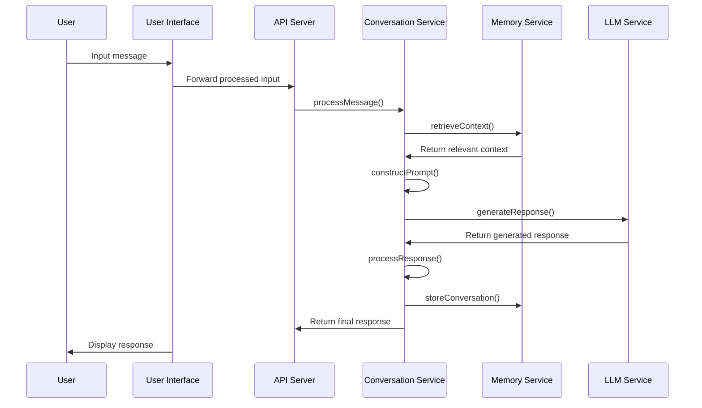

## Architecture Documentation

### Overview

The Personal AI Agent is designed with a modular, local-first architecture that prioritizes user privacy and data ownership. The system is structured into distinct components that communicate through well-defined interfaces, allowing for flexibility, maintainability, and extensibility.

### Core Components

1.  **User Interface (UI):**
    *   Provides the user interaction layer, handling input and output through text and voice.
    *   Built using Next.js for web and React Native for mobile, ensuring a consistent experience across platforms.
    *   Key responsibilities include rendering the chat interface, capturing voice input, displaying AI responses, and managing user settings.

2.  **API Server:**
    *   Acts as the entry point for all requests from the UI.
    *   Implemented using FastAPI, providing high performance, asynchronous support, and automatic API documentation.
    *   Handles request routing, authentication, and coordination between different services.

3.  **Conversation Service:**
    *   Manages the flow of conversations between the user and the AI agent.
    *   Responsible for maintaining conversation state, retrieving relevant context from memory, constructing prompts for the LLM, and processing LLM responses.

4.  **Memory Service:**
    *   Stores and retrieves user information, conversations, and knowledge.
    *   Utilizes a vector database (ChromaDB) for efficient similarity searches and SQLite for structured data and metadata.
    *   Provides CRUD operations for memory management and handles memory export/import.

5.  **LLM Service:**
    *   Generates intelligent responses based on user input and context.
    *   Supports both cloud-based LLMs (OpenAI API) and local LLM options (Llama 3) for offline use.
    *   Responsible for processing natural language inputs, applying personality settings, and managing token usage.

6.  **Document Processor:**
    *   Extracts, transforms, and stores information from documents.
    *   Parses various document formats (PDF, Word, text) and segments documents into manageable chunks.
    *   Generates metadata for extracted content and stores it in the memory system.

### Component Interactions

The following diagram illustrates the interactions between the core components:



### Data Flow

1.  **User Interaction Flow:**
    *   User inputs (text/voice) are captured by the UI layer.
    *   The Conversation Manager receives the processed input and retrieves relevant context from the Memory System.
    *   The LLM Service generates a response based on the input and context.
    *   Responses are delivered to the user as text and optionally converted to speech.

2.  **Memory Management Flow:**
    *   Conversations are automatically stored in the Memory System.
    *   Document and web content is processed by the Knowledge Processor.
    *   Extracted information is vectorized and stored in the Vector Database.
    *   Memory retrieval uses similarity search to find relevant context.
    *   User can explicitly manage (view, edit, delete) stored memories.

3.  **External Integration Flow:**
    *   Web searches are routed through the Search Service.
    *   LLM requests may be sent to cloud APIs (if local LLM is not used).
    *   Voice processing may leverage external STT/TTS services.
    *   Optional encrypted backups are sent to cloud storage.

4.  **Data Persistence Flow**:
    *   All data is stored locally by default.
    *   Vector embeddings are stored in the Vector Database.
    *   Structured data is stored in SQLite.
    *   Raw files and binary data are stored in the file system.
    *   Optional encrypted backups are created for cloud storage.

### Data Storage

The Personal AI Agent employs a hybrid database approach with a vector database for semantic search and a relational database for structured data storage. All data is stored locally by default, with optional encrypted cloud backup.

#### Entity Relationships

```mermaid
erDiagram
    CONVERSATION {
        uuid id PK
        timestamp created_at
        timestamp updated_at
        string title
        text summary
    }
    
    MESSAGE {
        uuid id PK
        uuid conversation_id FK
        timestamp created_at
        string role
        text content
        jsonb metadata
    }
    
    MEMORY_ITEM {
        uuid id PK
        uuid source_id FK
        timestamp created_at
        text content
        vector embedding
        jsonb metadata
        string category
    }
    
    DOCUMENT {
        uuid id PK
        timestamp created_at
        string filename
        string file_type
        string storage_path
        jsonb metadata
        boolean processed
    }
    
    WEB_PAGE {
        uuid id PK
        timestamp created_at
        string url
        string title
        timestamp last_accessed
        boolean processed
    }
    
    USER_SETTINGS {
        uuid id PK
        jsonb voice_settings
        jsonb personality_settings
        jsonb privacy_settings
        jsonb storage_settings
    }
    
    CONVERSATION ||--o{ MESSAGE : contains
    MESSAGE ||--o{ MEMORY_ITEM : generates
    DOCUMENT ||--o{ MEMORY_ITEM : generates
    WEB_PAGE ||--o{ MEMORY_ITEM : generates