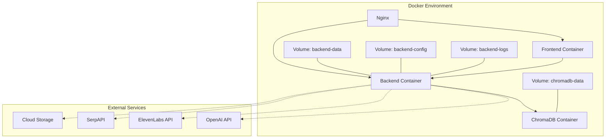
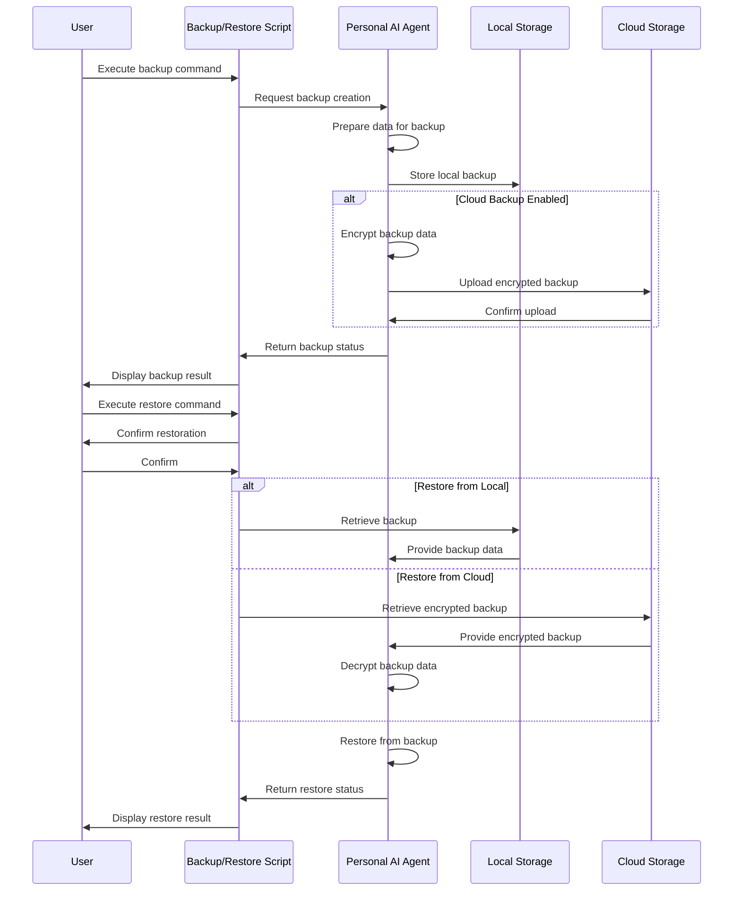

# Deployment Guide

## Introduction

Overview of the Personal AI Agent deployment options, emphasizing the local-first architecture and privacy-focused design. Explains the different deployment scenarios including desktop application, mobile application, and self-hosted options.

## System Requirements

Detailed hardware and software requirements for running the Personal AI Agent in different configurations.

### Minimum Requirements

Minimum hardware specifications for basic functionality: Dual-core CPU (2GHz+), 4GB RAM, 2GB storage, intermittent network connection.

### Recommended Specifications

Recommended hardware for optimal performance: Quad-core CPU (2.5GHz+), 8GB RAM, 10GB+ storage, broadband connection.

### Platform-Specific Requirements

Requirements for Windows, macOS, Linux, iOS, and Android platforms, including minimum OS versions and dependencies.

**Table: Platform-Specific Dependencies**

| Platform | Dependencies | Installation Command |
|---|---|---|
| Windows | Microsoft Visual C++ Redistributable | Download from Microsoft website |
| macOS | None required | N/A |
| Linux (Ubuntu/Debian) | build-essential, libgomp1, ca-certificates | `apt-get install build-essential libgomp1 ca-certificates` |
| Linux (RHEL/CentOS) | gcc, gcc-c++, libgomp, ca-certificates | `yum install gcc gcc-c++ libgomp ca-certificates` |

### Local LLM Requirements

Additional requirements for running local language models: 8+ cores, 16GB+ RAM, 20GB+ storage, optional CUDA-compatible GPU.

## Installation Guide

Step-by-step instructions for installing the Personal AI Agent on different platforms.

### Desktop Installation

Instructions for installing on Windows, macOS, and Linux using platform-specific installers.

**Basic installation command for Linux**
```bash
sudo apt-get update && sudo apt-get install -y personal-ai-agent
```

### Mobile Installation

Instructions for installing from app stores on iOS and Android devices.

### Self-Hosted Installation

Instructions for advanced users who want to self-host the application using Docker and Docker Compose.

## Configuration

Detailed information about configuring the Personal AI Agent for different use cases.

### Configuration Files

Overview of configuration files, their locations, and format (JSON/YAML).

**Table: Configuration File Locations**

| Platform | Configuration Path | Data Path | Log Path |
|---|---|---|---|
| Windows | `%APPDATA%\PersonalAI\config` | `%APPDATA%\PersonalAI\data` | `%APPDATA%\PersonalAI\logs` |
| macOS | `~/.personalai/config` | `~/.personalai/data` | `~/.personalai/logs` |
| Linux | `~/.personalai/config` | `~/.personalai/data` | `~/.personalai/logs` |
| Docker | `/app/config` | `/app/data` | `/app/logs` |

### Environment Variables

List of supported environment variables and their effects on the application.

**Example environment configuration**
```yaml
PYTHONDONTWRITEBYTECODE=1
PYTHONUNBUFFERED=1
CONFIG_DIR=/app/config
DATA_DIR=/app/data
LOG_LEVEL=INFO
PORT=8000
VECTOR_DB_PATH=/app/data/vector_db
SQLITE_DB_PATH=/app/data/sqlite.db
ENABLE_ENCRYPTION=true
DEVELOPMENT_MODE=false
```

### API Keys

Instructions for setting up and securing API keys for external services (OpenAI, ElevenLabs, SerpAPI).

### Storage Configuration

Options for configuring local storage locations and optional cloud backup.

## Docker Deployment

Comprehensive guide for deploying the Personal AI Agent using Docker containers.

### Development Environment

Using Docker Compose for local development with hot-reloading and debugging.

### Production Deployment

Deploying a production-ready instance using the production Docker Compose configuration.

**Starting the application with Docker Compose**
```bash
cd infrastructure/docker && docker-compose -f docker-compose.prod.yml up -d
```

### Container Configuration

Customizing container resources, networking, and volumes.

### Security Considerations

Security best practices for Docker deployments, including non-root users and volume permissions.

**Diagram: Docker Deployment Architecture**


## Backup and Recovery

Procedures for backing up and restoring the Personal AI Agent data.

### Local Backups

Creating and managing local backups using the `backup.sh` script.

**Creating a backup of all data**
```bash
./infrastructure/scripts/backup.sh create --name full-backup --include-all
```

### Cloud Backups

Configuring optional encrypted cloud backups with various storage providers.

### Automated Backups

Setting up scheduled backups using cron or system schedulers.

### Disaster Recovery

Procedures for recovering from various failure scenarios using the `restore.sh` script.

**Restoring from a backup**
```bash
./infrastructure/scripts/restore.sh restore --backup-path ./backups/full-backup.tar.gz
```

**Diagram: Backup and Restore Process**


## Maintenance

Routine maintenance procedures for keeping the Personal AI Agent running smoothly.

### Updates

Procedures for updating the application, including automatic updates and manual upgrades.

### Database Optimization

Maintaining optimal performance of SQLite and vector databases.

### Log Management

Managing and rotating log files to prevent disk space issues.

### Performance Tuning

Optimizing application performance based on available resources.

## Troubleshooting

Common issues and their solutions for the Personal AI Agent deployment.

### Installation Issues

Solutions for common installation problems on different platforms.

### Configuration Problems

Diagnosing and fixing configuration-related issues.

### Performance Issues

Identifying and resolving performance bottlenecks.

### Docker Troubleshooting

Debugging Docker-specific deployment issues.

### Log Analysis

Using application logs to diagnose problems.

## Security Considerations

Security best practices for deploying the Personal AI Agent.

### Data Encryption

Configuring encryption for sensitive data at rest and in transit.

### API Key Management

Securely managing API keys for external services.

### Network Security

Securing network communications for self-hosted deployments.

### Access Controls

Implementing appropriate access controls for multi-user environments.

## Advanced Topics

Advanced deployment scenarios and customizations for the Personal AI Agent.

### Local LLM Integration

Setting up and optimizing local language models for offline operation.

### Custom Voice Models

Integrating custom text-to-speech and speech-to-text models.

### Multi-Device Synchronization

Configuring secure synchronization between multiple devices.

### Custom Deployment Architectures

Tailoring the deployment architecture for specific use cases.

## References

Additional resources and references for deploying the Personal AI Agent.

### Documentation Links

Links to related documentation including [architecture.md](./architecture.md) and [api.md](./api.md), as well as setup instructions in the repository README.

### External Resources

Links to external documentation for dependencies and tools.

### Community Support

Information about community support channels and resources.

**Table: System Requirements by Deployment Type**

| Deployment Type | CPU | RAM | Storage | Network |
|---|---|---|---|---|
| Basic (Cloud LLM) | 2+ cores, 2GHz+ | 4GB | 2GB free | Intermittent |
| Standard | 4+ cores, 2.5GHz+ | 8GB | 5GB free | Broadband |
| Advanced (Local LLM) | 8+ cores, 3GHz+ | 16GB+ | 20GB+ free | Broadband |
| Mobile | Modern smartphone | 4GB+ | 1GB+ free | Mobile data/Wi-Fi |

**Diagram: Deployment Architecture Overview**
```mermaid
graph TD
    subgraph "User Device"
        A[Desktop App] --> B[Local API Server]
        C[Mobile App] --> B

        B --> D[Vector Database]
        B --> E[SQLite Database]
        B --> F[File Storage]

        B --> G[LLM Service]
        B --> H[Voice Service]
        B --> I[Document Service]
        B --> J[Web Service]

        G -->|Optional| K[Local LLM]
        G -->|Optional| L[Cloud LLM API]

        H -->|Optional| M[Local TTS/STT]
        H -->|Optional| N[Cloud Voice API]

        J -->|Optional| O[Web Search API]
    end

    subgraph "Optional Cloud Services"
        P[Cloud Storage]
        L[Cloud LLM API]
        N[Cloud Voice API]
        O[Web Search API]
    end

    B -->|Optional| P